<div align="center">


<a id="top"></a>

# 🕯️ CANDLE

### MSA 기반 모의 투자 & 투자 교육 플랫폼

### **Contract-Driven Microservices · Event-Driven Architecture · Financial Consistency**

<br/>


<br/><br/>

<table>
<tr>
<td align="center" width="280">

### 📈 Investment Core

Market · Stock · Trading  
Portfolio · Ranking · Wishlist · News

</td>

<td align="center" width="280">

### 🧩 Experience Platform

Auth · User · Learning  
Chatting · Notification

</td>

<td align="center" width="280">

### ⚙️ Operation Layer

Batch Orchestration  
CI/CD · Infra  
Docs

</td>
</tr>
</table>

<br/>

**Candle**은 투자 초보자가 실제 돈을 잃을 위험 없이  
주식 탐색 → 관심 종목 → 주문/예약 → 체결 → 포트폴리오 → 랭킹 → 뉴스 학습까지 경험할 수 있도록 만든  
**마이크로서비스 기반 모의 투자 플랫폼**입니다.

<br/>

> Service-Owned Data · gRPC Contract · Kafka Event · Transactional Outbox · Idempotency · Cache-Aside · Spring Batch

<br/>

<a href="https://app.dev.candle.io.kr">

</a>
&nbsp;
<a href="https://take-profit-institute.github.io/micro-services/">

</a>

</div>

---

# 📚 Table of Contents

- [👨‍💻 Team & Contributions](#-team--contributions)
- [💡 Project Overview](#-project-overview)
- [🧭 Domain Grouping Strategy](#-domain-grouping-strategy)
- [🏛 System Architecture](#-system-architecture)
- [📈 Investment Core Flow](#-investment-core-flow)
- [🧩 Investment Core Services](#-investment-core-services)
  - [📊 Market Service](#-market-service)
  - [🏢 Stock Service](#-stock-service)
  - [💳 Trading Service](#-trading-service)
  - [💼 Portfolio Service](#-portfolio-service)
  - [🏆 Ranking Service](#-ranking-service)
  - [⭐ Wishlist Service](#-wishlist-service)
  - [📰 News Service](#-news-service)
- [🧑‍💻 Experience Platform Services](#-experience-platform-services)
  - [🔐 Auth Service](#-auth-service)
  - [👤 User Service](#-user-service)
  - [📚 Learning Service](#-learning-service)
  - [💬 Chatting Service](#-chatting-service)
  - [🔔 Notification Service](#-notification-service)
- [⚙️ Operation Layer Services](#️-operation-layer-services)
  - [🕯️ Batch Service](#️-batch-service)
- [🛡 Core Engineering Principles](#-core-engineering-principles)
- [🚀 CI/CD & Deployment Architecture](#-cicd--deployment-architecture)
- [📂 Project Structure](#-project-structure)
- [⚙️ Environment Variables](#️-environment-variables)
- [🚀 Build & Run](#-build--run)
- [📄 Documentation Map](#-documentation-map)
- [🔥 Engineering Challenge & Troubleshooting](#-engineering-challenge--troubleshooting)
- [🗺 Roadmap](#-roadmap)

---

# 👨‍💻 Team & Contributions

<table>
<tr>
<td align="center" width="180px">

### 🐣 박유빈

</td>
<td>

### 🔐 User · Auth · Chatting · Stock · Wishlist · Portfolio · Infra

- 인증/사용자 기반 흐름 담당
- 종목 기준정보, 관심 종목, 보유 자산 조회 흐름 담당
- 실시간 채팅 및 배포 인프라 구성 담당

</td>
</tr>

<tr>
<td align="center" width="180px">

### 🕯️ 강찬미

</td>
<td>

### ⚙️ Batch · Ranking

- Spring Batch 기반 운영 Job 설계
- Portfolio EOD 이후 Ranking 확정 흐름 구현
- Ranking 조회 캐시, 정렬 정책, 멱등성/Outbox 문서화

</td>
</tr>

<tr>
<td align="center" width="180px">

### 📈 박은서

</td>
<td>

### 📊 Market

- 실시간 시세, 시장 랭킹, 장 상태 흐름 담당
- Kiwoom API 연동 및 Redis 캐시 기반 조회 구조 담당

</td>
</tr>

<tr>
<td align="center" width="180px">

### 📰 신예은

</td>
<td>

### 🗞 News · Notification

- 종목별 뉴스 수집 및 조회 기능 담당
- 알림 생성/발송/읽음 처리 흐름 담당

</td>
</tr>

<tr>
<td align="center" width="180px">

### 💸 김서원

</td>
<td>

### 💳 Trading

- 계좌, 즉시 주문, 예약 주문, 체결 도메인 담당
- 멱등성, Outbox, 수수료/거래세, 예약→주문 전환 흐름 담당

</td>
</tr>

<tr>
<td align="center" width="180px">

### 📚 조한림

</td>
<td>

### 🎓 Learning

- 학습 콘텐츠, 퀴즈, 진도 관리 담당
- 투자 교육 경험과 사용자 학습 흐름 담당

</td>
</tr>
</table>

<div align="right">

[🔝 Back to Top](#top)

</div>

---

# 💡 Project Overview

## 🎯 Why Candle?

투자 서비스는 초보자에게 어렵고, 실제 거래는 실수 비용이 큽니다.  
Candle은 실제 증권 서비스처럼 **시세·주문·체결·자산·랭킹** 흐름을 제공하되, 모의 투자 환경에서 안전하게 경험할 수 있도록 설계했습니다.

| Challenge | Candle Design |
|---|---|
| 주식 시세와 종목 정보는 읽기 트래픽이 많음 | Market/Stock 분리, Redis 캐시, Kiwoom fallback |
| 주문/체결은 정합성과 재시도가 중요함 | gRPC + Idempotency Key + Outbox |
| 체결 이후 자산/랭킹/알림은 후속 반영이 필요함 | Kafka 이벤트 기반 최종 일관성 |
| 일일 마감·랭킹 확정은 API 서버와 성격이 다름 | 독립 Spring Batch 애플리케이션 |
| 서비스가 많아지면 DB 직접 참조가 위험함 | Service-Owned Data, gRPC 계약, FK 금지 |

<div align="right">

[🔝 Back to Top](#top)

</div>

---

# 🧭 Domain Grouping Strategy

README는 사용자가 이해하기 쉬운 **연결 흐름 기준**으로 묶고, 상세 문서는 **도메인별**로 관리합니다.

## 1. 📈 Investment Core

```text
market → stock → trading → portfolio → ranking
       ↘ wishlist → notification
       ↘ news
```

- 투자 화면에서 가장 먼저 만나는 시세/종목/뉴스
- 사용자의 관심 종목과 주문 액션
- 체결 후 포트폴리오와 랭킹으로 이어지는 핵심 수익률 흐름

## 2. 🧩 Experience Platform

```text
auth → user → learning → chatting → notification
```

- 로그인과 사용자 상태
- 투자 학습 콘텐츠
- 종목별 커뮤니티와 알림 경험

## 3. ⚙️ Operation Layer

```text
stock sync → trading batch → portfolio EOD → ranking finalize
```

- 장 시작/장 마감 기준 운영 작업
- 실패 재시작과 수동 실행
- 문서/배포/관측 운영

<div align="right">

[🔝 Back to Top](#top)

</div>

---

# 🏛 System Architecture

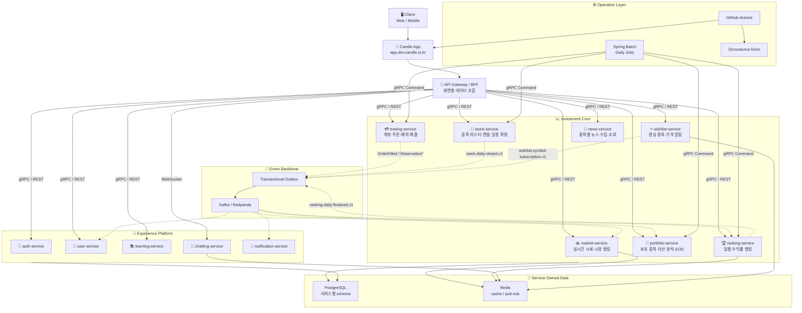
```mermaid
flowchart TB
    Client["🖥 Client<br/>Web / Mobile"] --> App["🚀 Candle App<br/>app.dev.candle.io.kr"]
    App --> BFF["🚪 API Gateway / BFF<br/>화면별 데이터 조합"]

    subgraph Core["📈 Investment Core"]
        Market["📊 market-service<br/>실시간 시세·시장 랭킹"]
        Stock["🏢 stock-service<br/>종목 마스터·캔들·일봉 확정"]
        Trading["💳 trading-service<br/>계좌·주문·예약·체결"]
        Portfolio["💼 portfolio-service<br/>보유 종목·자산 분석·EOD"]
        Ranking["🏆 ranking-service<br/>일별 수익률 랭킹"]
        Wishlist["⭐ wishlist-service<br/>관심 종목·가격 알림"]
        News["📰 news-service<br/>종목별 뉴스 수집·조회"]
    end

    subgraph Experience["🧩 Experience Platform"]
        Auth["🔐 auth-service"]
        User["👤 user-service"]
        Learning["📚 learning-service"]
        Chatting["💬 chatting-service"]
        Notification["🔔 notification-service"]
    end

    BFF -->|gRPC / REST| Auth
    BFF -->|gRPC / REST| User
    BFF -->|gRPC / REST| Market
    BFF -->|gRPC / REST| Stock
    BFF -->|gRPC / REST| Trading
    BFF -->|gRPC / REST| Portfolio
    BFF -->|gRPC / REST| Ranking
    BFF -->|gRPC / REST| Wishlist
    BFF -->|gRPC / REST| News
    BFF -->|WebSocket| Chatting
    BFF -->|gRPC / REST| Learning

    subgraph Event["📡 Event Backbone"]
        Kafka["Kafka / Redpanda"]
        Outbox["Transactional Outbox"]
    end

    Trading -. "OrderFilled / Reservation*" .-> Outbox
    Stock -. "stock.daily-closed.v1" .-> Outbox
    Ranking -. "ranking.daily-finalized.v1" .-> Outbox
    Wishlist -. "wishlist.symbol-subscription.v1" .-> Outbox
    Outbox --> Kafka

    Kafka -.-> Portfolio
    Kafka -.-> Ranking
    Kafka -.-> Notification
    Kafka -.-> Market
    Kafka -.-> User

    subgraph Data["💾 Service-Owned Data"]
        PG["PostgreSQL<br/>서비스별 schema"]
        Redis["Redis<br/>cache / pub-sub"]
    end

    Market --> Redis
    Ranking --> Redis
    Chatting --> Redis
    Wishlist --> Redis
    Core --> PG
    Experience --> PG

    subgraph Ops["⚙️ Operation Layer"]
        Batch["Spring Batch<br/>Daily Jobs"]
        Docs["Docusaurus Docs"]
        CI["GitHub Actions"]
    end

    Batch -->|gRPC Command| Stock
    Batch -->|gRPC Command| Trading
    Batch -->|gRPC Command| Portfolio
    Batch -->|gRPC Command| Ranking
    CI --> App
    CI --> Docs
```

<div align="right">

[🔝 Back to Top](#top)

</div>

---

# 📈 Investment Core Flow

## 전체 투자 흐름

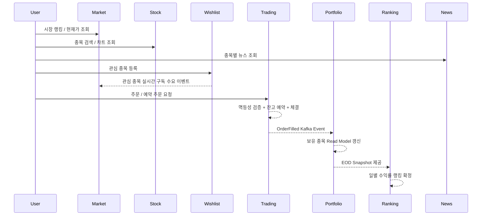
```mermaid
sequenceDiagram
    participant U as User
    participant M as Market
    participant S as Stock
    participant W as Wishlist
    participant T as Trading
    participant P as Portfolio
    participant R as Ranking
    participant N as News

    U->>M: 시장 랭킹 / 현재가 조회
    U->>S: 종목 검색 / 차트 조회
    U->>N: 종목별 뉴스 조회
    U->>W: 관심 종목 등록
    W-->>M: 관심 종목 실시간 구독 수요 이벤트
    U->>T: 주문 / 예약 주문 요청
    T-->>T: 멱등성 검증 + 잔고 예약 + 체결
    T-->>P: OrderFilled Kafka Event
    P-->>P: 보유 종목 Read Model 갱신
    P-->>R: EOD Snapshot 제공
    R-->>R: 일별 수익률 랭킹 확정
```

## Daily EOD Flow

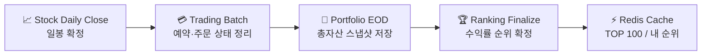
```mermaid
flowchart LR
    A["📈 Stock Daily Close<br/>일봉 확정"] --> B["💳 Trading Batch<br/>예약·주문 상태 정리"]
    B --> C["💼 Portfolio EOD<br/>총자산 스냅샷 저장"]
    C --> D["🏆 Ranking Finalize<br/>수익률 순위 확정"]
    D --> E["⚡ Redis Cache<br/>TOP 100 / 내 순위"]
```

<div align="right">

[🔝 Back to Top](#top)

</div>

---

# 🧩 Investment Core Services

---

## 📊 Market Service

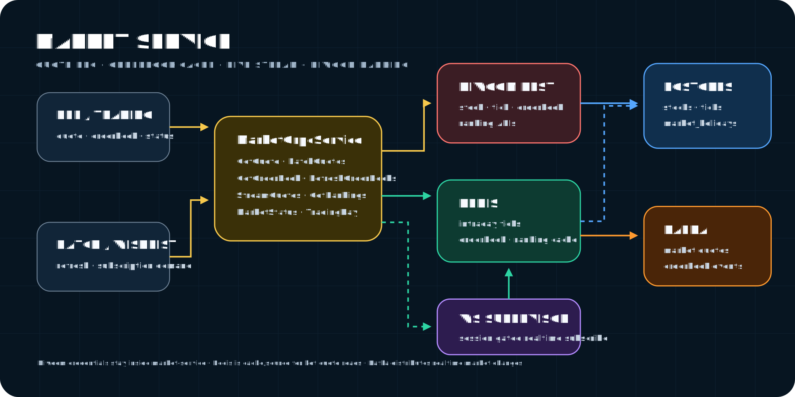

### Role

`market-service`는 Kiwoom Ranking API를 호출해 시장 랭킹 데이터를 가져오고, 공통 캐시 DTO로 변환한 뒤 Redis에 저장합니다. 조회 요청은 Kiwoom API를 직접 호출하지 않고 Redis 캐시를 읽어 반환합니다.

### Supported Ranking

| Ranking Type | Refresh Entry | Redis Key |
|---|---|---|
| 상승 종목 | `RisingRankingService.refresh()` | `StockRankingRedisKey.RISING` |
| 하락 종목 | `FallingRankingService.refresh()` | `StockRankingRedisKey.FALLING` |
| 인기 종목 | `PopularRankingService.refresh()` | `StockRankingRedisKey.POPULAR` |
| 거래량 급증 | `VolumeSpikeRankingService.refresh()` | `StockRankingRedisKey.VOLUME_SPIKE` |
| 등락률 상위 | `RateRankingService.refreshRateUp()` | `StockRankingRedisKey.RATE_UP` |
| 등락률 하위 | `RateRankingService.refreshRateDown()` | `StockRankingRedisKey.RATE_DOWN` |

### Flow

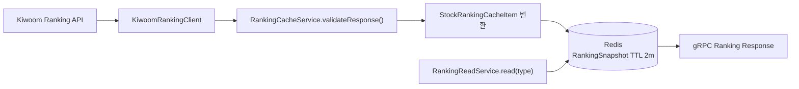
```mermaid
flowchart LR
    Kiwoom["Kiwoom Ranking API"] --> Client["KiwoomRankingClient"]
    Client --> Validator["RankingCacheService.validateResponse()"]
    Validator --> Mapper["StockRankingCacheItem 변환"]
    Mapper --> Redis[("Redis<br/>RankingSnapshot TTL 2m")]
    Reader["RankingReadService.read(type)"] --> Redis
    Redis --> Response["gRPC Ranking Response"]
```

### Engineering Points

| Point | Description |
|---|---|
| Cache First Read | 조회 경로는 외부 API를 호출하지 않고 Redis만 조회 |
| TTL | `RankingSnapshot`을 2분 TTL로 저장 |
| Validation | `returnCode != 0`, 응답 목록 없음, null 응답을 예외 처리 |
| Idempotent Refresh | 같은 Redis Key에 최신 스냅샷을 덮어써서 최종 상태를 유지 |
| Failure Impact | API 실패 시 기존 캐시는 TTL 동안 유지, 캐시가 없으면 `UNAVAILABLE` |

<div align="right">

[🔝 Back to Top](#top)

</div>

---

## 🏢 Stock Service

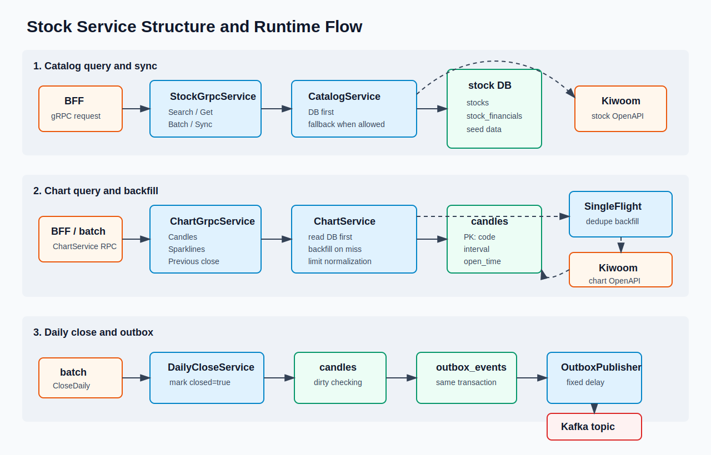

### Role

`stock-service`는 종목 마스터, 종목 재무정보, 캔들 차트 데이터를 관리합니다.  
`market-service`가 실시간 시세를 담당한다면, `stock-service`는 저장된 기준정보와 확정된 차트 데이터를 담당합니다.

### Responsibilities

| Area | Description |
|---|---|
| Catalog | 종목 검색, 상세 조회, 일괄 조회, 종목 동기화 |
| Financials | 종목별 최신 재무정보 조회 |
| Chart | 일/주/월 캔들, sparkline, 이전 종가, 가격 통계 |
| Backfill | DB 캔들이 부족하면 Kiwoom API에서 받아 저장 |
| Daily Close | 일봉을 확정하고 Outbox 이벤트 기록 |
| Outbox | `stock.daily-closed.v1` 이벤트를 Kafka로 발행 |

### APIs

| gRPC Service | RPC | Purpose |
|---|---|---|
| `StockService` | `SearchStocks` | 종목 검색/목록 조회 |
| `StockService` | `GetStock` | 종목 상세 조회 |
| `StockService` | `BatchGetStocks` | 여러 종목 기본정보 일괄 조회 |
| `StockService` | `SyncStocks` | Kiwoom 시장별 종목 동기화 |
| `ChartService` | `GetCandles` | 캔들 목록 조회 |
| `ChartService` | `GetSparklines` | 여러 종목 최근 종가 배열 조회 |
| `ChartService` | `GetPreviousClose` | 기준 시각 이전 최신 일봉 종가 조회 |
| `ChartService` | `CloseDailyCandles` | 거래일 일봉 확정 + Outbox 기록 |

### Core Flow

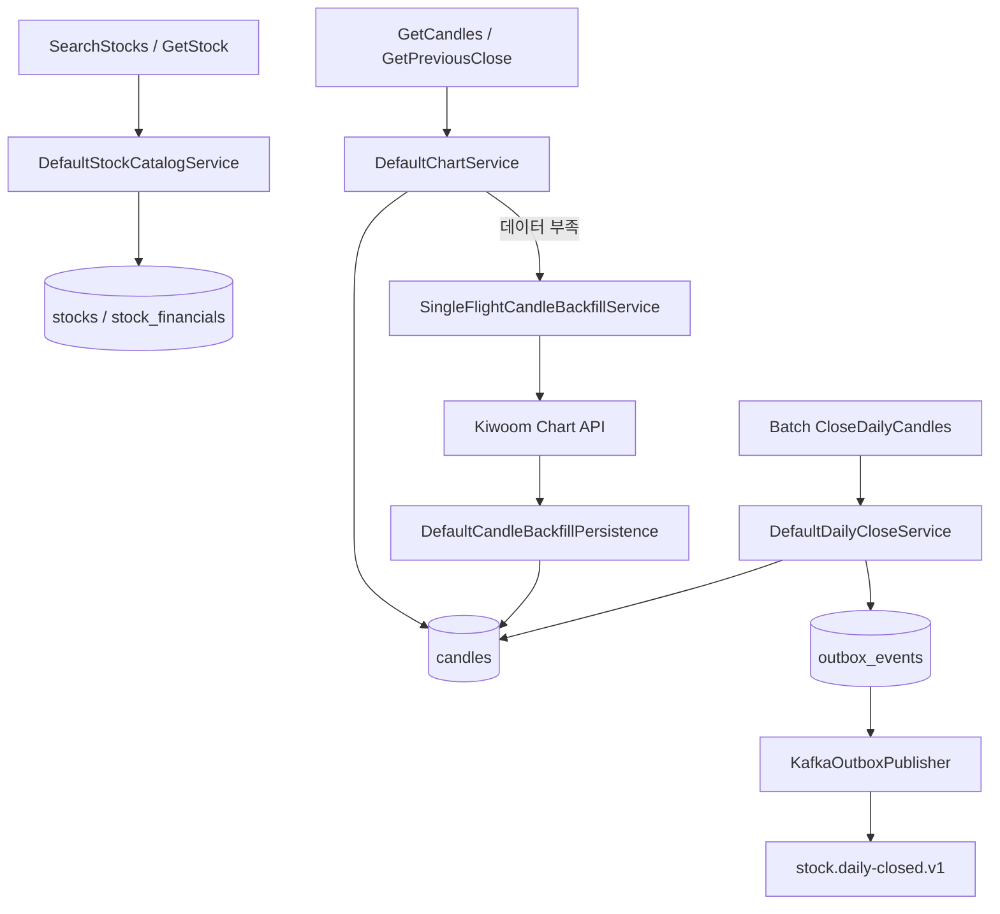
```mermaid
flowchart TD
    Search["SearchStocks / GetStock"] --> Catalog["DefaultStockCatalogService"]
    Catalog --> StockDB[("stocks / stock_financials")]

    ChartReq["GetCandles / GetPreviousClose"] --> Chart["DefaultChartService"]
    Chart --> CandleDB[("candles")]
    Chart -->|데이터 부족| SingleFlight["SingleFlightCandleBackfillService"]
    SingleFlight --> Kiwoom["Kiwoom Chart API"]
    Kiwoom --> Persist["DefaultCandleBackfillPersistence"]
    Persist --> CandleDB

    Batch["Batch CloseDailyCandles"] --> Daily["DefaultDailyCloseService"]
    Daily --> CandleDB
    Daily --> Outbox[("outbox_events")]
    Outbox --> Publisher["KafkaOutboxPublisher"]
    Publisher --> Kafka["stock.daily-closed.v1"]
```

### Engineering Points

| Point | Description |
|---|---|
| SingleFlight Backfill | 같은 `(code, interval, to)` backfill 요청을 하나로 합쳐 중복 외부 호출 감소 |
| Fallback Policy | `GetStock(allow_fallback=true)`인 경우에만 Kiwoom 상세 fallback 수행 |
| News Contract | `news-service`는 `GetStock(allow_fallback=false)`로 DB 기준 종목명만 조회 |
| Daily Close | 일봉 `closed=true` 처리와 `StockDailyClosedEvent` Outbox 저장을 같은 transaction에서 처리 |
| Retry by Outbox | Kafka 발행 실패 시 `published_at`이 비어 다음 주기에 재시도 |

<div align="right">

[🔝 Back to Top](#top)

</div>

---

## 💳 Trading Service

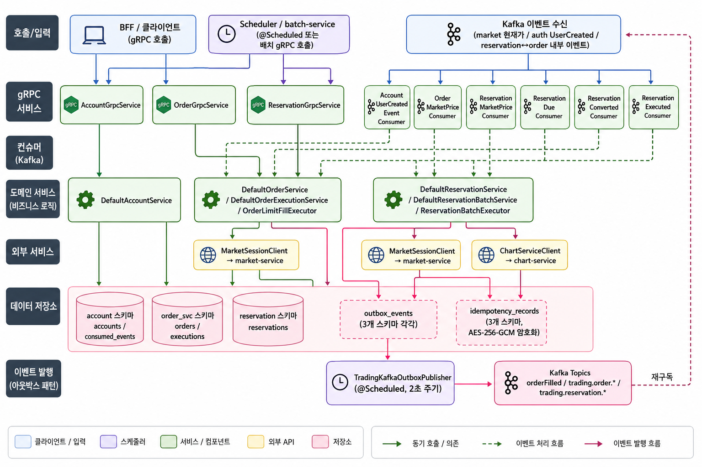

### Role

`trading-service`는 사용자의 주식 매매 주문을 처리합니다. 내부는 `account`, `order_svc`, `reservation` 세 하위 도메인으로 나뉘고, 각각 별도 DB schema를 사용하지만 하나의 서비스로 배포됩니다.

### Domain Boundary

| Domain | Responsibility |
|---|---|
| Account | 현금, 잠금 금액, 가용 금액, 계좌 생성/조회 |
| Order | 즉시 주문 접수, 시장가/지정가 체결, 취소, 정정 |
| Reservation | 시가/전일종가/당일종가 예약 주문, 배치 체결/전환 |
| Support | Idempotency, Outbox, 수수료/거래세 정책, Kafka publisher |

### Core Architecture

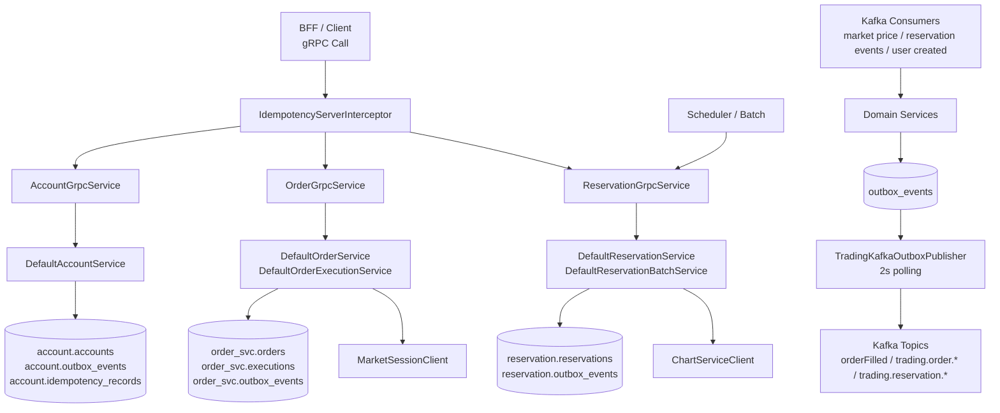
```mermaid
flowchart TB
    BFF["BFF / Client<br/>gRPC Call"] --> Interceptor["IdempotencyServerInterceptor"]
    Scheduler["Scheduler / Batch"] --> ReservationGrpc["ReservationGrpcService"]
    KafkaIn["Kafka Consumers<br/>market price / reservation events / user created"] --> Domain

    Interceptor --> AccountGrpc["AccountGrpcService"]
    Interceptor --> OrderGrpc["OrderGrpcService"]
    Interceptor --> ReservationGrpc

    AccountGrpc --> AccountService["DefaultAccountService"]
    OrderGrpc --> OrderService["DefaultOrderService<br/>DefaultOrderExecutionService"]
    ReservationGrpc --> ReservationService["DefaultReservationService<br/>DefaultReservationBatchService"]

    AccountService --> AccountDB[("account.accounts<br/>account.outbox_events<br/>account.idempotency_records")]
    OrderService --> OrderDB[("order_svc.orders<br/>order_svc.executions<br/>order_svc.outbox_events")]
    ReservationService --> ReservationDB[("reservation.reservations<br/>reservation.outbox_events")]

    OrderService --> MarketClient["MarketSessionClient"]
    ReservationService --> ChartClient["ChartServiceClient"]

    Domain["Domain Services"] --> Outbox[("outbox_events")]
    Outbox --> Publisher["TradingKafkaOutboxPublisher<br/>2s polling"]
    Publisher --> Kafka["Kafka Topics<br/>orderFilled / trading.order.* / trading.reservation.*"]
```

### Reservation → Order Conversion

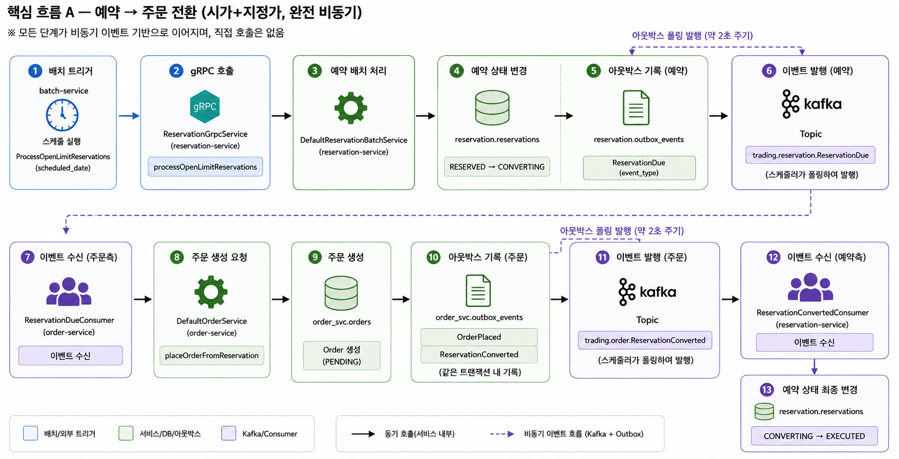

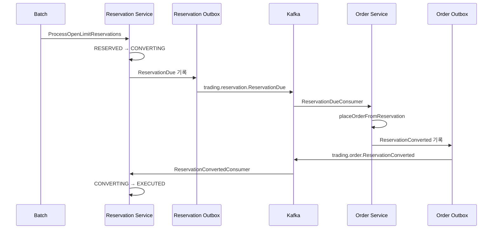
```mermaid
sequenceDiagram
    participant B as Batch
    participant R as Reservation Service
    participant RO as Reservation Outbox
    participant K as Kafka
    participant O as Order Service
    participant OO as Order Outbox

    B->>R: ProcessOpenLimitReservations
    R->>R: RESERVED → CONVERTING
    R->>RO: ReservationDue 기록
    RO->>K: trading.reservation.ReservationDue
    K->>O: ReservationDueConsumer
    O->>O: placeOrderFromReservation
    O->>OO: ReservationConverted 기록
    OO->>K: trading.order.ReservationConverted
    K->>R: ReservationConvertedConsumer
    R->>R: CONVERTING → EXECUTED
```

### Reservation Immediate Fill

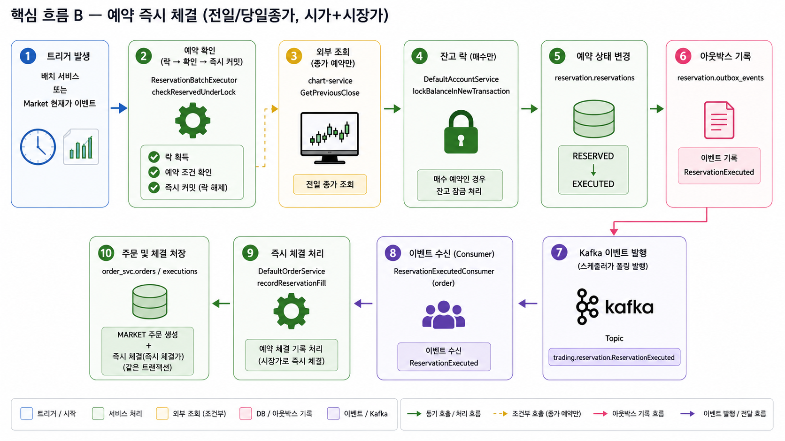


```mermaid
flowchart LR
    Trigger["배치 또는 현재가 이벤트"] --> Lock["예약 확인<br/>락 획득"]
    Lock --> Chart["ChartServiceClient<br/>전일/당일 종가 조회"]
    Chart --> Account["DefaultAccountService<br/>매수 잔고 선점"]
    Account --> Reservation["reservation.reservations<br/>RESERVED → EXECUTED"]
    Reservation --> Outbox["ReservationExecuted Outbox"]
    Outbox --> Kafka["Kafka"]
    Kafka --> Order["ReservationExecutedConsumer"]
    Order --> Execution["MARKET 주문 생성 + 즉시 체결"]
```

### Engineering Points

| Point | Description |
|---|---|
| Idempotency | 쓰기 RPC는 `x-idempotency-key`와 request metadata를 기준으로 중복 요청 차단 |
| Encrypted Response | 멱등성 응답 payload는 AES-256-GCM으로 암호화 저장 |
| Outbox | 도메인 변경 + Outbox + 멱등성 기록을 하나의 transaction으로 처리 |
| Pessimistic Safety | 계좌 잠금/해제/정산은 Account 도메인을 통해서만 수행 |
| Async Domain Coupling | 예약↔주문 전환은 Kafka 이벤트로만 연결해 동기 강결합 제거 |
| Executor Split | Spring self-invocation 문제를 피하기 위해 건별 트랜잭션 Executor 분리 |

<div align="right">

[🔝 Back to Top](#top)

</div>

---

## 💼 Portfolio Service

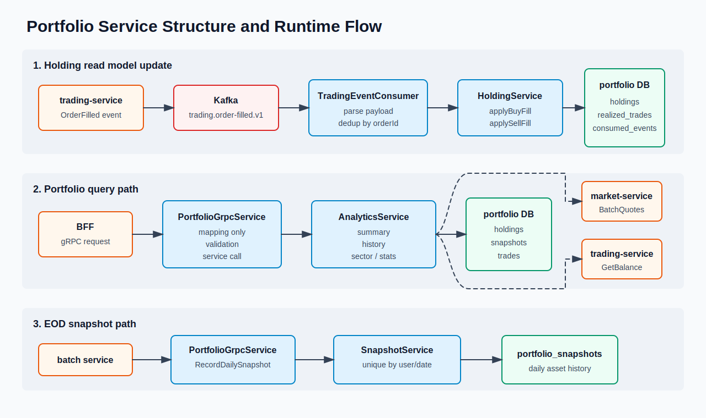

### Role

`portfolio-service`는 Trading 체결 이벤트를 소비해 사용자 보유 종목 read model을 갱신하고, 현재가와 현금 잔고를 조합해 포트폴리오 분석 결과를 제공합니다.

### Responsibilities

| Area | Description |
|---|---|
| Holding | `trading.order-filled.v1` 이벤트를 소비해 보유 종목 갱신 |
| Realized Trade | 매도 체결 시 실현손익 이력 저장 |
| Portfolio Analytics | 보유 종목 + 현재가 + 현금 잔고로 요약/수익률/섹터 비중 계산 |
| Daily Snapshot | EOD 배치가 넘긴 일별 포트폴리오 스냅샷 저장/조회 |

### Flow

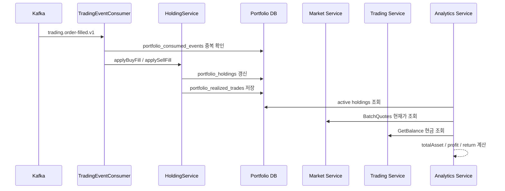
```mermaid
sequenceDiagram
    participant K as Kafka
    participant C as TradingEventConsumer
    participant H as HoldingService
    participant DB as Portfolio DB
    participant M as Market Service
    participant T as Trading Service
    participant A as Analytics Service

    K->>C: trading.order-filled.v1
    C->>DB: portfolio_consumed_events 중복 확인
    C->>H: applyBuyFill / applySellFill
    H->>DB: portfolio_holdings 갱신
    H->>DB: portfolio_realized_trades 저장

    A->>DB: active holdings 조회
    A->>M: BatchQuotes 현재가 조회
    A->>T: GetBalance 현금 조회
    A-->>A: totalAsset / profit / return 계산
```

### APIs

| gRPC Service | RPC | Purpose |
|---|---|---|
| `HoldingService` | `ListHoldings` | 사용자 보유 종목 목록 |
| `HoldingService` | `GetHolding` | 단일 보유 종목 |
| `HoldingService` | `ListActiveHolders` | EOD 배치용 활성 보유자 페이지 조회 |
| `PortfolioService` | `GetPortfolioSummary` | 총자산/수익률/손익 요약 |
| `PortfolioService` | `RecordDailySnapshot` | EOD 스냅샷 저장 |
| `PortfolioService` | `ListDailyPortfolioSnapshots` | Ranking 배치용 특정 일자 스냅샷 페이지 조회 |

### Engineering Points

| Point | Description |
|---|---|
| Event Dedup | `orderId`를 기준으로 `portfolio_consumed_events`에서 중복 소비 방지 |
| Read Model | Trading 원장을 직접 조회하지 않고 체결 이벤트로 보유 종목 read model 구성 |
| Market Fallback | Market 조회 실패 시 보유 종목의 `cachedCurrentPrice` fallback 사용 |
| Balance Fallback | Trading 잔고 조회 실패 시 현금 `0`으로 계산 |
| Snapshot Idempotency | `(user_id, snapshot_date)` unique 제약으로 EOD 저장 멱등성 보장 |
| Ranking Contract | `ListDailyPortfolioSnapshots`가 Ranking Finalize 입력 데이터 제공 |

<div align="right">

[🔝 Back to Top](#top)

</div>

---

## 🏆 Ranking Service

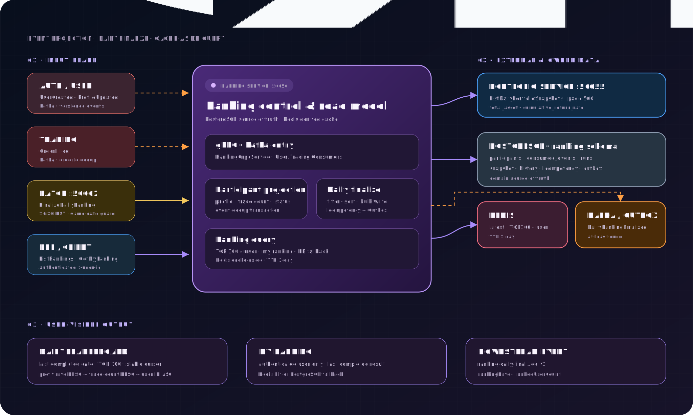

### Role

`ranking-service`는 Portfolio가 확정한 거래일별 EOD 자산과 누적 수익률을 입력으로 받아 일별 순위를 저장하고, 마지막 완료 거래일 기준 TOP 랭킹과 내 순위를 제공합니다.

### Core Architecture

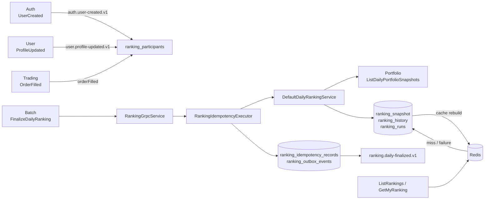
```mermaid
flowchart LR
    Auth["Auth<br/>UserCreated"] -->|"auth.user-created.v1"| Participant["ranking_participants"]
    User["User<br/>ProfileUpdated"] -->|"user.profile-updated.v1"| Participant
    Trading["Trading<br/>OrderFilled"] -->|"orderFilled"| Participant

    Batch["Batch<br/>FinalizeDailyRanking"] --> Grpc["RankingGrpcService"]
    Grpc --> Idem["RankingIdempotencyExecutor"]
    Idem --> Daily["DefaultDailyRankingService"]
    Daily --> Portfolio["Portfolio<br/>ListDailyPortfolioSnapshots"]
    Daily --> Result[("ranking_snapshot<br/>ranking_history<br/>ranking_runs")]
    Idem --> Command[("ranking_idempotency_records<br/>ranking_outbox_events")]
    Command --> Kafka["ranking.daily-finalized.v1"]

    Query["ListRankings / GetMyRanking"] --> Redis[("Redis")]
    Redis -->|"miss / failure"| Result
    Result -->|"cache rebuild"| Redis
```

### Ranking Finalize

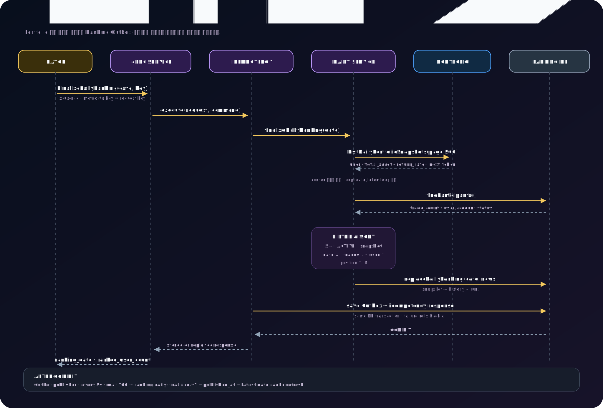

```text
Batch
→ RankingGrpcService.finalizeDailyRanking()
→ RankingIdempotencyExecutor.execute()
→ DefaultDailyRankingService.finalizeDailyRanking()
→ Portfolio ListDailyPortfolioSnapshots 전체 cursor 순회
→ 참가자 조건 필터링
→ 수익률 DESC, 거래 횟수 DESC, user_id ASC 정렬
→ ranking_snapshot + ranking_history + ranking_runs 저장
→ outbox + idempotency record 저장
```

### Participant Projection

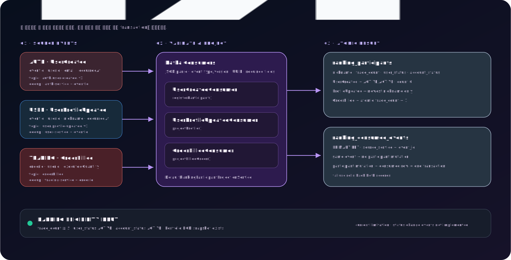

| Event | Effect |
|---|---|
| `auth.user-created.v1` | 참가자 생성, 사용자/계좌 ACTIVE 초기화 |
| `user.profile-updated.v1` | 닉네임 최신 이벤트 기준 갱신 |
| `orderFilled` | `trade_count` 원자 증가 |

### Query Cache

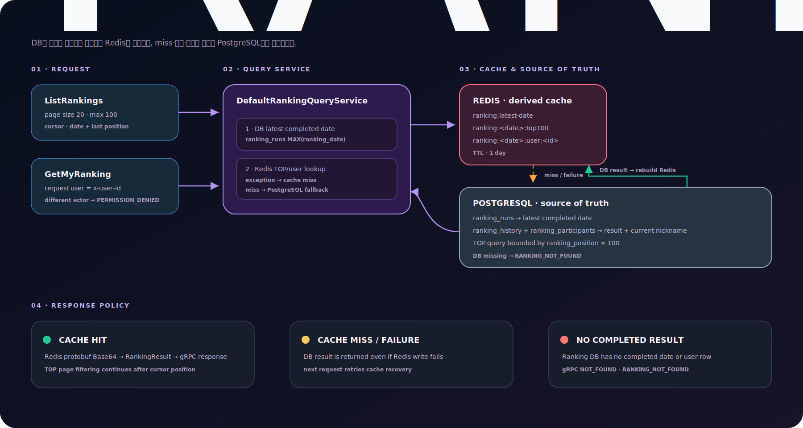

| Cache Key | Structure | TTL | Purpose |
|---|---|---|---|
| `ranking:latest-date` | String | 1 day | 마지막 완료 거래일 |
| `ranking:<date>:top100` | List | 1 day | TOP 100 protobuf Base64 목록 |
| `ranking:<date>:user:<userId>` | String | 1 day | 사용자별 RankingEntry |

### Engineering Points

| Point | Description |
|---|---|
| Ranking Source | Portfolio EOD Snapshot의 `total_asset`, `cumulative_return_rate` 사용 |
| Candidate Rule | `trade_count >= 5`, user/account ACTIVE, 해당 날짜 snapshot 존재 |
| Sorting Rule | 수익률 DESC → 거래 횟수 DESC → user_id ASC |
| Transaction | ranking 결과 + outbox + idempotency record를 하나의 transaction으로 commit |
| Cache-Aside | Redis 장애나 cache miss 시 PostgreSQL fallback 후 캐시 복구 |
| Failure Isolation | Ranking 실패는 Portfolio EOD를 rollback하지 않음 |

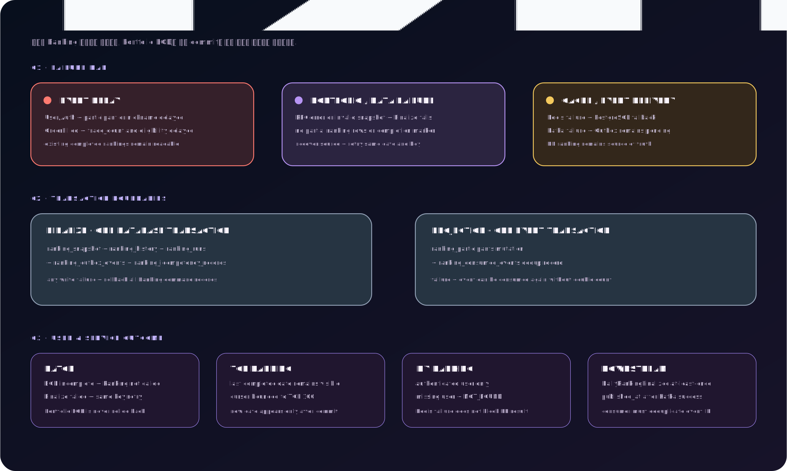

<div align="right">

[🔝 Back to Top](#top)

</div>

---

## ⭐ Wishlist Service

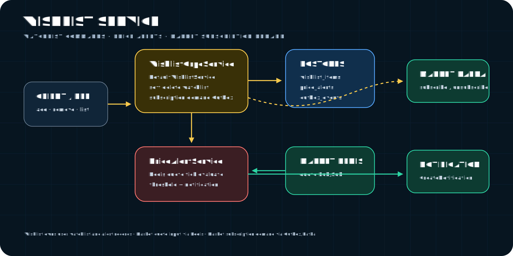

### Role

`wishlist-service`는 사용자의 관심 종목을 관리하고, 관심 종목 가격이 크게 움직이면 알림을 보내는 서비스입니다.  
또한 관심 유저 수가 0→1 또는 1→0으로 변할 때 market-service에 실시간 시세 구독 수요를 알립니다.

### Responsibilities

| Feature | Description |
|---|---|
| 관심종목 등록 | 특정 종목을 관심종목으로 등록 |
| 관심종목 삭제 | soft delete 방식으로 등록 해제 |
| 관심종목 목록 조회 | 사용자별 관심 종목 페이지 조회 |
| 급등락 감지 | Redis Pub/Sub 시세를 받아 시가 대비 등락률 계산 |
| 급등락 알림 | 임계치 초과 시 notification-service로 알림 발송 |
| 구독 수요 이벤트 | market-service에 실시간 시세 구독 켜기/끄기 신호 발행 |

### Communication

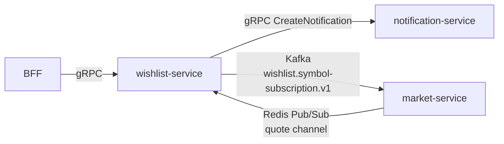
```mermaid
flowchart LR
    BFF["BFF"] -->|"gRPC"| Wishlist["wishlist-service"]
    Market["market-service"] -->|"Redis Pub/Sub<br/>quote channel"| Wishlist
    Wishlist -->|"gRPC CreateNotification"| Notification["notification-service"]
    Wishlist -->|"Kafka<br/>wishlist.symbol-subscription.v1"| Market
```

### Core Flow

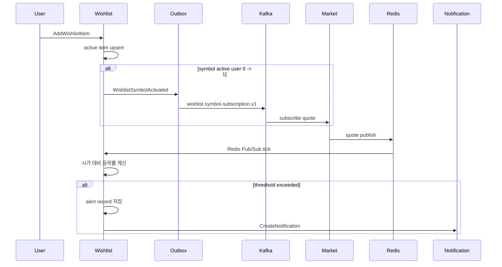
```mermaid
sequenceDiagram
    participant U as User
    participant W as Wishlist
    participant O as Outbox
    participant K as Kafka
    participant M as Market
    participant R as Redis
    participant N as Notification

    U->>W: AddWishlistItem
    W->>W: active item upsert
    alt symbol active user 0 -> 1
        W->>O: WishlistSymbolActivated
        O->>K: wishlist.symbol-subscription.v1
        K->>M: subscribe quote
    end

    M->>R: quote publish
    R->>W: Redis Pub/Sub tick
    W->>W: 시가 대비 등락률 계산
    alt threshold exceeded
        W->>W: alert record 저장
        W->>N: CreateNotification
    end
```

### Engineering Points

| Point | Description |
|---|---|
| Natural Idempotency | 별도 idempotency table 없이 upsert + active unique index로 중복 방지 |
| Soft Delete | 삭제 시 row를 지우지 않고 `deleted_at`으로 비활성화 |
| Redis for Quotes | 실시간 시세는 빠른 전달이 중요하므로 Redis Pub/Sub 사용 |
| Kafka for Subscription | 구독 수요 변경은 반드시 전달되어야 하므로 Outbox + Kafka 사용 |
| Notification Retry | 알림 발송 실패 시 `notification_id IS NULL` alert를 스케줄러가 재시도 |
| Duplicate Alert Guard | 동일 사용자/종목/날짜/방향/임계치 unique 제약으로 중복 알림 방지 |

<div align="right">

[🔝 Back to Top](#top)

</div>

---

## 📰 News Service

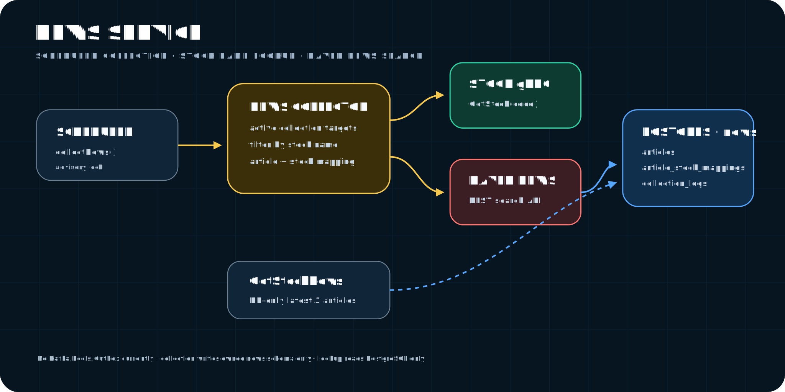

### Role

`news-service`는 종목별 최신 뉴스를 수집하고 조회하는 서비스입니다.  
조회 API는 외부 Naver API를 직접 호출하지 않고, Scheduler가 미리 수집해 저장한 DB 데이터만 반환합니다.

### Responsibilities

| Feature | Description |
|---|---|
| 종목별 뉴스 조회 | `NewsService.GetStockNews` gRPC로 최신 3건 반환 |
| 뉴스 수집 | 평일 cron 기반 `NewsCollectionScheduler.collectNews()` 실행 |
| 종목명 조회 | `stock-service` gRPC `GetStock(allow_fallback=false)` 호출 |
| 외부 검색 | Naver News REST API 검색 |
| 중복 저장 방지 | URL unique, `(article_id, stock_code)` unique |
| 수집 로그 | 성공/실패/부분실패 결과를 `collection_logs`에 저장 |

### Collection Flow

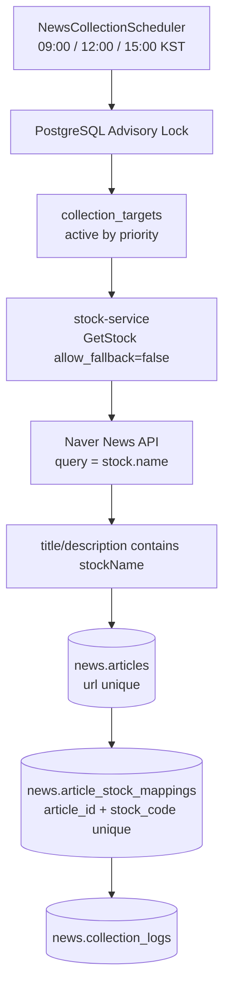
```mermaid
flowchart TD
    Scheduler["NewsCollectionScheduler<br/>09:00 / 12:00 / 15:00 KST"] --> Lock["PostgreSQL Advisory Lock"]
    Lock --> Targets["collection_targets<br/>active by priority"]
    Targets --> Stock["stock-service<br/>GetStock allow_fallback=false"]
    Stock --> Naver["Naver News API<br/>query = stock.name"]
    Naver --> Filter["title/description contains stockName"]
    Filter --> Articles[("news.articles<br/>url unique")]
    Articles --> Mapping[("news.article_stock_mappings<br/>article_id + stock_code unique")]
    Mapping --> Logs[("news.collection_logs")]
```

### Query Flow

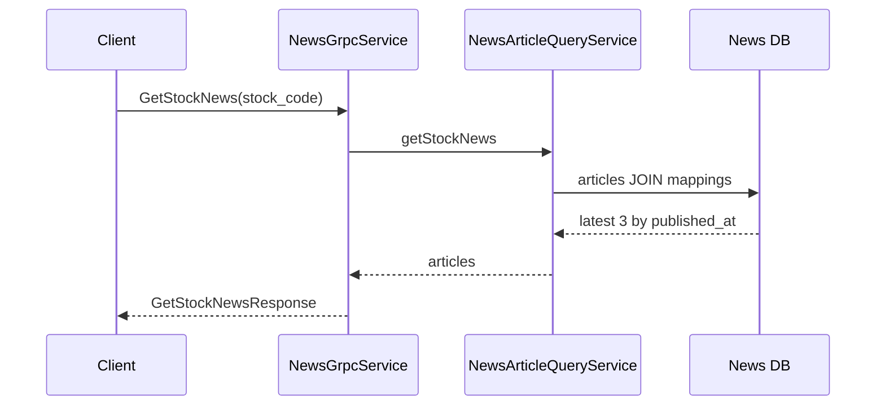
```mermaid
sequenceDiagram
    participant C as Client
    participant G as NewsGrpcService
    participant Q as NewsArticleQueryService
    participant DB as News DB

    C->>G: GetStockNews(stock_code)
    G->>Q: getStockNews
    Q->>DB: articles JOIN mappings
    DB-->>Q: latest 3 by published_at
    Q-->>G: articles
    G-->>C: GetStockNewsResponse
```

### Engineering Points

| Point | Description |
|---|---|
| Read Isolation | 조회 시 Naver/Stock 호출 없이 DB만 조회 |
| MSA Boundary | 종목명 원천은 stock-service가 소유, news-service는 DB 직접 조회 금지 |
| Scheduler Lock | PostgreSQL advisory lock으로 중복 수집 방지 |
| Target-level Failure | 한 target 실패가 전체 수집 중단으로 전파되지 않음 |
| No Outbox Yet | 현재 Kafka, Redis, Outbox, idempotency table 미사용 |
| No FK | news schema 내부 테이블에도 외부 서비스 FK를 만들지 않음 |

<div align="right">

[🔝 Back to Top](#top)

</div>

---

# 🧑‍💻 Experience Platform Services

Investment Core가 “투자 기능”을 담당한다면, Experience Platform은 사용자가 Candle 안에서 로그인하고, 프로필을 만들고, 학습하고, 채팅하고, 알림을 받는 **사용자 경험 기반 도메인**을 담당합니다.

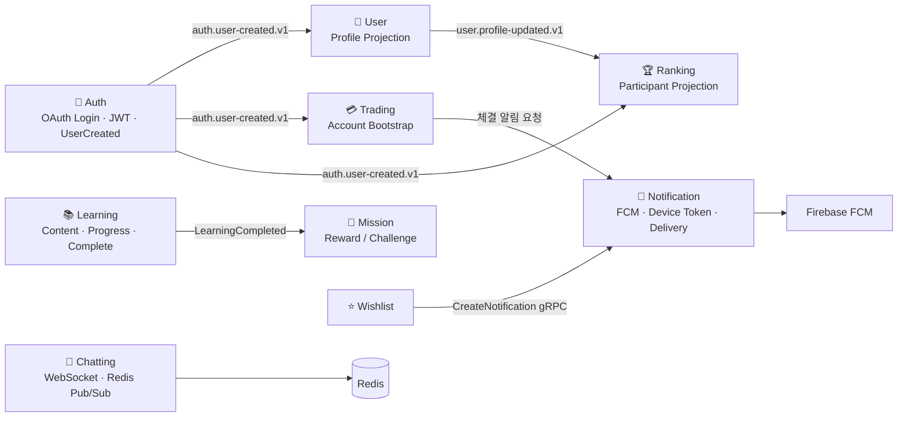
```mermaid
flowchart LR
    Auth["🔐 Auth<br/>OAuth Login · JWT · UserCreated"] -->|"auth.user-created.v1"| User["👤 User<br/>Profile Projection"]
    Auth -->|"auth.user-created.v1"| Trading["💳 Trading<br/>Account Bootstrap"]
    Auth -->|"auth.user-created.v1"| Ranking["🏆 Ranking<br/>Participant Projection"]

    User -->|"user.profile-updated.v1"| Ranking
    Learning["📚 Learning<br/>Content · Progress · Complete"] -->|"LearningCompleted"| Mission["🎯 Mission<br/>Reward / Challenge"]
    Chatting["💬 Chatting<br/>WebSocket · Redis Pub/Sub"] --> Redis[("Redis")]
    Notification["🔔 Notification<br/>FCM · Device Token · Delivery"] --> Firebase["Firebase FCM"]
    Wishlist["⭐ Wishlist"] -->|"CreateNotification gRPC"| Notification
    Trading -->|"체결 알림 요청"| Notification
```

---

## 🔐 Auth Service

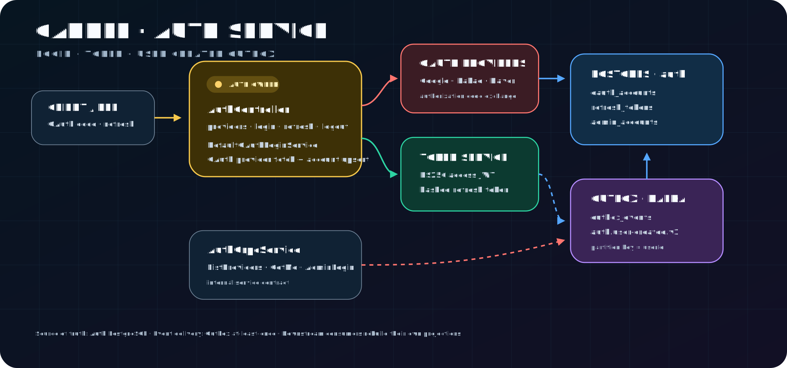

### Role

`auth-service`는 Candle의 인증 진입점입니다. OAuth 로그인으로 사용자를 식별하고, JWT access token과 refresh token을 발급·회전·폐기합니다. 신규 사용자가 처음 로그인하면 `UserCreated` 이벤트를 Outbox에 기록하고 Kafka로 발행합니다.

### Responsibilities

| Area | Description |
|---|---|
| OAuth Login | Google, Kakao, Naver OAuth provider 로그인 |
| Token Issue | RS256 JWT access token 발급 |
| Refresh Token | refresh token 저장, 회전, 로그아웃 폐기 |
| Auth Info | 인증 사용자 정보 조회 |
| Admin | 관리자 로그인과 관리자 계정 부트스트랩 |
| UserCreated Event | 신규 사용자 생성 이벤트 Outbox 기록 및 Kafka 발행 |

### APIs

| Type | API / RPC | Purpose |
|---|---|---|
| HTTP | `GET /api/v1/auth/providers` | 사용 가능한 OAuth provider 목록 조회 |
| HTTP | `POST /api/v1/auth/oauth/{provider}` | OAuth code 로그인 |
| HTTP | `POST /api/v1/auth/token/refresh` | refresh token 회전 |
| HTTP | `POST /api/v1/auth/logout` | refresh token 폐기 |
| gRPC | `ListProviders` | 내부 provider 목록 조회 |
| gRPC | `GetMe` | user_id 기준 인증 계정 조회 |
| gRPC | `AdminLogin` | 관리자 로그인 |

### Core Flow

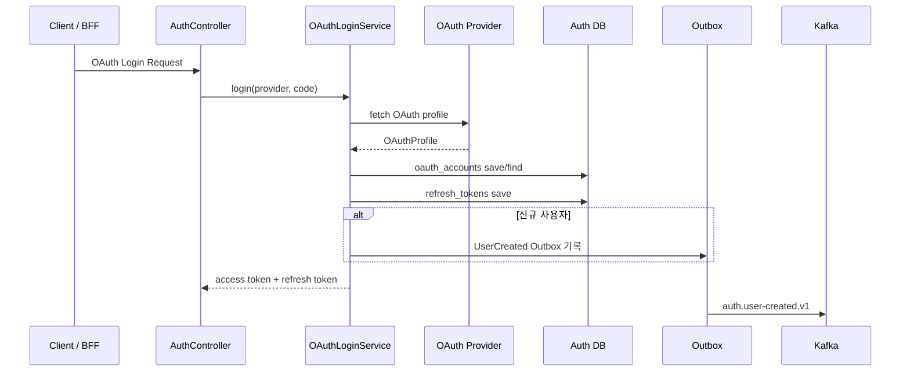
```mermaid
sequenceDiagram
    participant C as Client / BFF
    participant A as AuthController
    participant O as OAuthLoginService
    participant P as OAuth Provider
    participant DB as Auth DB
    participant OB as Outbox
    participant K as Kafka

    C->>A: OAuth Login Request
    A->>O: login(provider, code)
    O->>P: fetch OAuth profile
    P-->>O: OAuthProfile
    O->>DB: oauth_accounts save/find
    O->>DB: refresh_tokens save
    alt 신규 사용자
        O->>OB: UserCreated Outbox 기록
    end
    O-->>A: access token + refresh token
    OB->>K: auth.user-created.v1
```

### Engineering Points

| Point | Description |
|---|---|
| OAuth Identity | `(provider, provider_subject)`로 OAuth 계정 중복 방지 |
| Token Security | access token은 RS256 JWT, refresh token은 원문이 아닌 SHA-256 hash 저장 |
| Refresh Rotation | refresh token 회전 시 기존 token은 `revoked_at`으로 폐기 |
| Outbox | 신규 사용자 저장과 `UserCreated` Outbox 기록을 같은 transaction으로 처리 |
| At-least-once | Kafka 발행은 at-least-once이며 downstream은 eventId로 중복 방지 |
| Failure Impact | Kafka 장애 시 Auth DB commit은 유지되고 Outbox publisher가 재시도 |

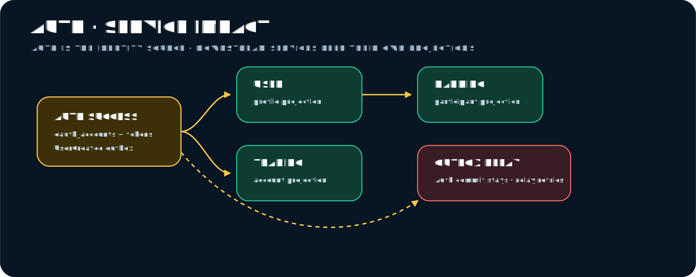

<div align="right">

[🔝 Back to Top](#top)

</div>

---

## 👤 User Service

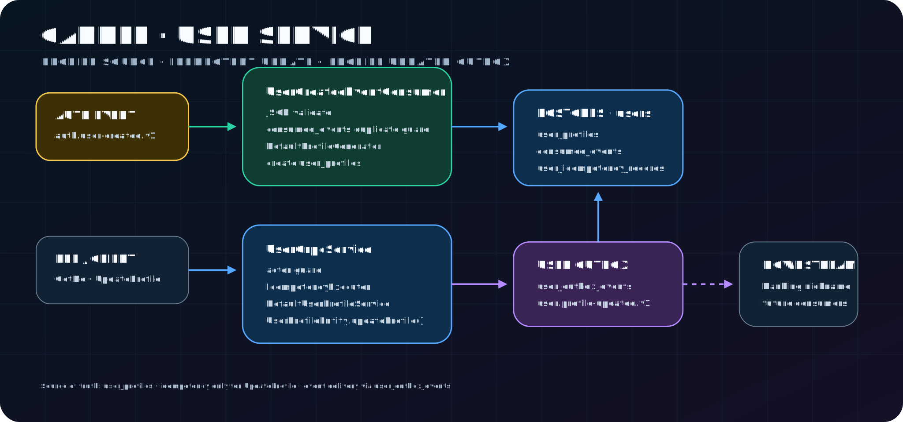

### Role

`user-service`는 Candle 사용자의 프로필 Read/Write 모델을 소유합니다. Auth의 `UserCreated` 이벤트를 소비해 기본 프로필을 만들고, 사용자의 프로필 수정 요청을 멱등하게 처리한 뒤 `UserProfileUpdated` 이벤트를 Outbox로 발행합니다.

### Responsibilities

| Area | Description |
|---|---|
| Profile Read | 인증 사용자 프로필 조회 |
| Profile Update | 닉네임과 프로필 이미지 수정 |
| Auth Projection | `auth.user-created.v1` 소비 후 기본 프로필 생성 |
| Idempotency | `UpdateProfile` 중복 요청 응답 재생 |
| User Event | `user.profile-updated.v1` Outbox 기록 및 Kafka 발행 |

### Flow

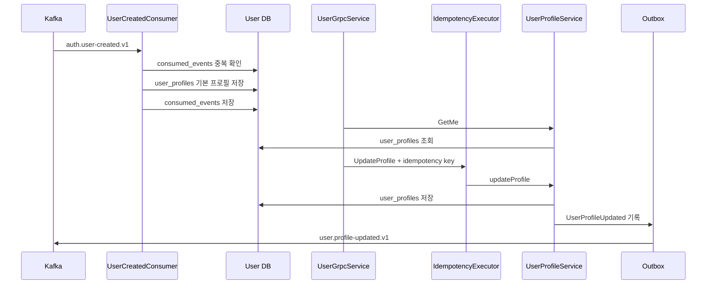
```mermaid
sequenceDiagram
    participant K as Kafka
    participant C as UserCreatedConsumer
    participant DB as User DB
    participant G as UserGrpcService
    participant I as IdempotencyExecutor
    participant S as UserProfileService
    participant OB as Outbox

    K->>C: auth.user-created.v1
    C->>DB: consumed_events 중복 확인
    C->>DB: user_profiles 기본 프로필 저장
    C->>DB: consumed_events 저장

    G->>S: GetMe
    S->>DB: user_profiles 조회

    G->>I: UpdateProfile + idempotency key
    I->>S: updateProfile
    S->>DB: user_profiles 저장
    S->>OB: UserProfileUpdated 기록
    OB->>K: user.profile-updated.v1
```

### APIs

| RPC | Purpose | Idempotency |
|---|---|---|
| `GetMe` | 인증 사용자 프로필 조회 | - |
| `UpdateProfile` | 닉네임·프로필 이미지 수정 | ✅ |

### Engineering Points

| Point | Description |
|---|---|
| Actor Validation | metadata actor와 request `user_id`가 다르면 `PERMISSION_DENIED` |
| Event Dedup | Auth 이벤트는 `consumed_events.event_id`로 중복 소비 방지 |
| Idempotent Update | 같은 key + 같은 payload는 저장된 응답 재생 |
| Outbox | 프로필 저장과 `UserProfileUpdated` 기록을 같은 transaction에서 처리 |
| No Redis | User Service는 Redis를 사용하지 않음 |
| Downstream Impact | Ranking은 `UserProfileUpdated`를 소비해 랭킹 닉네임을 최신화 |

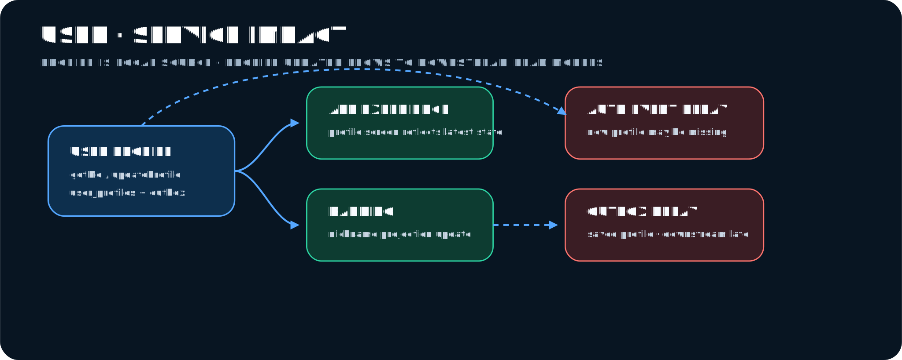

<div align="right">

[🔝 Back to Top](#top)

</div>

---

## 📚 Learning Service


### Role

`learning-service`는 투자 학습 콘텐츠를 관리하고 사용자 학습 진도를 추적합니다. 사용자가 학습 콘텐츠를 완료하면 `LearningCompleted` 이벤트를 Outbox에 저장하고 Kafka로 발행해 Mission 등 후속 도메인이 사용할 수 있게 합니다.

### Responsibilities

| Area | Description |
|---|---|
| Content Management | 관리자용 콘텐츠 생성/수정/삭제/목록 |
| Content Query | 사용자용 콘텐츠 상세/목록/검색/추천 |
| Learning State | 진도율 업데이트, 완료 처리, 즐겨찾기 |
| Learning Stats | 사용자 학습 통계와 카테고리별 진도 |
| Outbox | 학습 완료 이벤트 `LearningCompleted` 발행 |
| Idempotency | 모든 쓰기 RPC 중복 요청 방지 |

### APIs

| Group | RPC | Purpose | Idempotency |
|---|---|---|---|
| Admin | `CreateContent` | 학습 콘텐츠 생성 | ✅ |
| Admin | `UpdateContent` | 콘텐츠 부분 수정 | ✅ |
| Admin | `DeleteContent` | soft delete | ✅ |
| Admin | `ListAdminContents` | 관리자 목록 조회 | - |
| User | `GetContent` | 상세 조회 + 조회수 증가 + 상태 포함 | - |
| User | `ListContents` | 필터/정렬 목록 조회 | - |
| User | `SearchContents` | 제목 기반 검색 | - |
| User | `GetRecommendedContents` | 미열람 콘텐츠 추천 | - |
| State | `UpdateProgress` | 진도율 업데이트, 100% 자동 완료 | ✅ |
| State | `CompleteContent` | 학습 완료 처리 | ✅ |
| State | `ToggleFavorite` | 즐겨찾기 토글 | ✅ |
| State | `GetUserLearningStats` | 학습 통계 | - |
| State | `ListFavorites` | 즐겨찾기 목록 | - |

### Core Flow

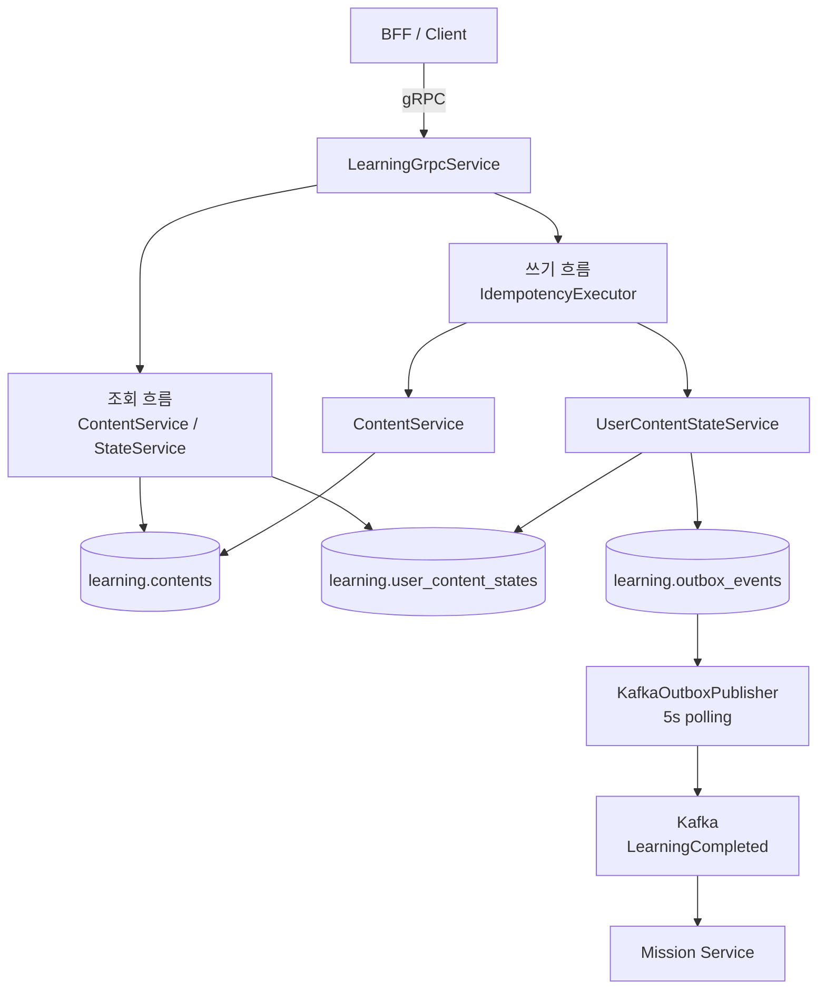
```mermaid
flowchart TB
    BFF["BFF / Client"] -->|"gRPC"| Grpc["LearningGrpcService"]

    Grpc --> Query["조회 흐름<br/>ContentService / StateService"]
    Grpc --> Write["쓰기 흐름<br/>IdempotencyExecutor"]

    Query --> ContentRepo[("learning.contents")]
    Query --> StateRepo[("learning.user_content_states")]

    Write --> ContentService["ContentService"]
    Write --> StateService["UserContentStateService"]
    ContentService --> ContentRepo
    StateService --> StateRepo
    StateService --> Outbox[("learning.outbox_events")]

    Outbox --> Publisher["KafkaOutboxPublisher<br/>5s polling"]
    Publisher --> Kafka["Kafka<br/>LearningCompleted"]
    Kafka --> Mission["Mission Service"]
```

### Engineering Points

| Point | Description |
|---|---|
| Soft Delete | `deleted_at IS NULL`을 `@SQLRestriction`으로 모든 JPA 조회에 자동 적용 |
| Read Count | atomic update로 동시 조회 lost update 방지 |
| Idempotency | `userId + operation + idempotencyKey` 기준 중복 감지 |
| Outbox | 학습 완료와 이벤트 기록을 같은 transaction에서 처리 |
| Progress Auto Complete | 진도율 100% 시 자동 완료 처리 |
| Mission Link | `LearningCompleted` 이벤트는 Mission/보상 도메인의 입력으로 사용 가능 |

<div align="right">

[🔝 Back to Top](#top)

</div>

---

## 💬 Chatting Service


### Role

`chatting-service`는 종목별 실시간 채팅방을 제공합니다. 종목코드로 방을 배정하고, WebSocket 연결을 통해 같은 방 사용자끼리 실시간 메시지를 주고받게 합니다. 메시지는 DB에 저장하지 않고 Redis Pub/Sub로 현재 접속 중인 사용자에게만 전달합니다.

### Responsibilities

| Area | Description |
|---|---|
| Room Assignment | 종목코드 기준 방 배정, 정원 초과 시 새 방 생성 |
| WebSocket | `/chat/ws` 연결, 메시지 송수신 |
| JWT Handshake | WebSocket 연결 시 auth-service 공개키 기반 JWT 검증 |
| Redis Counter | 방별 현재 인원 카운트 |
| Redis Pub/Sub | 여러 서버 인스턴스 간 메시지 팬아웃 |
| Stateless Scale-out | 서버 메모리에 채팅 상태를 저장하지 않음 |

### APIs

| Type | Endpoint | Purpose |
|---|---|---|
| REST | `GET /chat/rooms?symbol={symbol}` | 종목별 방 배정 |
| WebSocket | `GET /chat/ws?room={roomId}&token={jwt}` | 실시간 채팅 연결 |

### Core Flow

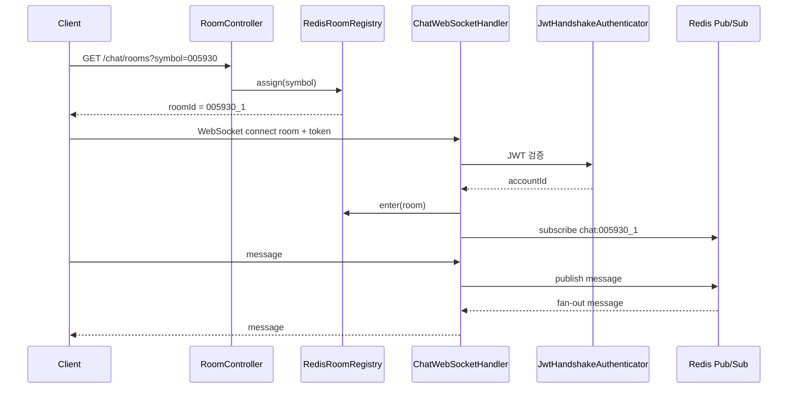
```mermaid
sequenceDiagram
    participant C as Client
    participant R as RoomController
    participant Registry as RedisRoomRegistry
    participant WS as ChatWebSocketHandler
    participant Auth as JwtHandshakeAuthenticator
    participant Redis as Redis Pub/Sub

    C->>R: GET /chat/rooms?symbol=005930
    R->>Registry: assign(symbol)
    Registry-->>C: roomId = 005930_1

    C->>WS: WebSocket connect room + token
    WS->>Auth: JWT 검증
    Auth-->>WS: accountId
    WS->>Registry: enter(room)
    WS->>Redis: subscribe chat:005930_1
    C->>WS: message
    WS->>Redis: publish message
    Redis-->>WS: fan-out message
    WS-->>C: message
```

### Redis Keys

| Key / Channel | Type | Purpose |
|---|---|---|
| `chat:rooms:{symbol}` | String counter | 종목별 최대 방 번호 |
| `{symbol}_{room}_count` | String counter + TTL | 방별 현재 인원 |
| `chat:{symbol}_{room}` | Pub/Sub channel | 메시지 팬아웃 |

### Engineering Points

| Point | Description |
|---|---|
| WebSocket | 서버가 먼저 메시지를 밀어넣어야 하는 실시간 채팅에 적합 |
| No Message DB | 영구 이력이 아닌 현재 실시간 대화에 집중 |
| Stateless Server | sticky session 없이 scale-out 가능 |
| Redis Pub/Sub | 여러 인스턴스에 흩어진 연결을 하나의 채널로 팬아웃 |
| Self JWT Verify | WebSocket 직결 구조 때문에 서비스 자체에서 JWT 검증 |
| Counter TTL | 비정상 종료로 leave가 누락되어도 카운터가 영구 누수되지 않게 방어 |

<div align="right">

[🔝 Back to Top](#top)

</div>

---

## 🔔 Notification Service

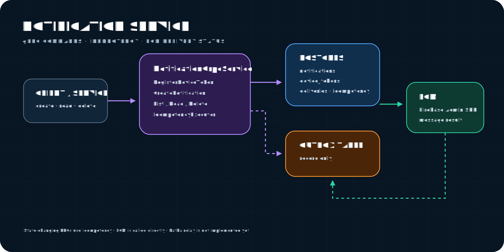

### Role

`notification-service`는 사용자 알림 생성, FCM 디바이스 토큰 등록, 알림 목록 조회, 읽음 처리, 삭제, 배송 상태 조회를 담당합니다. FCM 발송은 Firebase Admin SDK를 통해 직접 수행합니다.

### Responsibilities

| Area | Description |
|---|---|
| Device Token | FCM 디바이스 토큰 등록 또는 재활성화 |
| Notification Create | 알림 저장, 활성 토큰 조회, FCM 발송 |
| Delivery Status | 디바이스별 발송 결과 저장/조회 |
| Notification Query | 알림 목록, 미읽음 개수 조회 |
| Read / Delete | 단건 읽음, 전체 읽음, 단건 삭제 |
| Idempotency | 상태 변경 RPC 중복 요청 응답 재사용 |
| Outbox Record | 상태 변경 시 `notification.outbox_events`에 내부 이벤트 기록 |

### APIs

| RPC | Purpose | State Change | Idempotency |
|---|---|---|---|
| `RegisterDeviceToken` | FCM 토큰 등록/재활성화 | ✅ | ✅ |
| `CreateNotification` | 알림 생성 + FCM 발송 + delivery 기록 | ✅ | ✅ |
| `ListNotifications` | 알림 목록 cursor 조회 | - | - |
| `MarkAsRead` | 단건 읽음 처리 | ✅ | ✅ |
| `MarkAllAsRead` | 전체 미읽음 읽음 처리 | ✅ | ✅ |
| `DeleteNotification` | 알림 단건 hard delete | ✅ | ✅ |
| `CountUnread` | 미읽음 개수 조회 | - | - |
| `GetDeliveryStatus` | 특정 알림의 delivery 결과 조회 | - | - |

### Core Flow

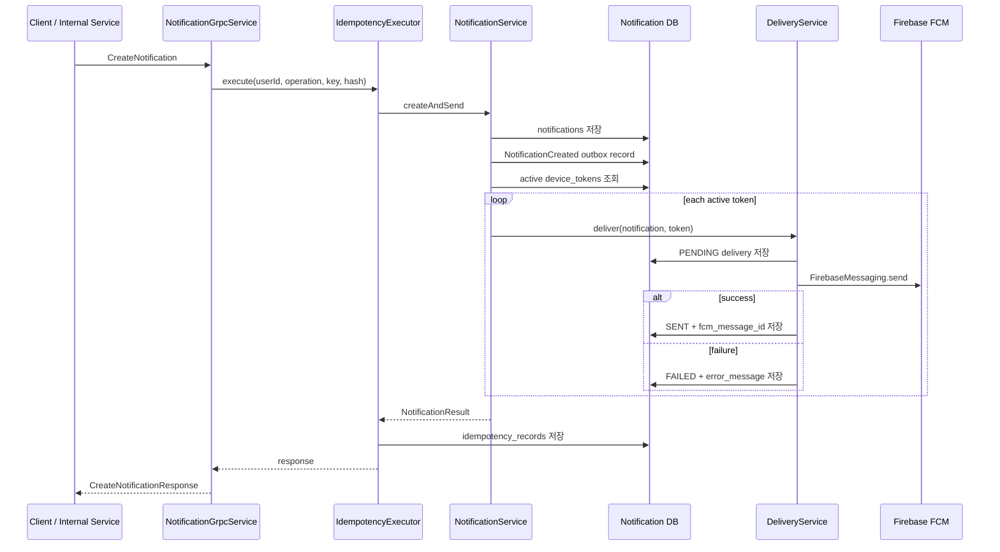
```mermaid
sequenceDiagram
    participant C as Client / Internal Service
    participant G as NotificationGrpcService
    participant I as IdempotencyExecutor
    participant S as NotificationService
    participant DB as Notification DB
    participant D as DeliveryService
    participant F as Firebase FCM

    C->>G: CreateNotification
    G->>I: execute(userId, operation, key, hash)
    I->>S: createAndSend
    S->>DB: notifications 저장
    S->>DB: NotificationCreated outbox record
    S->>DB: active device_tokens 조회
    loop each active token
        S->>D: deliver(notification, token)
        D->>DB: PENDING delivery 저장
        D->>F: FirebaseMessaging.send
        alt success
            D->>DB: SENT + fcm_message_id 저장
        else failure
            D->>DB: FAILED + error_message 저장
        end
    end
    S-->>I: NotificationResult
    I->>DB: idempotency_records 저장
    I-->>G: response
    G-->>C: CreateNotificationResponse
```

### DB Model

```mermaid
erDiagram
    NOTIFICATIONS ||--o{ NOTIFICATION_DELIVERIES : has
    DEVICE_TOKENS ||--o{ NOTIFICATION_DELIVERIES : receives

    NOTIFICATIONS {
        uuid id PK
        uuid user_id
        enum type
        string title
        string body
        enum status
        jsonb meta_json
        timestamptz read_at
    }

    DEVICE_TOKENS {
        uuid id PK
        uuid user_id
        string fcm_token UK
        enum platform
        boolean active
    }

    NOTIFICATION_DELIVERIES {
        uuid id PK
        uuid notification_id FK
        uuid device_token_id FK
        enum status
        string fcm_message_id
        string error_message
    }
```

### Engineering Points

| Point | Description |
|---|---|
| FCM Direct Send | `FirebaseFcmClient`가 Firebase Admin SDK를 통해 직접 전송 |
| Delivery Record | 토큰별 `PENDING → SENT/FAILED` 상태를 DB에 기록 |
| Idempotency | 상태 변경 RPC는 `user_id + operation + idempotency_key` 기준으로 응답 재사용 |
| Cursor Pagination | `created_at DESC, id DESC` 기준 cursor pagination |
| Outbox Scope | 현재는 Outbox record까지만 구현, Kafka publisher는 미구현 |
| Hard Delete | `DeleteNotification`은 soft delete가 아닌 hard delete |
| No Redis | Notification Service는 Redis/cache를 사용하지 않음 |

<div align="right">

[🔝 Back to Top](#top)

</div>

---


# ⚙️ Operation Layer Services

Operation Layer는 Candle의 일일 운영 흐름을 담당합니다.  
API 서버가 실시간 요청을 처리한다면, Batch는 정해진 시각에 **예약 주문 처리 → 일봉 확정 → 포트폴리오 EOD → 일별 랭킹 확정 → 종목 마스터 동기화**를 순서대로 실행합니다.

```mermaid
flowchart LR
    A["08:30<br/>PREV_CLOSE 예약"] --> B["09:00<br/>OPEN + LIMIT 전환"]
    B --> C["15:30<br/>미체결 주문 만료<br/>stale 예약 정리"]
    C --> D["15:40<br/>일봉 마감<br/>종가 예약 처리"]
    D --> E["16:00<br/>Portfolio EOD"]
    E --> F["16:20<br/>Daily Ranking Finalize"]
    F --> G["16:30<br/>Stock Master Sync"]
```

---

## 🕯️ Batch Service

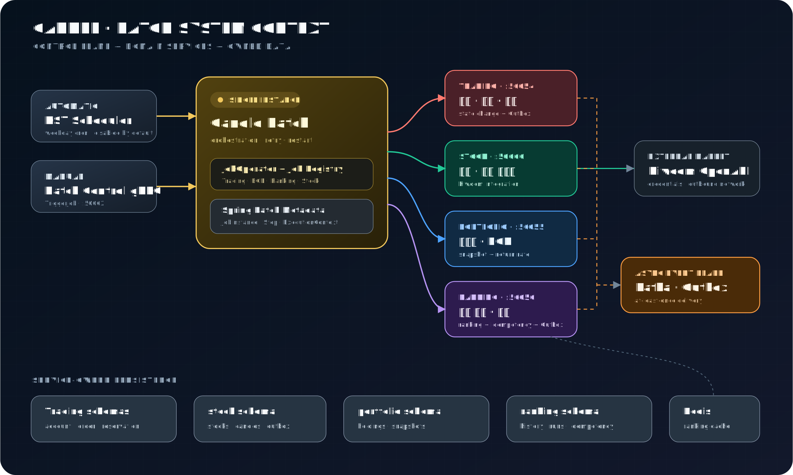

### Role

`batch`는 Candle의 운영 오케스트레이션 서비스입니다.  
Batch는 도메인 DB를 직접 수정하지 않고, 정해진 시각과 순서에 따라 Trading, Stock, Portfolio, Ranking 서비스의 gRPC API를 호출합니다. 최종 데이터와 트랜잭션은 항상 호출받은 도메인 서비스가 소유합니다.

### Responsibilities

| Area | Description |
|---|---|
| Scheduler | Asia/Seoul 기준 cron으로 일일 Job 자동 실행 |
| Manual Control | Batch Control gRPC로 수동 Job 실행 |
| Job Orchestration | 선행 Job 완료 여부 확인 후 후속 Job 실행 |
| Restart | Spring Batch metadata 기반 실패 지점 재시작 |
| Retry | 일시적 gRPC 오류에 대해 제한된 횟수 재시도 |
| Guard | Portfolio EOD 완료 전 Ranking 실행 차단 |
| Metadata | JobInstance, JobExecution, StepExecution, ExecutionContext 기록 |

### Daily Timeline

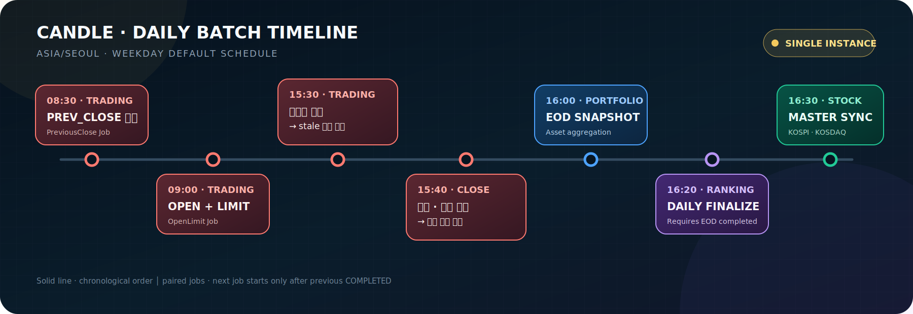

| Time(KST) | Job Group | Main RPC / Action | Owner Service |
|---|---|---|---|
| 08:30 | Previous Close Reservation | `ProcessPrevCloseReservations` | Trading |
| 09:00 | Open Limit Reservation | `ProcessOpenLimitReservations` | Trading |
| 15:30 | Market Close Cleanup | `ExpirePendingOrders` → stale converting cleanup | Trading |
| 15:40 | Today Close Processing | `CloseDailyCandles` → `ProcessTodayCloseReservations` | Stock / Trading |
| 16:00 | Portfolio EOD | `ListActiveHolders` → `RecordDailySnapshot` | Portfolio |
| 16:20 | Daily Ranking | `FinalizeDailyRanking` | Ranking |
| 16:30 | Stock Master Sync | `SyncStocks(KOSPI)` → `SyncStocks(KOSDAQ)` | Stock |

### Trading Day Chain

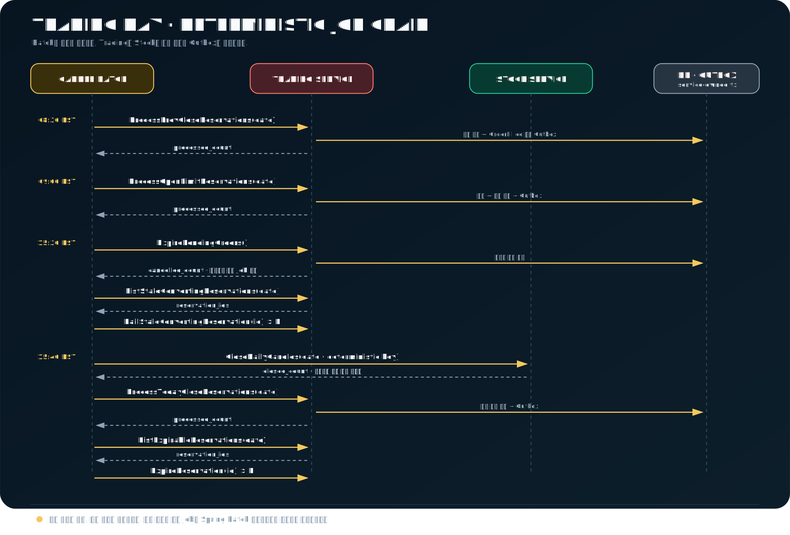

Trading 관련 Batch는 예약·주문 상태를 직접 변경하지 않습니다.  
Batch는 정해진 시간에 Trading 또는 Stock의 상태 변경 RPC를 호출하고, 실제 DB 변경과 Outbox 기록은 호출받은 서비스의 transaction에서 처리됩니다.

```mermaid
sequenceDiagram
    participant B as Candle Batch
    participant T as Trading Service
    participant S as Stock Service
    participant DB as Domain DB / Outbox

    B->>T: 08:30 ProcessPrevCloseReservations
    T->>DB: 예약 처리 + Outbox
    B->>T: 09:00 ProcessOpenLimitReservations
    T->>DB: 예약 → 주문 전환 + Outbox
    B->>T: 15:30 ExpirePendingOrders
    T->>DB: 미체결 주문 만료
    B->>T: ListStaleConvertingReservations / Fail...
    T->>DB: stale 예약 실패 처리
    B->>S: 15:40 CloseDailyCandles
    S->>DB: 일봉 확정 + Outbox
    B->>T: ProcessTodayCloseReservations
    T->>DB: 종가 예약 처리 + Outbox
    B->>T: ListExpirableReservations / Expire...
    T->>DB: 잔여 예약 만료
```

### Portfolio EOD → Ranking Finalize

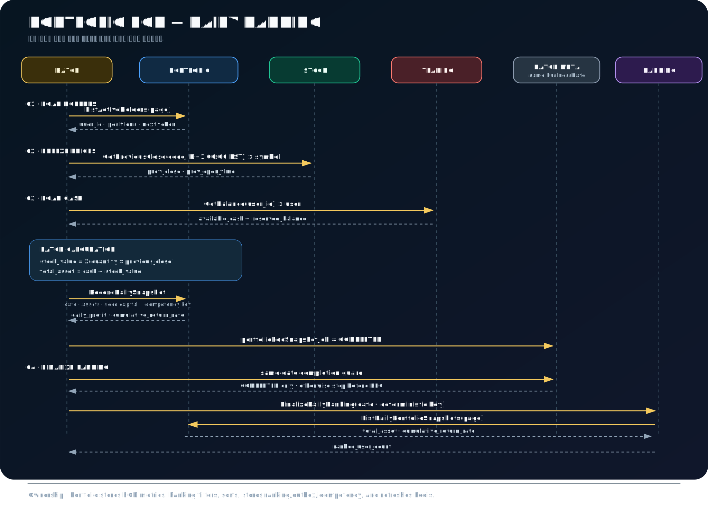

Portfolio EOD는 활성 보유자를 페이지로 읽고, 종목별 확정 종가와 사용자별 현금을 모아 일별 스냅샷을 저장합니다.  
Ranking은 같은 거래일의 `portfolioEodSnapshotJob`이 `COMPLETED`인 경우에만 실행됩니다.

| Step | Batch Action | Data Owner |
|---|---|---|
| 1 | `ListActiveHolders(page)`로 활성 보유자 조회 | Portfolio |
| 2 | `GetPreviousClose(code)`로 확정 종가 조회 | Stock |
| 3 | `GetBalance(user_id)`로 현금 잔고 조회 | Trading |
| 4 | `stock_value`, `total_asset` 계산 후 `RecordDailySnapshot` 호출 | Portfolio |
| 5 | Batch metadata에서 EOD 완료 여부 확인 | Batch |
| 6 | `FinalizeDailyRanking(rankingDate)` 호출 | Ranking |

### Stock Master Sync

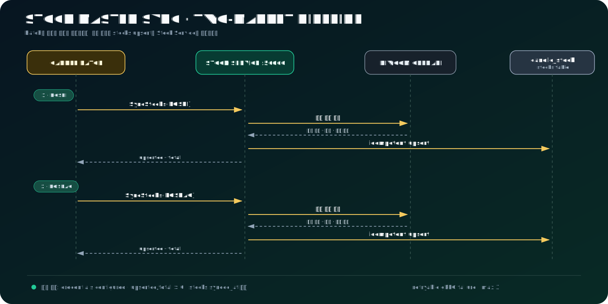

Stock Sync는 Batch가 시장 순서만 지정하고, Kiwoom 통신·응답 파싱·`stocks` upsert는 Stock Service가 전부 담당합니다.

```text
Batch stockSyncJob
  -> StockService.SyncStocks(KOSPI)
  -> StockService.SyncStocks(KOSDAQ)
  -> Stock Service가 Kiwoom 조회와 stocks upsert 수행
```

### Service Impact & Failure Containment

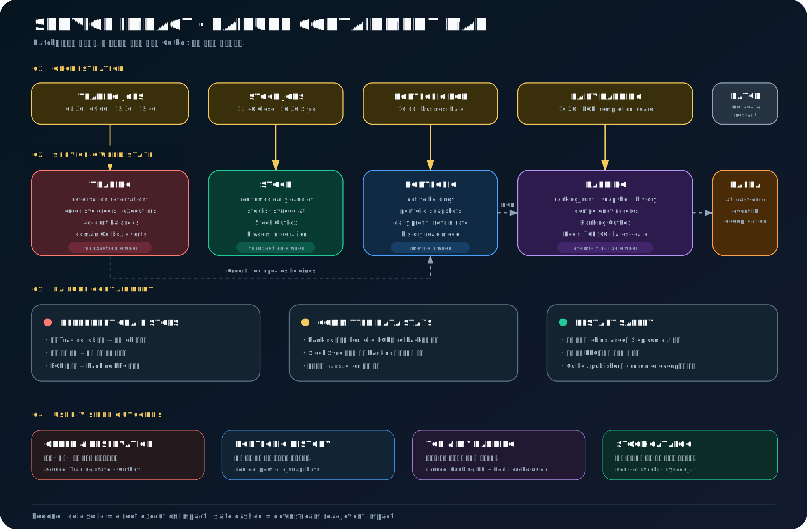

| Failure Point | Protected Behavior | Recovery |
|---|---|---|
| gRPC 연결 실패 | Step이 `FAILED`로 기록되고 성공으로 위장하지 않음 | 대상 서비스 복구 후 같은 날짜로 재시작 |
| Trading 선행 Job 실패 | 후속 stale/expire Job 미실행 | 선행 Job 성공 후 후속 Job 실행 |
| Stock 일봉 마감 실패 | 종가 예약 처리와 EOD 평가 기준 생성 차단 | `tradingTodayCloseJob` 재실행 |
| Portfolio EOD 미완료 | Ranking RPC를 호출하지 않음 | EOD 복구 후 Ranking 재실행 |
| Ranking transaction 실패 | 랭킹·Outbox·멱등성 레코드 함께 rollback | 같은 `rankingDate`와 동일 key로 재시작 |
| Redis 장애 | Ranking DB 원본은 유지 | DB fallback 또는 캐시 복구 |
| Kiwoom 장애 | 다른 일일 Job과 서비스 DB에 영향 없음 | 인증/응답 복구 후 `stockSyncJob` 재실행 |

### Engineering Points

| Point | Description |
|---|---|
| Single Batch Instance | 현재 운영 전제는 Batch replica 1개 |
| Service-Owned Transaction | Batch transaction은 원격 서비스 transaction을 대체하지 않음 |
| Deterministic Idempotency Key | `businessDate` / `rankingDate` 기준으로 같은 의미의 요청은 같은 key 사용 |
| Completion Guard | Ranking은 같은 날짜 Portfolio EOD 완료 여부를 먼저 확인 |
| Safe Restart | 실패 Job은 같은 날짜 parameter로 실패 지점부터 재시작 |
| No Direct DB Mutation | Batch는 Trading/Stock/Portfolio/Ranking DB를 직접 수정하지 않음 |
| Outbox Boundary | 이벤트 발행과 중복 소비는 도메인 서비스의 Outbox/Consumer 정책을 따름 |

<div align="right">

[🔝 Back to Top](#top)

</div>

---

# 🛡 Core Engineering Principles

## 1. Service-Owned Data

각 서비스는 자신의 DB schema와 transaction을 소유합니다.  
다른 서비스의 테이블을 직접 조회하거나 FK로 연결하지 않고 gRPC 또는 Kafka 이벤트로만 연결합니다.

```mermaid
flowchart LR
    A["Service A"] -->|"gRPC / Kafka Event"| B["Service B"]
    A -. "❌ Direct DB Access 금지" .-> BDB[("Service B DB")]
    B --> BDB
```

## 2. Contract-Driven Communication

서비스 간 동기 호출은 `.proto` 기반 gRPC 계약으로 관리합니다.  
요청/응답 구조가 빌드 단계에서 검증되기 때문에 서비스 간 API 불일치를 줄일 수 있습니다.

## 3. Event-Driven Consistency

체결·랭킹·알림·구독 수요처럼 후속 반영이 필요한 흐름은 Kafka 이벤트로 전파합니다.  
핵심 transaction은 소유 서비스 안에서 먼저 commit하고, 다른 서비스는 이벤트를 소비해 read model을 갱신합니다.

## 4. Transactional Outbox

DB 변경과 Kafka 발행 사이의 원자성 문제를 줄이기 위해 Outbox를 사용합니다.

```mermaid
flowchart LR
    Tx["Local Transaction"] --> DomainDB["Domain Table Update"]
    Tx --> Outbox["outbox_events Insert"]
    Outbox --> Publisher["Scheduled Publisher"]
    Publisher --> Kafka["Kafka Topic"]
```

## 5. Idempotency

주문, 예약, 랭킹 확정처럼 재시도 위험이 큰 쓰기 작업은 Idempotency Key를 사용합니다.  
같은 key + 같은 request는 저장된 응답을 재생하고, 같은 key + 다른 request는 충돌로 거부합니다.

<div align="right">

[🔝 Back to Top](#top)

</div>

---

# 🚀 CI/CD & Deployment Architecture

```mermaid
flowchart LR
    Dev["👩‍💻 Developer"] --> Git["GitHub Repository"]
    Git --> Actions["GitHub Actions"]
    Actions --> Build["Gradle Build / Test"]
    Build --> Image["Docker Image"]
    Image --> Deploy["Deployment Environment"]
    Deploy --> App["Candle App<br/>https://app.dev.candle.io.kr"]
    Actions --> Docs["Docusaurus Docs<br/>https://take-profit-institute.github.io/micro-services/"]
```

<div align="right">

[🔝 Back to Top](#top)

</div>

---

# 📂 Project Structure

```text
micro-services/
├── services/
│   ├── auth-service/
│   ├── user-service/
│   ├── market-service/
│   ├── stock-service/
│   ├── trading-service/
│   ├── portfolio-service/
│   ├── ranking-service/
│   ├── wishlist-service/
│   ├── news-service/
│   ├── notification-service/
│   ├── chatting-service/
│   └── learning-service/
│
├── batch/
│   └── candle-batch/
│
├── common/
│   ├── common-proto/
│   ├── common-event/
│   └── common-core/
│
├── website/
│   └── Docusaurus project docs
│
├── docker-compose.yml
├── build.gradle
├── settings.gradle
└── README.md
```

<div align="right">

[🔝 Back to Top](#top)

</div>

---

# ⚙️ Environment Variables

| Variable | Description |
|---|---|
| `SPRING_PROFILES_ACTIVE` | 실행 프로필 |
| `POSTGRES_HOST` / `POSTGRES_PORT` | PostgreSQL 접속 정보 |
| `POSTGRES_DB` / `POSTGRES_USER` / `POSTGRES_PASSWORD` | 서비스별 DB 인증 정보 |
| `REDIS_HOST` / `REDIS_PORT` | Redis 접속 정보 |
| `KAFKA_BOOTSTRAP_SERVERS` | Kafka/Redpanda Broker |
| `JWT_SECRET` | JWT Secret |
| `KIWOOM_*` | Kiwoom API 인증/접속 설정 |
| `NAVER_NEWS_CLIENT_ID` / `NAVER_NEWS_CLIENT_SECRET` | Naver News API 인증 |
| `FCM_CREDENTIALS` | Firebase Cloud Messaging 인증 |
| `*_GRPC_PORT` | 서비스별 gRPC 서버 포트 |
| `*_GRPC_TARGET` | 서비스별 gRPC client target |
| `BATCH_*_ENABLED` | Batch Scheduler 활성화 여부 |

<div align="right">

[🔝 Back to Top](#top)

</div>

---

# 🚀 Build & Run

## 1. Local Infra

```bash
docker compose up -d postgres redis redpanda
```

## 2. Build All

```bash
./gradlew clean build
```

## 3. Run Investment Core Services

```bash
./gradlew :services:market-service:bootRun
./gradlew :services:stock-service:bootRun
./gradlew :services:trading-service:bootRun
./gradlew :services:portfolio-service:bootRun
./gradlew :services:ranking-service:bootRun
./gradlew :services:wishlist-service:bootRun
./gradlew :services:news-service:bootRun
```

## 4. Run Batch

```bash
./gradlew :batch:bootRun
```

## 5. Run Docs

```bash
cd website
npm install
npm run start
```

<div align="right">

[🔝 Back to Top](#top)

</div>

---

# 📄 Documentation Map

📖 Project Docs: https://take-profit-institute.github.io/micro-services/

| Group | Documents |
|---|---|
| Overview | `README.md`, `ARCHITECTURE.md`, `COMMUNICATION.md`, `TROUBLESHOOTING.md` |
| Investment Core | `market-service.md`, `STOCK_SERVICE.md`, `TRADING_SERVICE.md`, `PORTFOLIO_SERVICE.md`, `RANKING_SERVICE.md`, `WISHLIST_SERVICE.md`, `NEWS_SERVICE.md` |
| Experience Platform | `AUTH_SERVICE.md`, `USER_SERVICE.md`, `learning-service-guide.md`, `CHATTING_SERVICE.md`, `NOTIFICATION_SERVICE.md` |
| Operation Layer | `BATCH_ARCHITECTURE.md`, `TRADING_BATCH.md`, `PORTFOLIO_EOD_BATCH.md`, `RANKING_BATCH.md`, `STOCK_SYNC_BATCH.md`, `BATCH_MANUAL_OPERATION.md` |
| Infra | `DEPLOYMENT.md`, `CI_CD.md`, `LOCAL_ENVIRONMENT.md` |

<div align="right">

[🔝 Back to Top](#top)

</div>

---

# 🔥 Engineering Challenge & Troubleshooting

## 🚨 1. 주문 중복 요청 방지

### Problem

네트워크 타임아웃 후 사용자가 같은 주문을 다시 보내면 주문이 중복 생성될 수 있습니다.

### Solution

Trading 쓰기 RPC는 Idempotency Key를 사용하고, request hash를 저장해 같은 key의 다른 요청을 거부합니다.

### Result

- 같은 요청 재시도는 이전 응답 재생
- 다른 요청에 같은 key를 쓰면 `ALREADY_EXISTS`
- 주문/예약/체결 중복 처리 방지

---

## 🚨 2. DB 저장 성공 후 Kafka 발행 실패

### Problem

주문 또는 일봉 확정은 DB에 저장됐지만 Kafka 발행에 실패하면 Portfolio, Ranking, Notification이 변경을 알 수 없습니다.

### Solution

도메인 변경과 Outbox 기록을 같은 transaction에 저장하고, Publisher가 미발행 Outbox를 주기적으로 발행합니다.

### Result

- Kafka 장애 시에도 도메인 DB commit 가능
- `published_at IS NULL` 이벤트는 다음 주기에 재시도
- 후속 서비스는 Kafka 복구 후 이벤트 반영 가능

---

## 🚨 3. Ranking 조회 성능과 Redis 장애

### Problem

TOP 랭킹과 내 순위 조회가 잦아지면 DB 조회 비용이 커집니다. 하지만 Redis 장애만으로 랭킹 조회가 실패하면 서비스 안정성이 낮아집니다.

### Solution

Redis는 파생 캐시로만 사용하고, 원본은 PostgreSQL `ranking_history`와 `ranking_runs`에 둡니다.

### Result

- Redis hit 시 빠른 조회
- Redis miss/failure 시 PostgreSQL fallback
- DB 결과 반환 후 캐시 재생성 시도

---

## 🚨 4. News 수집 중복 실행

### Problem

Scheduler가 여러 인스턴스에서 동시에 실행되면 같은 뉴스 수집이 중복 수행될 수 있습니다.

### Solution

PostgreSQL advisory lock으로 한 번에 하나의 수집 작업만 실행되도록 제어합니다.

### Result

- lock 획득 실패는 장애가 아닌 “이미 수집 중” 상태로 처리
- target 단위 실패는 전체 수집 중단으로 전파하지 않음
- 수집 결과는 `collection_logs`로 추적

<div align="right">

[🔝 Back to Top](#top)

</div>

---

# 🗺 Roadmap

| Area | Plan |
|---|---|
| Observability | OpenTelemetry 기반 분산 추적, Grafana 대시보드 고도화 |
| Load Test | 주문/시세/랭킹 API 부하 테스트 및 병목 분석 |
| Batch Ops | Batch Control UI, 실패 Job 알림, 재실행 자동화 |
| Trading | 실제 증권사 API 포팅 가능한 추상화 구조 확장 |
| News | 수집 target 자동 생성, Naver API backoff, 오래된 기사 정리 |
| Notification | Outbox Kafka publisher, FCM retry/DLQ, delivery cleanup 정책 추가 |
| Chatting | heartbeat 기반 카운터 보정, 메시지 신고/차단 정책 검토 |
| Learning | 콘텐츠 추천 정책 고도화, 학습 완료 이벤트 기반 Mission 연동 강화 |
| Docs | 도메인별 Mermaid 아키텍처와 API 명세 자동 연결 |

<div align="center">

<br/><br/>

# 🕯️ CANDLE

### Learn · Trade · Analyze · Grow

<br/>

**MSA 기반 모의 투자 & 투자 교육 플랫폼**

<br/>

[🔝 Back to Top](#top)


</div>
