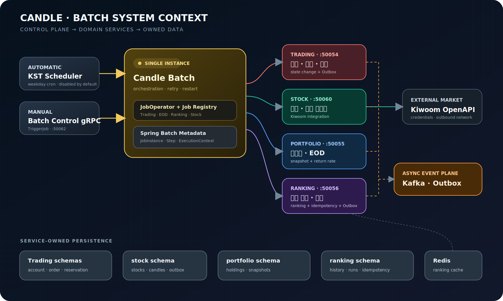
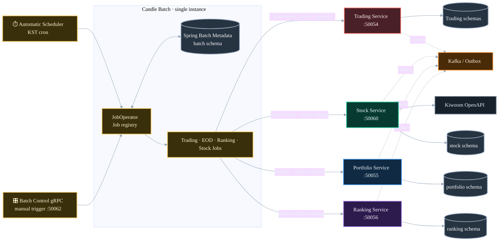
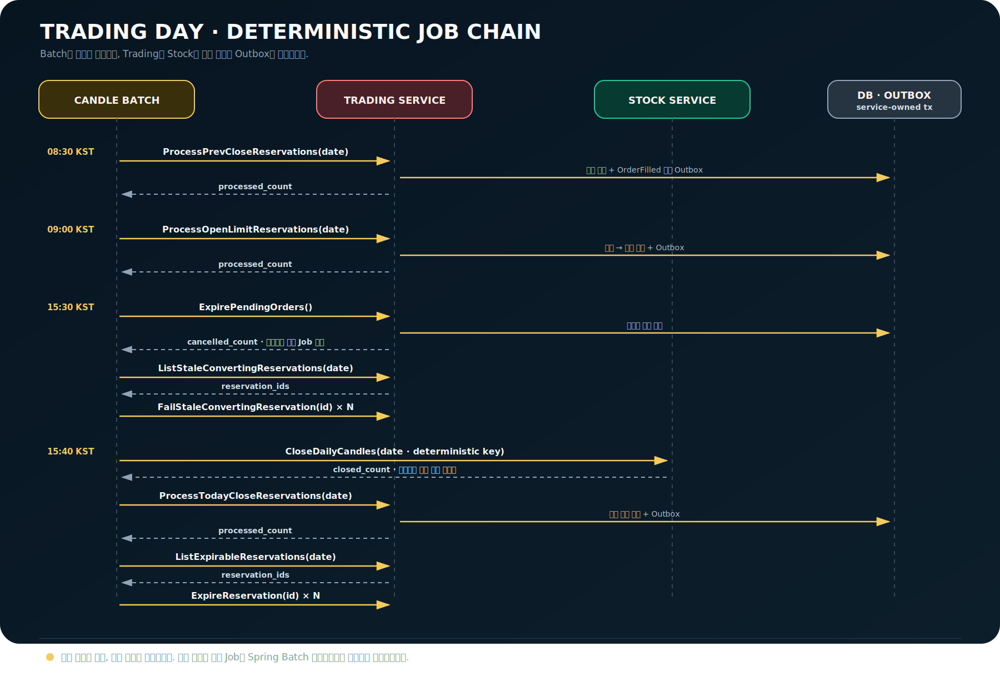
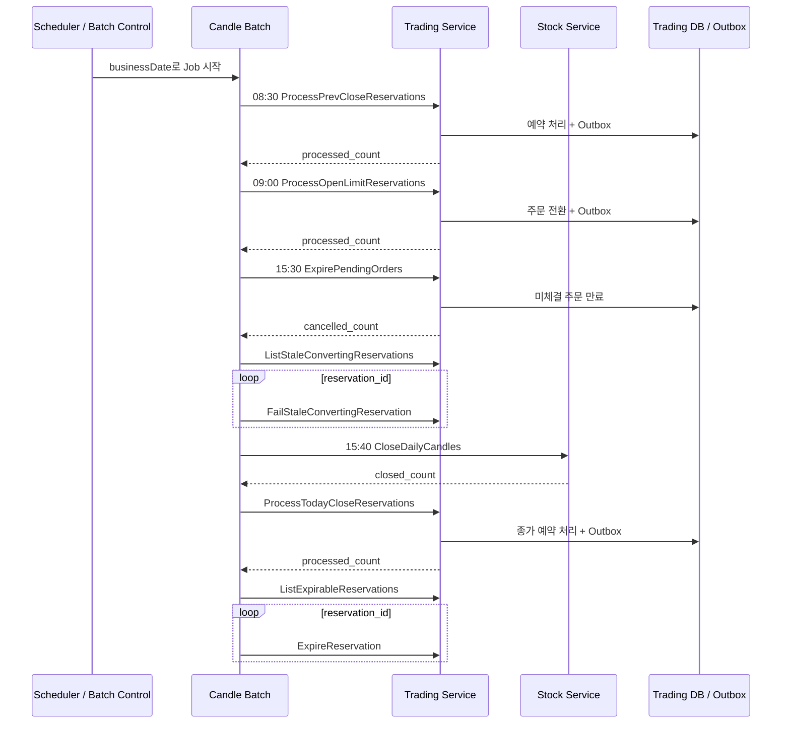
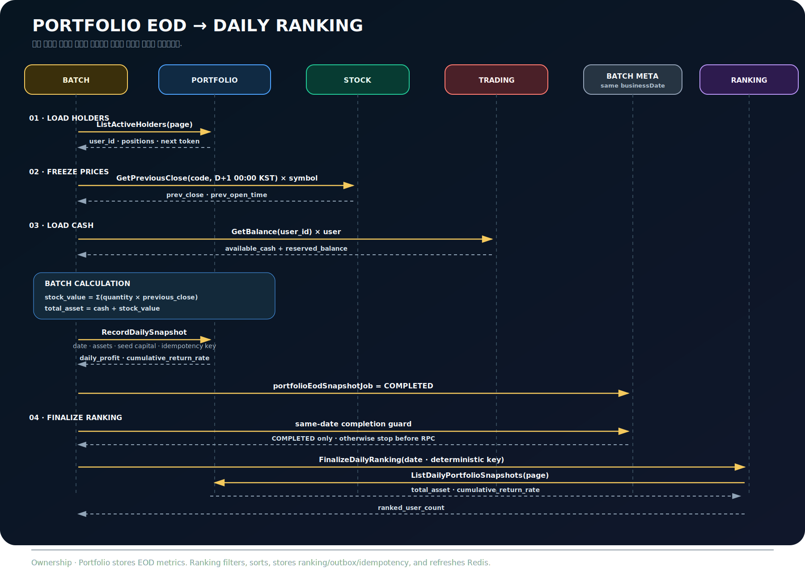
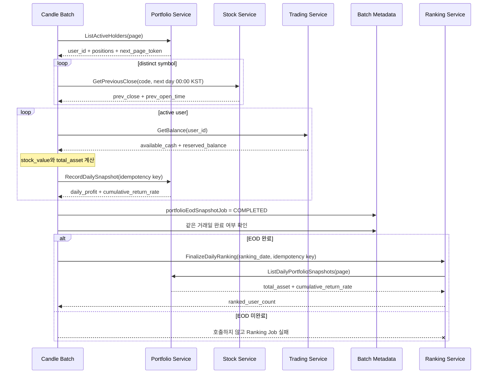
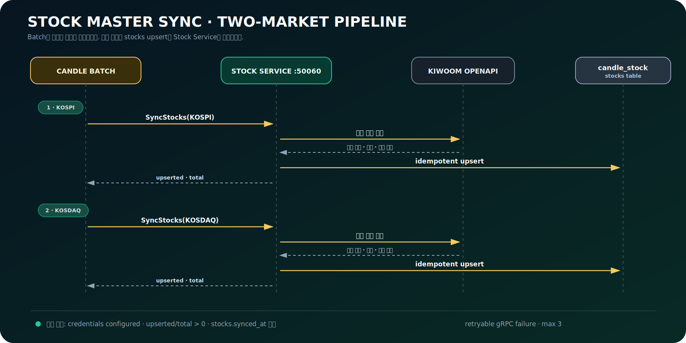
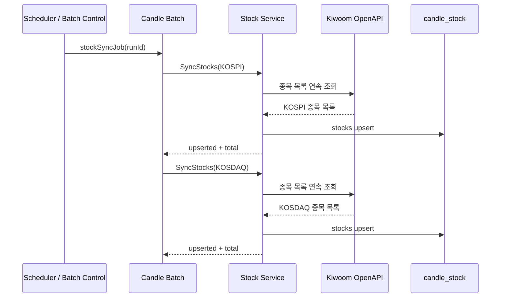

# Candle Batch Architecture

## 1. 문서 목적

이 문서는 Candle의 일일 Batch가 어떤 순서로 실행되고, 어떤 서비스에 영향을 주는지
한눈에 설명한다. Job의 세부 구현보다 다음 질문에 빠르게 답하는 것을 목표로 한다.

- 지금 시각에 어떤 Job이 실행되는가?
- Job은 어느 서비스를 호출하는가?
- 선행 Job이 실패하면 어디까지 영향이 전파되는가?
- 자동 실행과 수동 실행은 어디에서 합쳐지는가?
- 최종 데이터와 트랜잭션은 누가 소유하는가?

기준 시간대는 `Asia/Seoul`이며 업무 Job은 기본적으로 비활성화되어 있다. 운영에서는
환경변수로 필요한 Scheduler만 활성화한다. Batch 인스턴스는 1개 운영을 전제로 한다.

## 2. 시각 언어

| 색상 | 구성요소 | 의미 |
| --- | --- | --- |
| Gold | Batch | 시간, 실행 순서, 재시작, 실행 이력 |
| Coral | Trading | 예약, 주문, 계좌 및 체결 |
| Emerald | Stock | 종목 마스터와 확정 일봉 |
| Blue | Portfolio | 보유자와 EOD 스냅샷 |
| Purple | Ranking | 일별 랭킹과 조회 캐시 |
| Orange | Kafka / Outbox | 비동기 이벤트 전달 |
| Slate | PostgreSQL | 서비스별 영속 데이터 |

## 3. 일일 실행 타임라인

아래 시간은 기본 cron의 KST 기준이다. 같은 상자 안의 두 Job은 왼쪽 Job이
`COMPLETED`일 때 오른쪽 Job을 시작한다.

Mermaid 원본 보기

### 3.1 시간축에서 중요한 연결

- 15:30 흐름은 미체결 주문 만료가 성공해야 stale 예약 정리를 시작한다.
- 15:40 흐름은 Stock 일봉 마감과 종가 예약 처리가 성공해야 잔여 예약을 만료한다.
- 16:00 Portfolio EOD는 Trading 현금과 Stock 확정 종가를 사용한다.
- 16:20 Ranking은 같은 거래일의 Portfolio EOD가 `COMPLETED`인지 먼저 확인한다.
- 16:30 Stock Sync는 다음 실행을 위한 종목 마스터를 갱신하며 앞선 Ranking과 직접
  연결되지 않는다.

Smoke Job은 업무 흐름이 아니라 Batch 인프라 상태 확인용이므로 위 시간축에서
제외한다. 기본 설정에서는 1분 간격이지만 운영에서는 `BATCH_SMOKE_ENABLED=false`를
권장한다.

## 4. 시스템 컨텍스트

자동 Scheduler와 Batch Control 수동 요청은 모두 Spring Batch `JobOperator`로
합쳐진다. Batch는 실행 이력만 소유하고 도메인 결과는 각 서비스가 저장한다.

Mermaid 원본 보기

## 5. 최상위 책임 경계

| 구성요소 | 소유 책임 | 소유하지 않는 책임 |
| --- | --- | --- |
| Batch | cron, 순서, JobInstance, 재시도, 재시작, 실행 이력 | 도메인 DB 직접 변경, Kafka 직접 발행 |
| Trading | 예약·주문·계좌 상태 변경, Trading Outbox | Batch 실행 시각 |
| Stock | 일봉 확정, 종목 upsert, Kiwoom 통신 | Portfolio 자산 계산 |
| Portfolio | 활성 보유자, EOD 스냅샷, 손익·누적 수익률 | Ranking 순위 계산 |
| Ranking | 대상자 필터, 결정적 정렬, 랭킹·Outbox·캐시 | Portfolio 수익률 재계산 |

모든 서비스 호출은 gRPC를 사용한다. 도메인 상태 변경과 Outbox는 소유 서비스의 같은
트랜잭션에서 처리하며, Batch transaction은 원격 서비스 transaction을 대체하지 않는다.

## 6. Trading 일중 배치 상세 흐름

Trading 배치는 예약·주문 상태를 직접 수정하지 않는다. 정해진 시간에 Trading 또는
Stock의 상태 변경 RPC를 호출하고, 실제 DB 변경과 Outbox 기록은 호출받은 서비스가
하나의 트랜잭션으로 처리한다.

Mermaid 원본 보기

| 시각 | Job | 핵심 RPC | 성공 결과 | 실패 시 영향 |
| --- | --- | --- | --- | --- |
| 08:30 | `tradingPreviousCloseJob` | `ProcessPrevCloseReservations` | `processed_count` | 해당 Job 실패, 같은 거래일 재시작 가능 |
| 09:00 | `tradingOpenLimitJob` | `ProcessOpenLimitReservations` | `processed_count` | 해당 Job 실패, 같은 거래일 재시작 가능 |
| 15:30 | `tradingExpirePendingOrdersJob` | `ExpirePendingOrders` | `cancelled_count` | stale 정리 Job을 시작하지 않음 |
| 15:30 | `tradingFailStaleConvertingJob` | 목록 조회 후 건별 `FailStaleConvertingReservation` | 실패 처리 건수 | 실패한 지점부터 Job 재시작 |
| 15:40 | `tradingTodayCloseJob` | `CloseDailyCandles` → `ProcessTodayCloseReservations` | 확정 일봉·처리 건수 | 일봉 마감 실패 시 예약 처리 미호출 |
| 15:40 | `tradingExpireReservationsJob` | 목록 조회 후 건별 `ExpireReservation` | 만료 건수 | 선행 Job 미완료 시 시작하지 않음 |

예약 주문도 최종 체결 시 Trading의 `OrderFilled` 흐름으로 합쳐진다. 따라서 후속 Portfolio와
Ranking은 예약 종류를 별도로 판별하지 않고 동일한 체결 결과를 사용한다.

## 7. Portfolio EOD에서 Ranking까지

Portfolio EOD는 활성 보유자를 페이지로 읽고, 종목별 확정 종가와 사용자별 현금을 모아
스냅샷을 기록한다. Ranking은 같은 거래일 EOD Job이 `COMPLETED`인 경우에만 시작한다.

Mermaid 원본 보기

### 7.1 계산과 저장 소유권

| 값 또는 결과 | 산출 방식 | 최종 저장 주체 |
| --- | --- | --- |
| `stock_value` | `Σ(quantity × previous_close)` | Portfolio |
| 현금 | `available_cash + reserved_balance` | Trading이 제공, Portfolio가 스냅샷에 반영 |
| `total_asset` | 현금 + `stock_value` | Portfolio |
| 초기 원금 | 현재 정책상 사용자당 100,000,000 KRW | Portfolio 계산 입력; 입출금 도입 시 계약 변경 필요 |
| 손익·누적 수익률 | Portfolio의 스냅샷 정책 | Portfolio |
| 일별 순위 | 수익률 내림차순 → 거래 수 내림차순 → 사용자 ID 오름차순 | Ranking |

`RecordDailySnapshot`과 `FinalizeDailyRanking`은 거래일 기반의 결정적 멱등성 키를 사용한다.
재시작해도 같은 의미의 요청에는 같은 키를 보내며, 도메인 저장·Outbox·멱등성 응답 기록은
각 소유 서비스가 처리한다. Ranking은 Portfolio 수익률을 다시 계산하지 않는다.

## 8. Stock 종목 마스터 동기화

Stock Sync는 Batch가 시장만 지정하고, 키움 인증·페이징·응답 파싱·upsert는 Stock Service가
전부 담당한다. KOSPI가 성공한 뒤 KOSDAQ을 호출한다.

Mermaid 원본 보기

- 기본 Stock gRPC 대상은 `stock-service:50060`이다.
- 일시적 gRPC 오류는 최대 3회 재시도하며, 재실행은 upsert 특성상 안전하다.
- 키움 키가 없으면 Stock Service가 0건을 반환할 수 있다. 이는 연결 성공 검증일 뿐 실제
  종목 동기화 성공을 의미하지 않으므로 운영에서는 `upserted`, `total`, `synced_at`을 함께 본다.
- 상장폐지 종목을 `DELISTED`로 바꾸는 리컨실 정책은 Stock Service 책임이며 현재 Sync Job의
  호출 범위에는 포함되지 않는다.
