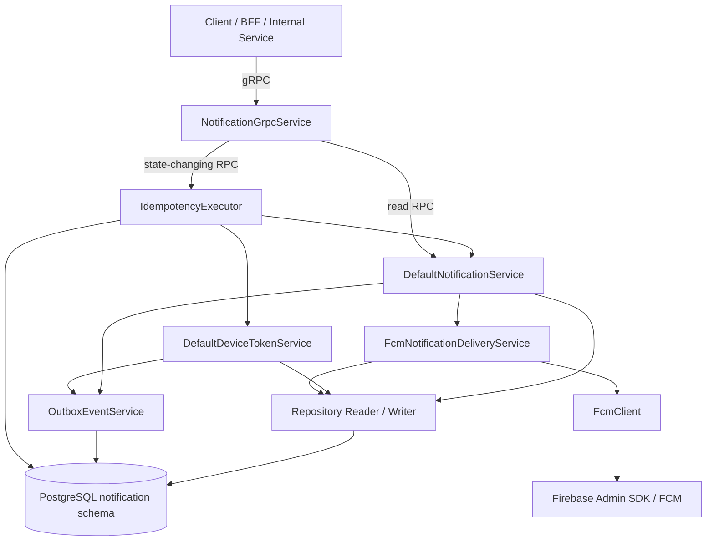
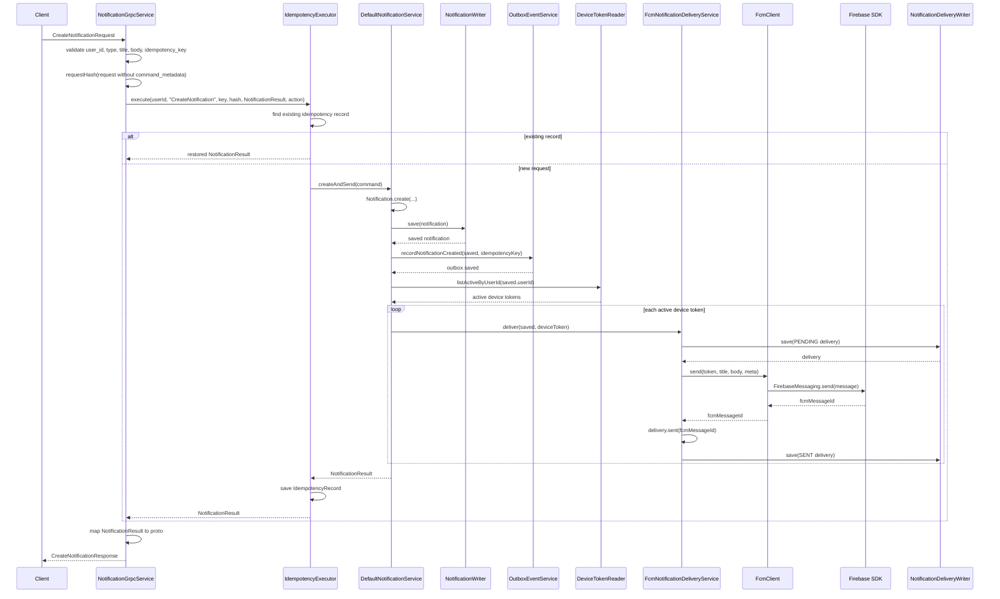
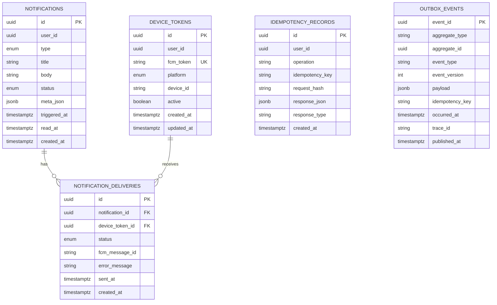

# Notification Service

## 1. 목적과 현재 전제

이 문서는 Candle `notification-service`의 실제 구현을 기준으로 기능, gRPC 계약, 데이터 저장 결과, 트랜잭션, 멱등성, Outbox, FCM 발송 흐름, 테스트 및 운영 설정을 정리한다.

이 문서는 이후 전체 서비스 흐름, gRPC 연결, 데이터 저장 결과, 장애 영향도를 Mermaid 및 SVG 아키텍처 다이어그램으로 제작할 때 원본 자료로 사용한다.

현재 전제는 다음과 같다.

- Notification Service는 내부 gRPC API를 제공한다.
- REST Controller는 구현하지 않는다.
- 다른 서비스 DB를 직접 조회하거나 수정하지 않는다.
- 다른 서비스 Entity를 import하지 않는다.
- 사용자 알림 생성, 디바이스 토큰 등록, 읽음 처리, 삭제, 배송 상태 조회를 담당한다.
- FCM 발송은 Firebase Admin SDK를 통해 직접 수행한다.
- Kafka Publisher, Debezium, CDC relay, Scheduler, DLQ, Retry 정책은 현재 구현 범위에 포함하지 않는다.
- Outbox는 Kafka 발행까지 수행하지 않고 `notification.outbox_events` 테이블에 이벤트를 기록하는 구조까지만 구현되어 있다.
- 운영 코드에 테스트용 Fake나 Mock은 포함하지 않는다.
- 실제 Firebase 인증 파일은 Git에 포함하지 않고 환경변수로 경로를 주입한다.

## 2. 서비스 책임

Notification Service의 책임은 다음과 같다.

- 사용자 FCM 디바이스 토큰 등록 및 재활성화
- 알림 생성 및 저장
- 사용자 활성 디바이스 토큰 조회
- FCM 발송 요청
- 디바이스별 발송 결과 저장
- 알림 목록 조회 및 cursor pagination
- 읽음 처리 및 전체 읽음 처리
- 알림 삭제
- 미읽음 개수 조회
- 멱등성 레코드 저장 및 중복 요청 응답 재사용
- 상태 변경 시 Outbox Event 기록

Notification Service가 하지 않는 일은 다음과 같다.

- 주문 체결 여부 판단
- 시세 급등락 조건 계산
- 미션 완료 여부 판단
- 랭킹 계산
- 다른 서비스 DB 직접 조회
- Kafka 직접 발행
- Debezium/CDC relay 실행
- 이메일/SMTP 발송
- Redis/cache 기반 조회 최적화

## 3. 전체 구조



## 4. 제공 gRPC API

`proto/candle/notification/v1/notification.proto` 기준 최종 RPC는 다음 8개이며, `NotificationGrpcService` 구현과 1:1로 일치한다.

| RPC | 구현 메서드 | 역할 | 상태 변경 | 멱등성 |
| --- | --- | --- | --- | --- |
| `RegisterDeviceToken` | `registerDeviceToken(...)` | FCM 디바이스 토큰 등록 또는 재활성화 | 예 | 적용 |
| `CreateNotification` | `createNotification(...)` | 알림 생성, FCM 발송, Delivery 기록 | 예 | 적용 |
| `ListNotifications` | `listNotifications(...)` | 사용자 알림 목록 조회 | 아니오 | 미적용 |
| `MarkAsRead` | `markAsRead(...)` | 알림 단건 읽음 처리 | 예 | 적용 |
| `MarkAllAsRead` | `markAllAsRead(...)` | 사용자 미읽음 알림 전체 읽음 처리 | 예 | 적용 |
| `DeleteNotification` | `deleteNotification(...)` | 알림 단건 삭제 | 예 | 적용 |
| `CountUnread` | `countUnread(...)` | 미읽음 알림 개수 조회 | 아니오 | 미적용 |
| `GetDeliveryStatus` | `getDeliveryStatus(...)` | 특정 알림의 FCM delivery 기록 조회 | 아니오 | 미적용 |

### 4.1 RegisterDeviceToken

목적은 사용자의 FCM 토큰을 등록하거나 기존 토큰을 재활성화하는 것이다.

요청 주요 필드:

- `user_id`
- `fcm_token`
- `platform`
- `device_id`
- `command_metadata.idempotency_key`

처리 흐름:

1. `NotificationGrpcService.registerDeviceToken(...)`
2. `user_id` UUID 검증
3. `fcm_token` 필수값 검증
4. `DevicePlatform` 변환 및 검증
5. `command_metadata.idempotency_key` 검증
6. `RegisterDeviceTokenCommand` 생성
7. `IdempotencyExecutor.execute(...)`
8. `DefaultDeviceTokenService.register(...)`
9. `fcm_token`으로 기존 토큰 조회
10. 기존 토큰이 있으면 `reactivate(userId, platform, deviceId)`
11. 없으면 `DeviceToken.register(...)`
12. `device_tokens` 저장
13. `DeviceTokenRegistered` Outbox Event 기록
14. `device_token_id` 응답

### 4.2 CreateNotification

목적은 알림을 생성하고, 사용자 활성 디바이스 토큰에 FCM을 발송한 뒤 디바이스별 발송 결과를 저장하는 것이다.

요청 주요 필드:

- `user_id`
- `type`
- `title`
- `body`
- `meta_json`
- `command_metadata.idempotency_key`

처리 흐름은 아래 Mermaid sequence diagram과 같다.



주의할 점:

- `CreateNotification`은 outbox만 기록하는 구조가 아니다.
- 알림 저장과 Outbox 기록 이후 활성 device token별로 FCM 직접 전송을 수행한다.
- FCM 성공/실패 결과는 `notification_deliveries`에 저장된다.
- Kafka 발행은 수행하지 않는다.

### 4.3 ListNotifications

목적은 사용자 알림 목록을 최신순으로 조회하는 것이다.

정책:

- 기본 page size: 20
- 최대 page size: 100
- 정렬: `created_at DESC, id DESC`
- page token: `createdAt|id`를 URL-safe Base64 인코딩
- 다음 페이지는 마지막 항목의 `created_at`, `id`를 기준으로 조회

실제 호출:

- `NotificationGrpcService.listNotifications(...)`
- `notificationService.list(userId, pageSize, pageToken)`
- `NotificationReader.listByCriteria(criteria)`

### 4.4 MarkAsRead

목적은 사용자 알림 단건을 읽음 상태로 변경하는 것이다.

처리 정책:

- notification 존재 확인
- 요청 user 소유 확인
- 이미 `READ`면 no-op
- `UNREAD`면 `READ`로 변경하고 `read_at` 설정
- `NotificationRead` Outbox Event 기록
- 멱등성 적용

### 4.5 MarkAllAsRead

목적은 사용자의 모든 미읽음 알림을 읽음 상태로 변경하는 것이다.

실제 호출:

- `NotificationGrpcService.markAllAsRead(...)`
- `IdempotencyExecutor.execute(...)`
- `notificationService.markAllAsRead(userId, idempotencyKey)`

대상:

- `notificationReader.listByUserIdAndStatus(userId, NotificationStatus.UNREAD)`
- 해당 user의 `UNREAD` notification 전체

Outbox:

- 각 notification마다 `outboxEventService.recordNotificationRead(notification, idempotencyKey)` 호출
- event type: `NotificationRead`

### 4.6 DeleteNotification

목적은 알림 단건을 삭제하는 것이다.

정책:

- Hard Delete
- soft delete 컬럼/설정 없음
- 없는 notification이면 `DeleteNotificationResult(false)` 반환
- 소유자가 다르면 `NOTIFICATION_ACCESS_DENIED`
- Outbox 기록 없음
- 멱등성 적용

실제 호출:

- `NotificationGrpcService.deleteNotification(...)`
- `idempotencyExecutor.execute(...)`
- `notificationService.deleteNotification(userId, notificationId, idempotencyKey)`
- `notificationReader.findById(notificationId)`
- `notificationWriter.delete(notification)`
- `notificationJpaRepository.delete(notification)`

### 4.7 CountUnread

목적은 사용자 미읽음 알림 개수를 조회하는 것이다.

실제 호출:

- `NotificationGrpcService.countUnread(...)`
- `notificationService.countUnread(userId)`
- `NotificationReader.countByUserIdAndStatus(userId, NotificationStatus.UNREAD)`

### 4.8 GetDeliveryStatus

목적은 특정 notification의 FCM delivery 결과 목록을 조회하는 것이다.

실제 호출:

- `NotificationGrpcService.getDeliveryStatus(...)`
- `notificationService.getDeliveryStatus(notificationId)`
- `NotificationDeliveryReader.listByNotificationId(notificationId)`

현재 주의사항:

- 요청 필드는 `notification_id` 기준이다.
- 사용자 소유권 검증은 문서 작성 시점의 검증 결과에서 별도 구현으로 확인되지 않았다.

## 5. 내부 클래스 구조

### 5.1 gRPC

- `NotificationGrpcService`
  - proto 요청 검증
  - UUID 파싱
  - enum 변환
  - blank 값 검증
  - idempotency key 검증
  - request hash 생성
  - Command/Criteria 변환
  - Service 호출
  - Result를 proto response로 변환
  - `NotificationException`을 gRPC Status로 매핑

### 5.2 Service

- `DefaultNotificationService`
  - 알림 생성/조회/읽음/삭제/배송상태 조회 담당
- `DefaultDeviceTokenService`
  - device token 등록 및 재활성화 담당
- `FcmNotificationDeliveryService`
  - FCM 발송과 delivery 상태 기록 담당
- `OutboxEventService`
  - Outbox Event 생성 및 저장 담당
- `IdempotencyExecutor`
  - 멱등성 레코드 조회, request hash 비교, response 재사용, 신규 response 저장 담당

### 5.3 FCM

현재 FCM 발송 구조는 다음과 같다.

```text
FcmNotificationDeliveryService
    ↓
FcmClient
    ↓
FirebaseFcmClient
    ↓
FirebaseMessaging
```

`FcmNotificationDeliveryService`는 Firebase SDK를 직접 알지 않고 `FcmClient`에만 의존한다. 실제 Firebase Admin SDK 호출은 `FirebaseFcmClient`가 담당한다.

## 6. 도메인 모델과 DB 저장 결과



### 6.1 notifications

Entity:

- `Notification`

Table:

- `notification.notifications`

주요 컬럼:

- `id`
- `user_id`
- `type`
- `title`
- `body`
- `status`
- `meta_json`
- `triggered_at`
- `read_at`
- `created_at`

Index:

- `idx_notifications_user_created (user_id, created_at DESC, id DESC)`
- `idx_notifications_user_status (user_id, status)`

Delete:

- Hard Delete

### 6.2 device_tokens

Entity:

- `DeviceToken`

Table:

- `notification.device_tokens`

주요 컬럼:

- `id`
- `user_id`
- `fcm_token`
- `platform`
- `device_id`
- `active`
- `created_at`
- `updated_at`

제약조건:

- `uq_device_tokens_fcm_token UNIQUE (fcm_token)`

Index:

- `idx_device_tokens_user_active (user_id, active)`

정책:

- `deactivate()` 메서드는 존재하지만 현재 서비스 흐름에서는 호출되지 않는다.
- `fcm_token`이 재등록되면 기존 토큰을 재활성화하고 user/platform/deviceId/active/updatedAt을 갱신한다.

### 6.3 notification_deliveries

Entity:

- `NotificationDelivery`

Table:

- `notification.notification_deliveries`

주요 컬럼:

- `id`
- `notification_id`
- `device_token_id`
- `status`
- `fcm_message_id`
- `error_message`
- `sent_at`
- `created_at`

FK:

- `notification_id -> notifications(id)`
- `device_token_id -> device_tokens(id)`

Index:

- `idx_notification_deliveries_notification_created (notification_id, created_at ASC)`

상태:

- `PENDING`
- `SENT`
- `FAILED`

### 6.4 idempotency_records

Entity:

- `IdempotencyRecord`

Table:

- `notification.idempotency_records`

주요 컬럼:

- `id`
- `user_id`
- `operation`
- `idempotency_key`
- `request_hash`
- `response_json`
- `response_type`
- `created_at`

제약조건:

- `uq_idempotency_records_operation_key UNIQUE (user_id, operation, idempotency_key)`

Index:

- `idx_idempotency_records_created (created_at)`

사용 위치:

- `RegisterDeviceToken`
- `CreateNotification`
- `MarkAsRead`
- `MarkAllAsRead`
- `DeleteNotification`

### 6.5 outbox_events

Entity:

- `OutboxEvent`

Table:

- `notification.outbox_events`

주요 컬럼:

- `event_id`
- `aggregate_type`
- `aggregate_id`
- `event_type`
- `event_version`
- `payload`
- `idempotency_key`
- `occurred_at`
- `trace_id`
- `published_at`

Index:

- `idx_outbox_events_unpublished (occurred_at, event_id) WHERE published_at IS NULL`

현재 기록되는 event type:

- `NotificationCreated`
- `NotificationRead`
- `DeviceTokenRegistered`

주의:

- 현재 Kafka 발행은 수행하지 않는다.
- `published_at` 갱신 처리도 구현되어 있지 않다.

## 7. Enum

### NotificationType

- `PRICE_RISE`
- `PRICE_FALL`
- `BUY_FILLED`
- `SELL_FILLED`
- `MARKET_OPEN`
- `MARKET_CLOSE`

### NotificationStatus

- `UNREAD`
- `READ`

### DeliveryStatus

- `PENDING`
- `SENT`
- `FAILED`

### DevicePlatform

- `WEB`
- `ANDROID`
- `IOS`

## 8. Repository 구조

### NotificationReader / JpaNotificationReader

- `listByUserId(userId, pageSize)`
- `listByCriteria(criteria)`
- `findByIdAndUserId(notificationId, userId)`
- `findById(notificationId)`
- `listByUserIdAndStatus(userId, status)`
- `countByUserIdAndStatus(userId, status)`

### NotificationWriter / JpaNotificationWriter

- `save(notification)`
- `delete(notification)`

### DeviceTokenReader / JpaDeviceTokenReader

- `findByFcmToken(fcmToken)`
- `listActiveByUserId(userId)`

### DeviceTokenWriter / JpaDeviceTokenWriter

- `save(deviceToken)`

### NotificationDeliveryReader / JpaNotificationDeliveryReader

- `listByNotificationId(notificationId)`

### NotificationDeliveryWriter / JpaNotificationDeliveryWriter

- `save(notificationDelivery)`

### OutboxEventWriter / JpaOutboxEventWriter

- `save(event)`

### IdempotencyRecordJpaRepository

- `findByUserIdAndOperationAndIdempotencyKey(userId, operation, idempotencyKey)`
- `save(...)`

## 9. Transaction 정책

### IdempotencyExecutor

`execute(...)`에 `@Transactional`이 적용되어 있다.

같은 트랜잭션에서 수행되는 작업:

- idempotency record 조회
- action 실행
- response JSON 저장
- idempotency record 저장

### DefaultNotificationService

`@Transactional` 적용 메서드:

- `list(...)`: readOnly
- `markAsRead(...)`
- `markAllAsRead(...)`
- `deleteNotification(...)`
- `countUnread(...)`: readOnly
- `getDeliveryStatus(...)`: readOnly

`createAndSend(...)` 자체에는 `@Transactional`이 없다. 내부에서 `TransactionTemplate`으로 notification 저장과 `NotificationCreated` outbox 저장을 실행한다.

주의:

- `CreateNotification`은 `IdempotencyExecutor.execute(...)` 안에서 실행된다.
- 현재 구조에서는 FCM 전송이 idempotency transaction 안에서 실행될 수 있다.

### FcmNotificationDeliveryService

`deliver(...)`에 `@Transactional`이 적용되어 있다.

수행 작업:

- `NotificationDelivery.pending(...)` 저장
- FCM send 호출
- 성공 시 `SENT`, `fcm_message_id`, `sent_at` 기록
- 실패 시 `FAILED`, `error_message` 기록
- delivery 재저장

### DefaultDeviceTokenService

`register(...)`에 `@Transactional`이 적용되어 있다.

수행 작업:

- `fcm_token` 조회
- 기존 token reactivate 또는 신규 register
- device token 저장
- `DeviceTokenRegistered` outbox 저장

## 10. Idempotency 정책

상태 변경 gRPC는 `CommandMetadata.idempotency_key`를 필수로 요구한다.

적용 대상:

- `RegisterDeviceToken`
- `CreateNotification`
- `MarkAsRead`
- `MarkAllAsRead`
- `DeleteNotification`

정책:

- key 형식: `^[A-Za-z0-9._:-]{8,128}$`
- request hash는 command metadata 제거 후 SHA-256 + Base64로 생성
- 동일 key + 동일 hash면 저장된 response 반환
- 동일 key + 다른 hash면 `ALREADY_EXISTS`
- idempotency response는 `idempotency_records.response_json`에 저장된다.

처리 기준:

- `user_id`
- `operation`
- `idempotency_key`
- `request_hash`

## 11. Outbox 정책

현재 Notification Service는 Kafka를 구현하지 않는다.

구현된 범위:

- 상태 변경 시 `notification.outbox_events`에 내부 이벤트 기록
- event type:
  - `NotificationCreated`
  - `NotificationRead`
  - `DeviceTokenRegistered`

현재 범위 제외:

- Kafka Publisher
- Debezium
- CDC relay
- DLQ
- Retry Scheduler
- published_at 갱신 처리
- outbox backlog/failure monitoring

주의:

- 문서에서는 outbox가 Kafka까지 발행된다고 표현하지 않는다.
- 현재 구현은 outbox record까지만 수행한다.

## 12. FCM Delivery 정책

FCM 발송은 `FcmNotificationDeliveryService.deliver(...)`가 담당한다.

각 활성 device token마다 다음 결과가 남는다.

1. `notification_deliveries`에 `PENDING` 저장
2. `FcmClient.send(token, title, body, meta)` 호출
3. 성공 시:
   - `status = SENT`
   - `fcm_message_id` 저장
   - `sent_at` 저장
4. 실패 시:
   - `status = FAILED`
   - `error_message` 저장

외부 의존성:

- Firebase Admin SDK
- `FirebaseMessaging.send(...)`

운영 주의:

- 실제 Firebase credential은 `FIREBASE_CREDENTIALS_PATH` 또는 `firebase.credentials.path`로 주입한다.
- 실제 credential JSON은 Git에 포함하지 않는다.
- 테스트에서는 실제 Firebase를 호출하지 않는다.

## 13. Cursor Pagination 정책

`ListNotifications`는 cursor pagination을 사용한다.

정책:

- 기본 page size: 20
- 최대 page size: 100
- 정렬: `created_at DESC, id DESC`
- page token: `createdAt|id`를 URL-safe Base64 인코딩
- 잘못된 token은 `INVALID_ARGUMENT`

조회 조건:

- cursor가 없으면 user 기준 최신순 조회
- cursor가 있으면 다음 조건으로 조회
  - `created_at < cursorCreatedAt`
  - 또는 `created_at = cursorCreatedAt AND id < cursorId`

## 14. Exception 정책

`NotificationException`은 `CandleException`을 상속한다.

주요 ErrorCode:

| ErrorCode | 발생 상황 |
| --- | --- |
| `NOTIFICATION_INVALID_USER_ID` | gRPC에서 `user_id` UUID 파싱 실패 |
| `NOTIFICATION_INVALID_NOTIFICATION_ID` | `notification_id` UUID 파싱 실패 |
| `NOTIFICATION_INVALID_DEVICE_PLATFORM` | 지원하지 않는 DevicePlatform |
| `NOTIFICATION_INVALID_NOTIFICATION_TYPE` | 지원하지 않는 NotificationType |
| `NOTIFICATION_INVALID_REQUEST` | blank 필수값, 잘못된 page token, request hash 실패, response JSON 처리 실패 |
| `NOTIFICATION_INVALID_IDEMPOTENCY_KEY` | idempotency key regex 불일치 |
| `NOTIFICATION_IDEMPOTENCY_KEY_REQUIRED` | idempotency key 누락 또는 blank |
| `NOTIFICATION_IDEMPOTENCY_REQUEST_MISMATCH` | 동일 key의 저장된 request hash와 현재 request hash 불일치 |
| `NOTIFICATION_NOT_FOUND` | 대상 notification 없음 |
| `NOTIFICATION_ACCESS_DENIED` | notification userId와 요청 userId 불일치 |
| `NOTIFICATION_DEVICE_TOKEN_NOT_FOUND` | 현재 throw 위치 없음 |
| `NOTIFICATION_FCM_SEND_FAILED` | Firebase FCM send 실패 |
| `NOTIFICATION_FIREBASE_CREDENTIAL_INVALID` | Firebase credential path 누락/파일 없음/읽기 실패 |
| `NOTIFICATION_INTERNAL_ERROR` | gRPC RuntimeException catch 시 INTERNAL 응답 설명 |

## 15. Flyway Migration

| 순서 | Migration | 생성 내용 |
| --- | --- | --- |
| 1 | `V20260629_001__create_notification_tables.sql` | `notification` schema, enum type, `notifications`, `device_tokens`, `notification_deliveries` |
| 2 | `V20260629_002__create_idempotency_records.sql` | `notification.idempotency_records` |
| 3 | `V20260629_003__create_outbox_events.sql` | `notification.outbox_events` |

## 16. 테스트 방법

### 16.1 테스트 실행

```bash
./gradlew :services:notification-service:test
```

Windows PowerShell:

```powershell
.\gradlew :services:notification-service:test
```

현재 테스트 결과:

- 총 테스트 수: 29개
- failures: 0
- errors: 0
- skipped: 0

### 16.2 테스트 파일

- `DefaultNotificationServiceTest`
  - notification 생성
  - active token 전송
  - outbox 기록
  - mark as read
  - not found/access denied
  - delete missing/other user
  - cursor pagination
  - invalid token
  - page size default/max
  - outbox 실패 시 delivery 미수행
  - active token만 delivery

- `NotificationGrpcServiceTest`
  - idempotency key 검증
  - userId/notificationId 검증
  - notification type/title 검증
  - create notification idempotency executor 경유
  - gRPC status 매핑

- `IdempotencyExecutorTest`
  - 동일 key/hash response 재사용
  - 동일 key/다른 hash 거부
  - missing key 거부

- `FcmNotificationDeliveryServiceTest`
  - FCM 성공 시 SENT
  - FCM 실패 시 FAILED

- `DefaultDeviceTokenServiceTest`
  - 신규 token 등록
  - 기존 token reactivate/update

### 16.3 실행 검증

컴파일:

```bash
./gradlew :services:notification-service:compileJava
```

Spring Boot 실행 검증:

```bash
./gradlew :services:notification-service:bootRun --args='--spring.main.web-application-type=none'
```

로컬 DB가 없으면 PostgreSQL 연결 실패가 날 수 있다. 이 경우 설정 파싱, Bean 생성, Firebase credential 검증이 어느 단계까지 통과했는지 로그를 확인한다.

## 17. 운영 설정

`application.yml` 기준:

| 항목 | 값 |
| --- | --- |
| gRPC Port | `${NOTIFICATION_GRPC_PORT:50057}` |
| HTTP Port | `${NOTIFICATION_SERVER_PORT:8089}` |
| DB URL | `${NOTIFICATION_DB_URL:jdbc:postgresql://localhost:5432/candle?currentSchema=notification,public}` |
| DB Username | `${NOTIFICATION_DB_USERNAME:candle}` |
| DB Password | `${NOTIFICATION_DB_PASSWORD:candle}` |
| JPA ddl-auto | `validate` |
| JPA open-in-view | `false` |
| Flyway locations | `classpath:migration` |

환경변수:

- `NOTIFICATION_GRPC_PORT`
- `NOTIFICATION_SERVER_PORT`
- `NOTIFICATION_DB_URL`
- `NOTIFICATION_DB_USERNAME`
- `NOTIFICATION_DB_PASSWORD`
- `FIREBASE_CREDENTIALS_PATH`

Firebase:

- `application.yml`에는 Firebase 설정이 없다.
- `FirebaseConfig`는 `${firebase.credentials.path:${FIREBASE_CREDENTIALS_PATH:}}`를 사용한다.
- credential resource가 없으면 `NOTIFICATION_FIREBASE_CREDENTIAL_INVALID`가 발생한다.
- 실제 인증 파일은 Git에 포함하지 않는다.

## 18. 서비스 영향도

### 18.1 성공 시 영향

`CreateNotification`이 성공하면 다음 결과가 남는다.

- `notifications`에 알림 저장
- `outbox_events`에 `NotificationCreated` 기록
- 사용자 활성 `device_tokens` 조회
- 활성 토큰별 FCM 발송 시도
- 토큰별 `notification_deliveries`에 `SENT` 또는 `FAILED` 기록
- 클라이언트는 생성된 Notification 응답 수신

`RegisterDeviceToken`이 성공하면 다음 결과가 남는다.

- `device_tokens`에 신규 토큰 저장 또는 기존 토큰 재활성화
- `outbox_events`에 `DeviceTokenRegistered` 기록
- 이후 알림 발송 대상에 포함될 수 있음

`MarkAsRead` 또는 `MarkAllAsRead`가 성공하면 다음 결과가 남는다.

- 대상 알림의 `status`가 `READ`로 변경
- `read_at` 기록
- `outbox_events`에 `NotificationRead` 기록

### 18.2 실패 시 영향

- 알림 생성 전 validation 실패는 DB 변경을 남기지 않는다.
- idempotency key 누락/형식 오류는 DB 변경을 남기지 않는다.
- 동일 key + 다른 request hash는 기존 기록을 보호하고 새 작업을 수행하지 않는다.
- Outbox 기록 실패 시 상태 변경 트랜잭션이 실패할 수 있다.
- FCM 발송 실패는 notification 생성 자체를 취소하지 않고 delivery를 `FAILED`로 기록한다.
- Kafka Publisher가 없으므로 outbox event가 외부 시스템으로 자동 발행되지는 않는다.

## 19. 구현 범위와 향후 변경 지점

### 19.1 구현 완료

- Notification gRPC server
- DeviceToken 등록
- Notification 생성
- Notification 목록 cursor pagination
- MarkAsRead
- MarkAllAsRead
- DeleteNotification hard delete
- CountUnread
- GetDeliveryStatus
- Idempotency record 저장/재사용/hash mismatch 검증
- Outbox event 저장
- Firebase FCM 직접 전송
- Delivery 결과 저장
- 단위 테스트 및 Spring Boot 실행 검증

### 19.2 현재 미구현

- Kafka Publisher
- Debezium / CDC relay
- Scheduler
- Retry 정책
- Dead Letter Queue
- Outbox publish 처리
- Outbox `published_at` 갱신 처리
- Redis
- Cache
- REST Controller
- Firebase credential test profile 대체 설정
- FCM 실패 재시도 정책
- delivery cleanup/retention 정책

### 19.3 현재 범위 제외

- 다른 서비스 DB 접근
- 다른 서비스 Entity import
- notification-service 내부의 다른 gRPC client
- BFF REST API 구현
- Kafka consumer 구현
- 이메일/SMTP 발송 구현

### 19.4 향후 변경 시 확인할 파일

- gRPC 계약 변경: `proto/candle/notification/v1/notification.proto`
- 알림 도메인 정책 변경: `DefaultNotificationService`
- 디바이스 토큰 정책 변경: `DefaultDeviceTokenService`
- FCM 발송 정책 변경: `FcmNotificationDeliveryService`, `FcmClient`, `FirebaseFcmClient`
- 멱등성 정책 변경: `IdempotencyExecutor`, `IdempotencyRecord`
- Outbox 정책 변경: `OutboxEventService`, `OutboxEvent`
- DB 구조 변경: `services/notification-service/src/main/resources/migration/*`
- 운영 설정 변경: `services/notification-service/src/main/resources/application.yml`

## 20. 로컬 실행 순서

### 20.1 인프라 준비

Notification Service를 실제로 실행하려면 PostgreSQL이 필요하다.

```bash
docker compose up -d postgres
```

### 20.2 Firebase credential 준비

실제 FCM 발송을 테스트하려면 Firebase Admin SDK credential 파일을 Git 외부 경로에 둔다.

예시:

```bash
export FIREBASE_CREDENTIALS_PATH=/opt/secrets/firebase-adminsdk.json
```

Windows PowerShell:

```powershell
$env:FIREBASE_CREDENTIALS_PATH="D:\secrets\firebase-adminsdk.json"
```

### 20.3 서비스 실행

```bash
NOTIFICATION_GRPC_PORT=50057 \
NOTIFICATION_SERVER_PORT=8089 \
NOTIFICATION_DB_URL='jdbc:postgresql://localhost:5432/candle?currentSchema=notification,public' \
NOTIFICATION_DB_USERNAME=candle \
NOTIFICATION_DB_PASSWORD=candle \
FIREBASE_CREDENTIALS_PATH=/opt/secrets/firebase-adminsdk.json \
./gradlew :services:notification-service:bootRun
```

## 21. 문서 작성 시 주의 사항

이 문서에서는 다음 내용을 확정 표현으로 작성하지 않는다.

- 존재하지 않는 Kafka topic
- 존재하지 않는 Kafka consumer/producer
- 존재하지 않는 Debezium connector
- 존재하지 않는 Scheduler
- 존재하지 않는 Retry/DLQ 정책
- outbox가 Kafka까지 발행된다는 표현
- BFF가 실제로 notification-service를 호출한다는 확정 표현
- 이메일/SMTP 발송 구현
- Redis/cache 기반 중복 방지 또는 조회 최적화
- 다른 팀/서비스가 반드시 소비하는 event 계약 확정 내용
