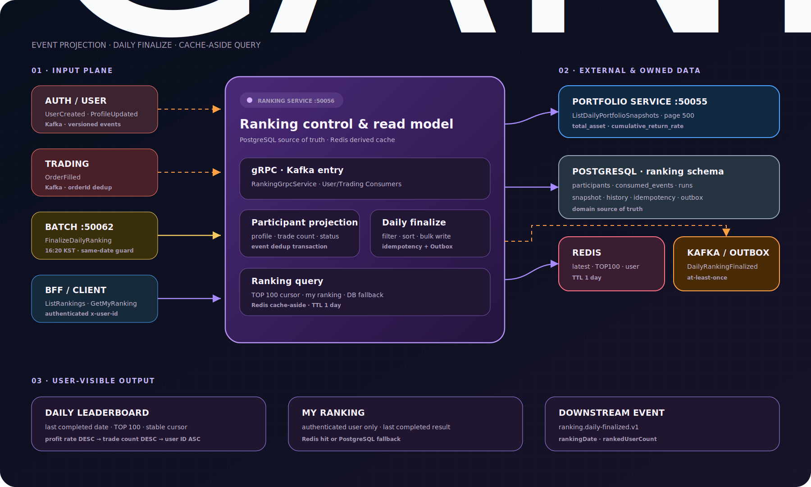
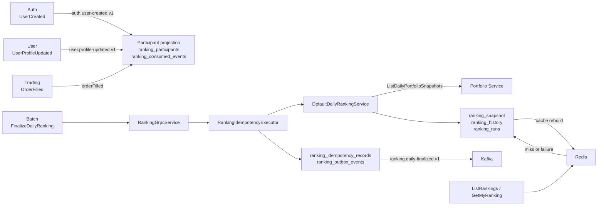
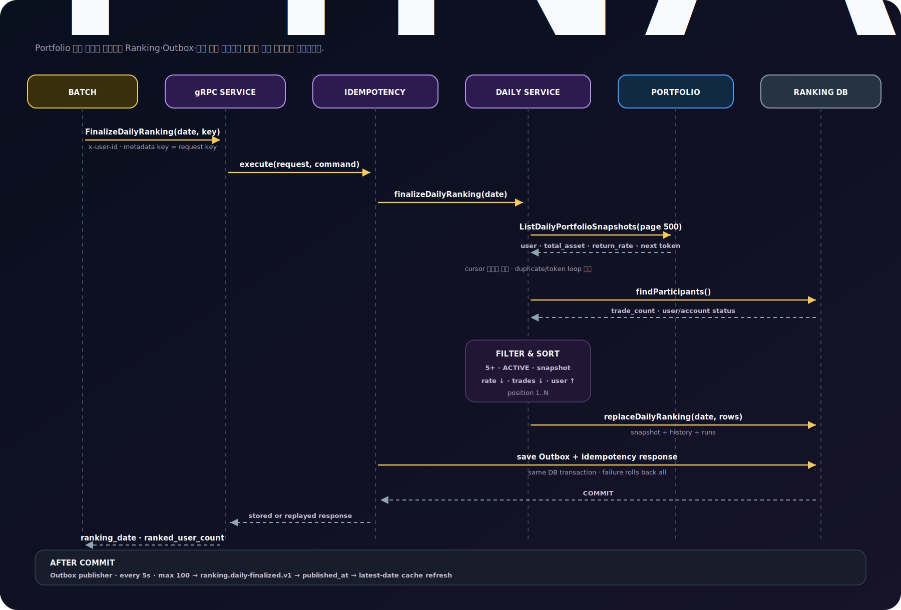
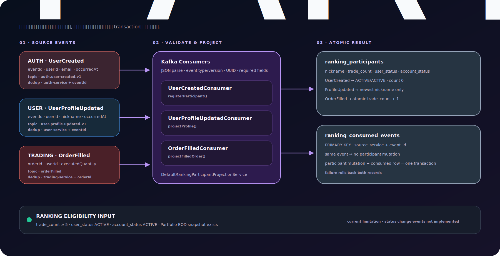
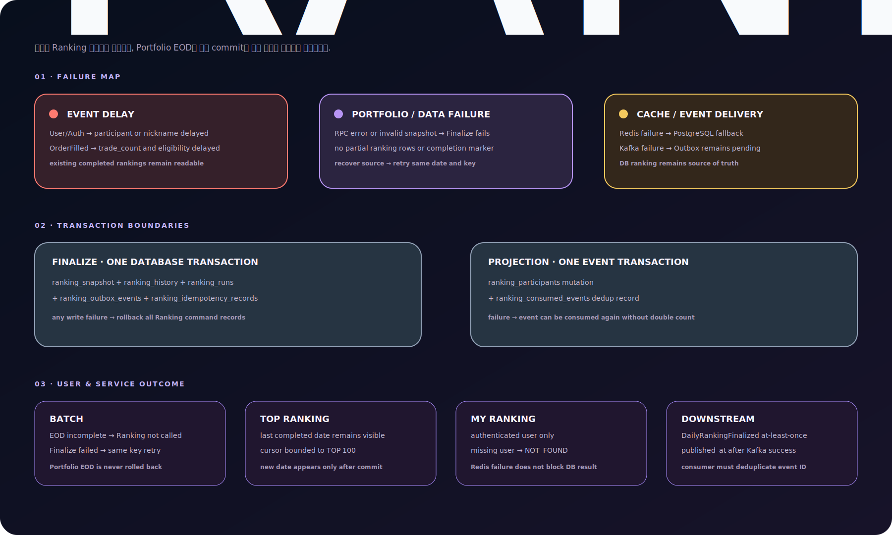

# Ranking Service 기능·연동·운영 가이드

## 1. 문서 목적과 책임

Ranking Service는 Portfolio가 거래일별로 확정한 EOD 자산과 누적 수익률을 입력으로 받아
일별 순위를 저장하고, 마지막 완료 거래일의 TOP 랭킹과 인증 사용자의 순위를 제공한다.

Ranking이 소유하는 책임은 다음과 같다.

- 사용자·닉네임·누적 체결 수·사용자/계좌 상태의 랭킹 참가자 투영
- Portfolio EOD 스냅샷을 이용한 일별 랭킹 확정
- 랭킹 상태 변경 RPC의 멱등성·Outbox·트랜잭션
- 마지막 완료일 기준 TOP 100과 내 순위 조회
- Redis cache-aside와 PostgreSQL fallback

Ranking이 소유하지 않는 책임은 다음과 같다.

- 보유 수량, 현금, 종가, 총자산 및 누적 수익률 계산
- 주문·체결과 사용자·계좌 원본 상태 변경
- 다른 서비스 DB 직접 조회 또는 다른 서비스 테이블에 대한 FK
- Batch 실행 시각, 선행 EOD Job 확인, Batch 재시작 정책

Ranking의 원본 데이터는 PostgreSQL이다. Redis는 조회 성능을 위한 파생 캐시이며 삭제되거나
장애가 발생해도 PostgreSQL에서 복구한다.

## 2. 전체 아키텍처와 데이터 흐름



<details>
<summary>Mermaid 원본 보기</summary>



</details>

### 2.1 일별 랭킹 확정 흐름

```text
Batch
→ RankingGrpcService.finalizeDailyRanking()
→ RankingIdempotencyExecutor.execute()
→ DefaultDailyRankingService.finalizeDailyRanking()
→ GrpcPortfolioSnapshotClient.listDailySnapshots()로 전체 cursor 순회
→ JdbcDailyRankingRepository.findParticipants()
→ 거래 5회·사용자 ACTIVE·계좌 ACTIVE 대상만 필터
→ 수익률 DESC, 거래 횟수 DESC, user_id ASC 정렬
→ ranking_snapshot + ranking_history + ranking_runs 저장
→ ranking_outbox_events + ranking_idempotency_records 저장
→ FinalizeDailyRankingResponse 반환
```



### 2.2 참가자 투영 흐름

```text
Kafka Consumer
→ JSON 역직렬화와 필수 필드 검증
→ DefaultRankingParticipantProjectionService
→ (source_service, event_id) 소비 이력 확인
→ ranking_participants 생성·닉네임 갱신·trade_count 원자 증가
→ ranking_consumed_events 저장
```

참가자 변경과 소비 이력은 하나의 DB 트랜잭션이다. 같은 이벤트가 다시 도착하면 소비 이력으로
중복을 막는다.



### 2.3 조회 흐름

```text
RankingGrpcService
→ DefaultRankingQueryService
→ ranking_runs에서 마지막 완료 거래일 확인
→ Redis TOP/사용자 캐시 조회
→ miss·Redis 장애 시 ranking_history + ranking_participants 조회
→ DB 결과 반환 후 Redis 캐시 복구 시도
```


## 3. 기능 진입점

### 3.1 gRPC

| RPC | 진입 메서드 | Service | 목적 |
| --- | --- | --- | --- |
| `FinalizeDailyRanking` | `RankingGrpcService.finalizeDailyRanking()` | `DailyRankingService.finalizeDailyRanking()` | 특정 KST 거래일의 랭킹 확정 |
| `ListRankings` | `RankingGrpcService.listRankings()` | `RankingQueryService.listRankings()` | 마지막 완료일 기준 TOP 순위 cursor 조회 |
| `GetMyRanking` | `RankingGrpcService.getMyRanking()` | `RankingQueryService.getMyRanking()` | 인증 사용자의 마지막 완료 순위 조회 |

### 3.2 Kafka 소비

| Topic | Consumer | Service 메서드 | 결과 |
| --- | --- | --- | --- |
| `auth.user-created.v1` | `UserCreatedConsumer.onUserCreated()` | `registerParticipant()` | 참가자 생성, 현재 정책상 사용자·계좌 `ACTIVE` 초기화 |
| `user.profile-updated.v1` | `UserProfileUpdatedConsumer.onUserProfileUpdated()` | `projectProfile()` | 닉네임 생성 또는 최신 이벤트 기준 갱신 |
| `${RANKING_ORDER_FILLED_TOPIC:orderFilled}` | `OrderFilledConsumer.onOrderFilled()` | `projectFilledOrder()` | `trade_count` 원자 증가 |

### 3.3 Scheduler

| 작업 | 주기 | 역할 |
| --- | --- | --- |
| `RankingOutboxPublisher.publishPendingEvents()` | 5초 | 미발행 Outbox 최대 100건을 Kafka로 발행 |
| `RankingIdempotencyExecutor.cleanExpiredRecords()` | 1시간 | 만료된 멱등성 성공 응답 삭제 |

일별 랭킹 실행 Scheduler는 Ranking Service가 아니라 Batch 모듈이 소유한다. Batch는 기본
16:20 KST에 `FinalizeDailyRanking`을 호출하며 같은 거래일 Portfolio EOD 완료 여부를 먼저
검사한다.

## 4. 외부 서비스와 공개 계약

### 4.1 Portfolio 조회 계약

- 서비스: `candle.portfolio.v1.PortfolioService`
- RPC: `ListDailyPortfolioSnapshots`
- 기본 대상: `static://localhost:50055`
- Client: `GrpcPortfolioSnapshotClient`
- deadline: 기본 3초
- Ranking page size: 500
- 정렬과 cursor 소유자: Portfolio Service

요청:

| 필드 | 값 |
| --- | --- |
| `snapshot_date` | KST 거래일 `YYYY-MM-DD` |
| `page.page_size` | `500` |
| `page.page_token` | 첫 페이지는 빈 문자열, 이후 응답 token |

응답에서 사용하는 값:

| 필드 | Ranking 사용처 |
| --- | --- |
| `user_id` | 참가자 투영과 결합 |
| `total_asset` | 랭킹 결과 저장·조회 |
| `cumulative_return_rate` | 순위 계산; Ranking에서 재계산하지 않음 |
| `page.next_page_token` | 전체 페이지 순회 |

Ranking Service 내부에서 Portfolio 호출을 자동 재시도하지 않는다. gRPC 오류는
`RANKING_PORTFOLIO_SNAPSHOT_SERVICE_UNAVAILABLE`과 `UNAVAILABLE`로 변환되어
`FinalizeDailyRanking` 전체가 실패한다. Batch가 동일 거래일·동일 멱등성 키로 최대 3회
재시도한다.

잘못된 UUID, 음수 `total_asset`, 비어 있는 수익률, 중복 사용자, 반복 cursor는
`RANKING_INVALID_PORTFOLIO_SNAPSHOT`으로 실패한다. 일부 결과를 저장하지 않는다.

### 4.2 Ranking gRPC 계약

#### `FinalizeDailyRanking`

요청:

- `ranking_date`: KST 거래일 `YYYY-MM-DD`
- `command_metadata.idempotency_key`: UUID canonical string
- metadata `x-idempotency-key`: request와 동일한 값
- metadata `x-user-id`: 명령 실행 주체, Batch는 `batch-service`

응답:

- `ranking_date`
- `ranked_user_count`: 대상자가 0명이어도 정상적으로 `0`

#### `ListRankings`

- 요청: 공통 `PageRequest`
- 기본 page size: 20
- 최대 page size: 100
- 응답: `rank`, `user_id`, `nickname`, `return_rate`, `total_asset`, `trade_count`, `ranking_date`
- cursor: `ranking_date:position`을 URL-safe Base64로 인코딩
- 조회 범위: 마지막 완료 거래일의 1위부터 최대 100위

#### `GetMyRanking`

- request `user_id`와 metadata `x-user-id`가 반드시 같아야 한다.
- 다른 사용자를 요청하면 `PERMISSION_DENIED`다.
- 완료 랭킹에 사용자가 없으면 `RANKING_NOT_FOUND`다.

조회 RPC는 상태를 변경하지 않으므로 Outbox와 멱등성 레코드 대상이 아니다.

### 4.3 Kafka 이벤트 계약

#### `UserCreated`

- topic: `auth.user-created.v1`
- 필수: `eventId`, `eventType=UserCreated`, `eventVersion=1`, `userId`, `occurredAt`
- email이 있으면 `@` 앞부분을 초기 닉네임으로 사용한다.
- email이 없으면 `user-<UUID 앞 8자리>`를 사용한다.
- 중복 키: `(auth-service, eventId)`

#### `UserProfileUpdated`

- topic: `user.profile-updated.v1`
- 필수: `eventId`, `eventType=UserProfileUpdated`, `eventVersion=1`, `userId`, `nickname`, `occurredAt`
- 닉네임 최대 길이: 100
- 과거 이벤트가 나중에 도착하면 현재 닉네임을 덮어쓰지 않는다.
- 중복 키: `(user-service, eventId)`

#### `OrderFilled`

- topic 기본값: `orderFilled`
- 필수 사용 필드: `orderId`, `userId`, `executedQuantity > 0`
- 현재 중복 키: `(trading-service, orderId)`
- 일반·예약 주문은 최종적으로 동일한 `OrderFilled`로 집계한다.
- 같은 사용자의 체결이 동시에 도착해도 DB 원자 증가로 횟수를 유실하지 않는다.

현재 `OrderFilled`에는 공통 `eventId`, `eventVersion`, `occurredAt`이 없으므로 `orderId`를
이벤트 ID로 사용한다. Trading 계약이 공통 이벤트 봉투로 변경되면 consumer record와
중복 키를 함께 변경해야 한다.

### 4.4 Ranking Outbox 발행 계약

- topic: `ranking.daily-finalized.v1`
- Kafka key: `ranking_date`
- event type: `DailyRankingFinalized`
- payload: `rankingDate`, `rankedUserCount`
- 발행 정책: at-least-once
- 성공한 이벤트만 `published_at` 갱신

Outbox event ID는 `(actor_id, operation, idempotency_key)`로 결정적으로 생성한다.

## 5. 데이터 저장 결과와 트랜잭션

### 5.1 테이블

| 테이블 | 주요 키·제약 | 저장 결과 |
| --- | --- | --- |
| `ranking_participants` | PK `user_id`, `trade_count >= 0` | 닉네임, 누적 체결 수, 사용자·계좌 상태 |
| `ranking_consumed_events` | PK `(source_service, event_id)` | 외부 이벤트 소비 중복 방지 |
| `ranking_snapshot` | UNIQUE `(user_id, snapshot_date)` | 거래일별 랭킹 입력 자산·수익률·체결 수 |
| `ranking_history` | UNIQUE `(user_id, ranking_date)`, `(ranking_date, ranking_position)` | 최종 순위와 조회 원본 |
| `ranking_runs` | PK `ranking_date` | 대상자 0명인 날을 포함한 완료 표식과 처리 인원 |
| `ranking_idempotency_records` | PK `(actor_id, operation, idempotency_key)` | request hash, 성공 response protobuf, 24시간 TTL |
| `ranking_outbox_events` | PK `event_id`, pending index | 일별 랭킹 확정 이벤트와 발행 상태 |

Ranking DB의 `user_id`는 UUID지만 다른 서비스 테이블 FK를 만들지 않는다.

### 5.2 일별 랭킹 저장

`JdbcDailyRankingRepository.replaceDailyRanking()`은 같은 거래일의 기존
`ranking_history`와 `ranking_snapshot`을 삭제하고 계산 결과를 500건 단위 batch insert한다.
마지막으로 `ranking_runs`를 upsert한다.

`FinalizeDailyRanking` 최초 성공 요청에서는 다음 데이터가 하나의 transaction으로 commit된다.

```text
ranking_snapshot
+ ranking_history
+ ranking_runs
+ ranking_outbox_events
+ ranking_idempotency_records
```

Outbox 또는 멱등성 응답 저장이 실패하면 랭킹 결과와 완료 표식도 rollback된다.

### 5.3 Redis

| Key | 자료 구조 | TTL | 용도 |
| --- | --- | --- | --- |
| `ranking:latest-date` | String | 1일 | 마지막 완료 거래일 |
| `ranking:<date>:top100` | List | 1일 | 최신 TOP 100 protobuf Base64 목록 |
| `ranking:<date>:user:<userId>` | String | 1일 | 사용자별 RankingEntry protobuf Base64 |

Outbox 발행 후 `latest-date` 갱신을 시도한다. Redis `DataAccessException`은 Outbox 발행 완료
처리를 되돌리지 않는다. 조회 시 DB의 마지막 완료일과 비교하여 누락되거나 오래된 캐시를
다시 생성한다.

## 6. 핵심 도메인·멱등성·조회 정책

### 6.1 랭킹 대상과 정렬

대상자는 다음 조건을 모두 만족해야 한다.

- `trade_count >= 5`
- `user_status = ACTIVE`
- `account_status = ACTIVE`
- 요청 거래일의 Portfolio EOD 스냅샷 존재

정렬은 항상 다음 순서다.

1. `cumulative_return_rate DESC`
2. `trade_count DESC`
3. `user_id ASC`

수익률은 `BigDecimal`로 처리하고 소수점 4자리 `HALF_UP`으로 저장한다. `double`과
`float`은 사용하지 않는다. `total_asset`은 원 단위 `long/BIGINT`다.

### 6.2 `FinalizeDailyRanking` 멱등성

- scope: `(actor_id, full_grpc_operation, idempotency_key)`
- metadata와 request의 key는 둘 다 필수이며 같아야 한다.
- request에서 key만 제거한 deterministic protobuf bytes로 SHA-256 hash를 계산한다.
- 같은 key·같은 request: 저장된 성공 response 재생, 명령·Outbox 재실행 없음
- 같은 key·다른 request: `ALREADY_EXISTS`
- 동시 같은 key: PK 충돌 후 먼저 commit한 response 재생
- 성공 응답 TTL: 24시간
- 만료 정리: 1시간 간격

### 6.3 조회와 cursor

- `ListRankings` 기본 20건, 최대 100건
- page size가 100보다 크면 100으로 제한
- cursor에는 거래일과 마지막 `ranking_position` 저장
- 잘못된 Base64·날짜·순위는 `RANKING_INVALID_PAGE_TOKEN`
- Redis 장애는 cache miss로 취급하고 PostgreSQL 결과를 반환
- DB에도 완료 결과가 없으면 `RANKING_NOT_FOUND`

### 6.4 현재 상태 정책과 미구현 계약

탈퇴·정지·계좌 비활성 이벤트는 아직 구현되지 않았다. 현재는 가입 사용자와 신규 계좌를
`ACTIVE`로 초기화하고 기존 `UNKNOWN` 데이터도 migration으로 `ACTIVE` 전환한다.

향후 필요한 계약:

```text
UserStatusChanged
- eventId, eventType, eventVersion, userId, status, occurredAt

AccountStatusChanged
- eventId, eventType, eventVersion, userId, status, occurredAt
```

두 상태는 별도 갱신 시각을 두어 늦게 도착한 과거 이벤트가 최신 상태를 덮어쓰지 않게 해야 한다.

## 7. 서비스 영향도와 장애 전파



| 상황 | 직접 영향 | 유지되는 데이터 | 복구 방식 |
| --- | --- | --- | --- |
| User/Auth 이벤트 지연 | 신규 참가자·닉네임 반영 지연 | 기존 랭킹 결과 | 이벤트 재소비 후 다음 랭킹에 반영 |
| `OrderFilled` 지연 | `trade_count`와 5회 조건 반영 지연 | 기존 참가자와 랭킹 | 동일 이벤트 재소비, orderId 중복 방지 |
| Portfolio RPC 실패 | 해당 거래일 Finalize 전체 실패 | 이전 완료 랭킹 | Portfolio 복구 후 같은 날짜·key로 Batch 재시도 |
| 잘못된 Portfolio 데이터 | 일부 저장 없이 Finalize 실패 | 이전 완료 랭킹 | 원본 스냅샷 수정 후 재시도 |
| Ranking DB 실패 | Finalize 또는 DB fallback 조회 실패 | 이미 commit된 다른 서비스 데이터 | DB 복구 후 재시도 |
| Outbox 저장 실패 | 랭킹·완료 표식·멱등성 응답까지 rollback | Portfolio EOD | 같은 날짜·key로 재실행 |
| Kafka 발행 실패 | `published_at IS NULL` 유지 | commit된 랭킹 결과 | 5초 publisher가 재시도 |
| Redis 장애 | 캐시 갱신·조회만 실패 | PostgreSQL 랭킹 원본 | DB fallback 후 다음 요청에서 캐시 복구 |

Ranking 실패는 Portfolio EOD를 rollback하지 않는다. 반대로 Portfolio EOD가 Batch에서
`COMPLETED`가 아니면 Ranking Batch는 `FinalizeDailyRanking`을 호출하지 않는다.

## 8. 테스트와 결과 확인

### 8.1 필요한 인프라와 실행

```bash
docker compose up -d postgres redpanda redis
./gradlew :services:ranking-service:bootRun
```

정상 로그:

```text
Started RankingServiceApplication
```

실제 `FinalizeDailyRanking` 연동 테스트에는 Portfolio Service `50055`와 해당 거래일의 EOD
스냅샷이 필요하다. 조회·투영 단위 테스트는 외부 서비스를 실행하지 않아도 된다.

### 8.2 전체 자동 테스트

```bash
./gradlew :services:ranking-service:test
```

주요 기능만 확인:

```bash
./gradlew :services:ranking-service:test \
--tests '*GrpcPortfolioSnapshotClientTest' \
--tests '*OrderFilledConsumerTest' \
--tests '*DefaultRankingParticipantProjectionServiceTest' \
--tests '*DefaultDailyRankingServiceTest' \
--tests '*RankingIdempotencyExecutorTest' \
--tests '*RankingGrpcServiceTest' \
--tests '*DefaultRankingQueryServiceTest'
```

### 8.3 PostgreSQL 로컬 통합 테스트

거래 횟수 중복·동시 증가:

```bash
RUN_LOCAL_RANKING_TRADE_TEST=true \
KEEP_LOCAL_RANKING_TRADE_TEST_DATA=true \
./gradlew :services:ranking-service:test \
--tests '*RankingTradeProjectionLocalIntegrationTest'
```

일별 랭킹 저장:

```bash
RUN_LOCAL_RANKING_DB_TEST=true \
KEEP_LOCAL_RANKING_DB_TEST_DATA=true \
./gradlew :services:ranking-service:test \
--tests '*DailyRankingLocalIntegrationTest'
```

멱등성·Outbox transaction:

```bash
RUN_LOCAL_RANKING_COMMAND_DB_TEST=true \
KEEP_LOCAL_RANKING_COMMAND_DB_TEST_DATA=true \
./gradlew :services:ranking-service:test \
--tests '*RankingCommandLocalIntegrationTest'
```

조회·Redis fallback:

```bash
RUN_LOCAL_RANKING_QUERY_TEST=true \
KEEP_LOCAL_RANKING_QUERY_TEST_DATA=true \
./gradlew :services:ranking-service:test \
--tests '*RankingQueryLocalIntegrationTest'
```

### 8.4 DB 결과 확인

```bash
docker compose exec postgres \
psql -U candle -d candle -P pager=off -c "
SELECT user_id, nickname, trade_count, user_status, account_status
FROM ranking.ranking_participants
ORDER BY user_id;

SELECT ranking_date, ranked_user_count, completed_at
FROM ranking.ranking_runs
ORDER BY ranking_date DESC;

SELECT ranking_date, ranking_position, user_id, total_asset, profit_rate, trade_count
FROM ranking.ranking_history
ORDER BY ranking_date DESC, ranking_position;

SELECT event_type, aggregate_id, published_at
FROM ranking.ranking_outbox_events
ORDER BY occurred_at DESC;
"
```

정상 결과:

- `ranking_runs.ranked_user_count`와 해당 날짜 `ranking_history` 행 수가 같다.
- 순위는 1부터 빈 번호 없이 증가한다.
- 수익률 동점이면 거래 횟수, 다시 동점이면 사용자 ID 순서다.
- 성공 명령 한 번에 Outbox와 멱등성 레코드가 각각 한 건이다.
- 대상자가 0명이어도 `ranking_runs`에는 완료 행이 존재한다.

### 8.5 Redis 결과 확인

```bash
docker compose exec redis redis-cli GET ranking:latest-date
docker compose exec redis redis-cli KEYS 'ranking:*'
docker compose exec redis redis-cli LRANGE ranking:<YYYY-MM-DD>:top100 0 -1
```

TOP 목록 값은 `RankingEntry` protobuf bytes를 Base64로 저장한 문자열이므로 사람이 읽는 JSON이
아닌 것이 정상이다.

### 8.6 Kafka 수동 확인

```bash
printf '%s\n' '{
  "orderId":"82000000-0000-4000-8000-000000000099",
  "userId":"81000000-0000-4000-8000-000000000001",
  "symbol":"005930",
  "side":"BUY",
  "executedPriceKrw":80000,
  "executedQuantity":1,
  "feeKrw":10,
  "taxKrw":0,
  "netAmountKrw":80010
}' | docker compose exec -T redpanda rpk topic produce orderFilled
```

같은 payload를 두 번 발행해도 `trade_count`와 `(trading-service, orderId)` 소비 이력은 한
번만 반영돼야 한다.

### 8.7 테스트용 Fake와 Mock 범위

- Portfolio Fake는 `DefaultDailyRankingServiceTest` 안에서만 사용한다.
- gRPC client 테스트는 in-process 또는 Mock stub을 사용한다.
- 로컬 통합 테스트는 전용 UUID 데이터를 생성한다.
- 운영 코드는 `GrpcPortfolioSnapshotClient`만 사용한다.
- 운영 코드에는 임시 수익률, 임시 사용자, 성공을 반환하는 Fake가 없다.

## 9. 운영 설정과 향후 변경 지점

### 9.1 포트와 환경변수

| 설정 | 기본값 | 용도 |
| --- | --- | --- |
| `RANKING_GRPC_PORT` | `50056` | Ranking gRPC server |
| `RANKING_SERVER_PORT` | `8086` | HTTP/Actuator server |
| `RANKING_PORTFOLIO_GRPC_TARGET` | `static://localhost:50055` | Portfolio client target |
| `RANKING_PORTFOLIO_GRPC_DEADLINE` | `3s` | Portfolio 조회 deadline |
| `RANKING_DB_URL` | `jdbc:postgresql://localhost:5432/candle?currentSchema=ranking,public` | Ranking schema |
| `RANKING_DB_USERNAME` | `candle` | DB 사용자 |
| `RANKING_DB_PASSWORD` | `candle` | 로컬 기본값; 운영은 secret 사용 |
| `RANKING_REDIS_HOST` | `localhost` | Redis host |
| `RANKING_REDIS_PORT` | `6379` | Redis port |
| `KAFKA_BOOTSTRAP_SERVERS` | `localhost:9092` | Kafka bootstrap servers |
| `RANKING_ORDER_FILLED_TOPIC` | `orderFilled` | Trading 체결 topic |

비밀값은 코드나 문서에 실제 값으로 저장하지 않는다.

### 9.2 운영 기본 동작

- Ranking Service가 실행되면 Kafka consumer, Outbox publisher, TTL 정리 Scheduler가 동작한다.
- 일별 랭킹 자동 실행 여부는 Batch의 `BATCH_RANKING_ENABLED`가 소유하며 기본값은 `false`다.
- Batch 단일 인스턴스 운영을 전제로 한다. 다중 인스턴스 전환 전에는 Batch 실행 잠금 정책이
  필요하다.

### 9.3 향후 변경 지점

1. `UserStatusChanged` 계약이 생기면 사용자 상태 event record·consumer와 상태별 갱신 시각을 추가한다.
2. `AccountStatusChanged` 계약이 생기면 계좌 상태 투영과 `ACTIVE` 임시 초기화 정책을 제거한다.
3. Trading이 공통 이벤트 봉투를 제공하면 `OrderFilled` 중복 키를 `eventId`로 전환한다.
4. Debezium 공식 topic이 확정되면 `RANKING_ORDER_FILLED_TOPIC` 운영값을 변경한다.
5. Ranking Outbox topic을 환경별로 바꿔야 하면 현재 상수 `ranking.daily-finalized.v1`을 설정으로 분리한다.
6. Portfolio deadline 또는 Batch 재시도 횟수는 실제 처리 시간과 운영 지표를 근거로 조정한다.
7. Redis 장애율과 Outbox pending 수를 Micrometer metric·알림에 연결한다.

## 10. 테스트 완료 기준

- 거래 5회 미만 참가자가 제외된다.
- 비활성·정지·탈퇴 상태가 랭킹 대상에서 제외된다.
- 수익률·거래 횟수·사용자 ID 순서가 결정적이다.
- 동일 외부 이벤트가 한 번만 투영된다.
- 같은 멱등성 key·같은 요청은 동일 응답을 재생한다.
- 같은 key·다른 요청은 `ALREADY_EXISTS`다.
- Outbox 실패 시 랭킹과 멱등성 레코드도 rollback된다.
- Redis 장애 시 PostgreSQL 결과를 반환한다.
- page size 최대 100과 cursor가 안정적으로 동작한다.
- 다른 서비스 DB를 직접 조회하거나 FK로 연결하지 않는다.
