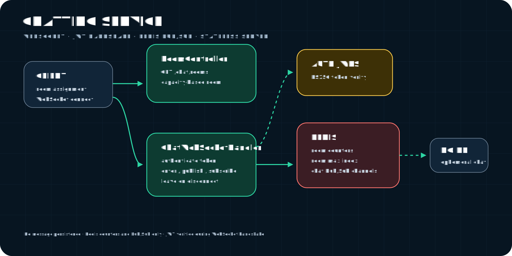

# Chatting Service 구조 설명



이 문서는 `chatting-service`의 구조와 동작 방식을 설명한다.
개발 경험이나 WebSocket 지식 없이도 읽을 수 있도록 작성했다.


---

## 목차

1. [Chatting Service가 하는 일](#1-chatting-service가-하는-일)
2. [WebSocket이란 무엇인가](#2-websocket이란-무엇인가)
3. [서비스 구조 한눈에 보기](#3-서비스-구조-한눈에-보기)
4. [계층별 역할 설명](#4-계층별-역할-설명)
5. [주요 기능 흐름](#5-주요-기능-흐름)
6. [왜 서버가 아무 상태도 안 들고 있는가 (Stateless 설계)](#6-왜-서버가-아무-상태도-안-들고-있는가-stateless-설계)
7. [Redis 키 설계](#7-redis-키-설계)
8. [API 계약](#8-api-계약)
9. [핵심 설계 결정 요약](#9-핵심-설계-결정-요약)
10. [테스트는 어떻게 검증하나](#10-테스트는-어떻게-검증하나)

---

## 1. Chatting Service가 하는 일

Chatting Service는 **종목별 실시간 채팅방**을 제공하는 서비스다. 예를 들어 삼성전자(005930) 종목 페이지에 들어가면, 그 종목에 관심 있는 다른 사용자들과 실시간으로 채팅할 수 있다.

| 기능 | 설명 |
|------|------|
| 방 배정 | 종목코드를 주면 입장할 방 번호를 알려준다(정원이 차면 새 방을 만든다) |
| 실시간 메시지 송수신 | WebSocket으로 연결된 같은 방 사람들끼리 메시지를 실시간으로 주고받는다 |
| 인증 | 채팅 연결 시점에 로그인한 사용자인지 확인한다 |

다른 Service들과 다른 점이 하나 있다 — **메시지를 DB에 저장하지 않는다.** 채팅 이력을 남기는 기능이 아니라 "지금 이 순간의 실시간 대화"에만 집중하는 서비스로 설계됐다. 껐다 켜면 이전 메시지는 사라진다(카카오톡 같은 영구 저장 채팅과는 다른 설계다).

---

## 2. WebSocket이란 무엇인가

### REST API와의 비교

gRPC나 일반적인 REST API는 **클라이언트가 요청을 보내야만 서버가 응답하는** 방식이다.

```
클라이언트 → 요청 → 서버
클라이언트 ← 응답 ← 서버
(끝. 연결은 여기서 종료)
```

채팅처럼 "누군가 메시지를 보내면 나머지 사람들에게 즉시 전달돼야 하는" 상황에는 이 방식이 맞지 않는다. 서버가 먼저 나서서 클라이언트에 메시지를 밀어넣을 방법이 없기 때문이다.

### WebSocket을 쓰는 이유

**WebSocket**은 한 번 연결을 맺으면 그 연결을 계속 열어둔 채로 **양쪽이 아무 때나** 메시지를 주고받을 수 있는 프로토콜이다.

```
클라이언트 ⇄ 서버
(연결이 유지되는 동안 양쪽 다 아무 때나 메시지를 보낼 수 있다)
```

- **실시간성**: 서버가 먼저 메시지를 보낼 수 있다(누가 채팅을 치면 즉시 다른 사람에게 전달)
- **연결 유지**: 매번 새로 연결할 필요 없이 하나의 연결로 계속 주고받는다
- **양방향**: 클라이언트→서버, 서버→클라이언트 둘 다 가능

### 이 서비스가 쓰는 리액티브 스택(WebFlux)

이 서비스는 Spring WebFlux(리액티브) 기반이다. 전통적인 Spring MVC는 요청 하나에 스레드 하나를 붙잡아두는데, WebSocket처럼 연결을 오래 유지하는 경우 리액티브 방식(`Mono`/`Flux`)이 훨씬 적은 리소스로 많은 동시 연결을 감당할 수 있다.

### WS 요청 흐름

```
클라이언트 앱
    │
    │  WebSocket 연결 요청 (ws://.../chat/ws?room=005930_1&token=...)
    ▼
[WebSocketConfig] ← "/chat/ws" 경로를 ChatWebSocketHandler로 라우팅
    │
    ▼
[ChatWebSocketHandler] ← 핸드셰이크 인증 + 방 입장 + 메시지 송수신
    │
    ▼
[Redis] ← 인원 카운터 + Pub/Sub 채널
```

여기서 눈여겨볼 점: Trading Service의 `IdempotencyServerInterceptor`처럼 "모든 요청이 거치는 관문"이 이 서비스에도 있다 — 다만 멱등성 검증이 아니라 **JWT 인증**이 그 역할을 한다(4-2절).

---

## 3. 서비스 구조 한눈에 보기

```
chatting-service/src/main/java/org/profit/candle/chatting/
│
├── ChattingServiceApplication.java   ← 부트 클래스
│
├── config/
│   ├── WebSocketConfig      ← /chat/ws 라우팅 → ChatWebSocketHandler
│   ├── ChatProperties        ← JWT(jwkSetUri/issuer/audience), room(capacity/counterTtl), cors 설정
│   ├── CorsConfig            ← 방 배정 REST용 CORS
│   └── RedisConfig
│
├── auth/
│   ├── HandshakeAuthenticator        ← 인터페이스("토큰을 검증해 계정 ID를 돌려줘")
│   └── JwtHandshakeAuthenticator     ← RS256 + JWKS로 WS 핸드셰이크를 직접 검증
│
├── room/
│   ├── RoomKey            ← {symbol}_{room} 식별자 (예: "005930_1")
│   ├── RoomAssignment     ← 배정 결과(어느 방에, 현재 몇 명)
│   ├── RoomAssigner       ← 인터페이스("이 종목, 어느 방으로 보낼까?")
│   ├── RoomCounter        ← 인터페이스("입장했다/퇴장했다")
│   ├── RedisRoomRegistry  ← RoomAssigner + RoomCounter를 Redis로 구현
│   └── RoomController     ← REST: GET /chat/rooms?symbol=005930
│
└── ws/
    ├── ChatMessage             ← 메시지 한 건의 모양 { accountId, text, timestamp }
    ├── ChatBroker              ← 인터페이스("구독해줘" / "발행해줘")
    ├── RedisChatBroker          ← ChatBroker를 Redis Pub/Sub로 구현
    └── ChatWebSocketHandler     ← 실제 WS 커넥션을 처리하는 핵심 클래스
```

다른 Service와 비교하면 구조가 훨씬 단순하다 — `domain`/`repository`/`event`(Outbox) 계층이 통째로 없다. 이유는 간단하다: **저장할 데이터 자체가 없기 때문**이다.

---

## 4. 계층별 역할 설명

### 4-1. 방 배정 (`room/RoomController.java`, `room/RedisRoomRegistry.java`)

**비유**: 놀이공원 입장 안내원. "삼성전자 채팅방 가고 싶어요"라고 하면, 사람이 덜 찬 방을 안내해주거나, 다 찼으면 새 방을 열어준다.

```java
// RoomController.java
@GetMapping
public Mono<RoomAssignment> assign(@RequestParam String symbol) {
    return roomAssigner.assign(symbol);
}
```

실제 배정 로직(`RedisRoomRegistry.assign`)은 이렇게 동작한다:

```java
// RedisRoomRegistry.java (일부, 흐름만 발췌)
public Mono<RoomAssignment> assign(String symbol) {
    return maxRoom(symbol).flatMap(max -> {
        if (max == 0) {
            return allocateNewRoom(symbol);   // 이 종목 방이 하나도 없으면 1번 방 신규 발급
        }
        return Flux.range(1, max)
                .concatMap(room -> count(new RoomKey(symbol, room))
                        .map(current -> RoomAssignment.of(new RoomKey(symbol, room), current)))
                .filter(assignment -> assignment.count() < properties.room().capacity())  // 정원 미만인 방
                .next()
                .switchIfEmpty(Mono.defer(() -> allocateNewRoom(symbol)));  // 다 찼으면 새 방
    });
}
```

**중요한 설계 선택**: 방 배정은 인원수를 **읽기만** 한다. 실제로 인원수를 늘리고 줄이는 권한은 오직 WebSocket 연결/해제(`RoomCounter.enter/leave`)에만 있다 — 배정 API를 여러 번 호출해도 카운터가 늘어나지 않는다.

### 4-2. 핸드셰이크 인증 (`auth/JwtHandshakeAuthenticator.java`)

**비유**: 공연장 입구의 티켓 검사원. Trading Service는 게이트웨이가 미리 신분 확인을 해주고 통과시켜주지만, 이 서비스는 **WebSocket이 게이트웨이를 거치지 않고 직결**되기 때문에 검사원을 자기가 직접 세워둬야 한다.

```java
// JwtHandshakeAuthenticator.java (일부)
public Optional<String> authenticate(String token) {
    if (token == null || token.isBlank()) {
        return Optional.empty();
    }
    try {
        JWTClaimsSet claims = jwtProcessor.process(token, null);   // RS256 서명 검증(auth-service 공개키)

        Date expiration = claims.getExpirationTime();
        if (expiration == null || expiration.toInstant().plusSeconds(CLOCK_SKEW_SECONDS).isBefore(Instant.now())) {
            return Optional.empty();   // 만료됐거나 만료 시각이 아예 없으면 거부
        }
        // issuer, audience 검증 생략(발췌)...
        return Optional.ofNullable(claims.getSubject());   // 통과하면 accountId 반환
    } catch (Exception e) {
        return Optional.empty();   // 서명 위조, 파싱 실패 등은 전부 인증 실패로 처리
    }
}
```

검사 항목을 정리하면:
- **서명**: auth-service가 공개한 JWKS(공개키 목록)로 진짜 auth-service가 발급한 토큰인지 확인
- **만료(exp)**: 반드시 있어야 하고, 만료됐으면 거부(30초 정도의 시계 오차는 봐준다)
- **발급자(iss)**, **대상(aud)**: 설정돼 있으면 일치해야 함

### 4-3. WS 커넥션 처리 (`ws/ChatWebSocketHandler.java`)

**비유**: 채팅방 문지기. 손님이 들어오면(연결) 이름표를 확인하고(인증), 입장 명부에 이름을 적고(카운터 증가), 방 안 대화를 들려주고(구독), 손님이 하는 말을 방 전체에 전달한다(발행). 손님이 나가면(연결 종료) 명부에서 이름을 지운다(카운터 감소).

```java
// ChatWebSocketHandler.java (일부, 핵심 흐름만 발췌)
public Mono<Void> handle(WebSocketSession session) {
    // 1. 쿼리스트링에서 room, token 꺼내기
    String roomId = query.get("room");
    RoomKey key = RoomKey.parse(roomId);
    String token = ... ; // 쿼리 우선, 없으면 Sec-WebSocket-Protocol 헤더에서
    Optional<String> account = authenticator.authenticate(token);
    if (account.isEmpty()) {
        return session.close(UNAUTHORIZED);   // 4401 코드로 종료
    }

    // 2. 이 방을 구독(다른 사람이 보낸 메시지를 받는 쪽)
    Flux<WebSocketMessage> outbound = broker.subscribe(key.channel()).map(session::textMessage);

    // 3. 내가 보내는 메시지를 방에 발행하는 쪽
    Mono<Void> inbound = session.receive()
            .map(WebSocketMessage::getPayloadAsText)
            .concatMap(text -> broker.publish(key.channel(), serialize(account.get(), text)))
            .then();

    // 4. enter(입장, 카운터 증가)가 성공했을 때만 leave(퇴장, 카운터 감소)가 실행되도록 보장
    return Mono.usingWhen(
            roomCounter.enter(key),
            entered -> Mono.firstWithSignal(session.send(outbound), inbound),
            entered -> roomCounter.leave(key));
}
```

`Mono.usingWhen`이 하는 일이 중요하다 — "자원을 획득했을 때만 해제한다"는 패턴이다. 만약 `enter`(입장 처리) 자체가 실패했는데도 `leave`(퇴장 처리)가 실행되면, 카운터가 실제 입장 안 한 사람만큼 마이너스로 내려갈 수 있다. 이 비대칭을 코드로 원천 차단한 것이다.

### 4-4. 왜 토큰을 쿼리스트링으로 받는가

브라우저의 기본 `WebSocket` API는 커스텀 HTTP 헤더를 붙일 수 없다(REST 호출과 다른 제약이다). 그래서 이 서비스는 토큰을 두 가지 경로로 받도록 설계했다:
1. **쿼리스트링** `?token=...` (1순위)
2. **`Sec-WebSocket-Protocol` 헤더** (2순위 — WebSocket 스펙상 브라우저가 붙일 수 있는 몇 안 되는 커스텀 값)

쿼리스트링에 토큰을 넣으면 서버 로그 등에 노출될 수 있어서, 코드 주석에도 "짧은 수명 토큰을 권장한다"고 명시돼 있다.

---

## 5. 주요 기능 흐름

### 5-1. 방 배정 흐름 (`GET /chat/rooms`)

```
클라이언트
    │  GET /chat/rooms?symbol=005930
    ▼
[RoomController.assign]
    ▼
[RedisRoomRegistry.assign]
    │
    ├─ Redis에서 "이 종목에 지금까지 발급된 최대 방 번호"를 확인
    │
    ├─ 발급된 방이 없으면 → 1번 방 신규 발급
    │
    └─ 있으면 → 1번 방부터 순서대로 인원수 확인
         ├─ 정원 미만인 방을 찾으면 그 방 배정
         └─ 다 찼으면 → 새 번호로 방 신규 발급
    ▼
클라이언트에 { roomId: "005930_1", count: 3 } 반환
```

### 5-2. WS 연결 및 메시지 송수신 흐름

```
클라이언트
    │  WS 연결 요청 (room=005930_1, token=eyJhbGc...)
    ▼
[ChatWebSocketHandler.handle]
    │
    ├─ roomId 파싱 (형식이 잘못되면 즉시 연결 거부)
    ├─ 토큰 인증 (실패하면 4401로 연결 종료)
    ├─ 카운터 증가(enter) — 이때부터 "입장한 사람"으로 카운트됨
    ├─ 이 방의 Redis 채널 구독 시작 (다른 사람 메시지 수신 대기)
    │
    ├─ (클라이언트가 메시지 보낼 때마다)
    │    → { accountId, text, timestamp } 형태로 포장
    │    → Redis 채널에 발행
    │    → 이 채널을 구독 중인 모든 서버 인스턴스가 받아서 각자의 클라이언트에 전달
    │
    └─ (연결 종료 시) 카운터 감소(leave)
```

**여기서 중요한 지점**: 메시지가 "저장"되는 곳이 어디에도 없다. Redis Pub/Sub는 그 순간 구독 중인 사람에게만 전달하고 끝이다 — 채팅방에 들어오기 전에 오간 대화는 볼 수 없다(카카오톡과 다른 점, 1절에서 설명한 설계 원칙 그대로다).

---

## 6. 왜 서버가 아무 상태도 안 들고 있는가 (Stateless 설계)

### 문제 상황

채팅 서버가 여러 대 떠 있다고 해보자. A 서버에 연결된 사용자와 B 서버에 연결된 사용자가 같은 방에 있다면, A 서버는 B 서버에 연결된 사용자에게 메시지를 어떻게 전달할까?

```
❌ 서버가 상태(연결 정보)를 자기 메모리에만 들고 있다면
    A 서버: "나한테 연결된 사람들끼리만 메시지 전달"
    B 서버: "나한테 연결된 사람들끼리만 메시지 전달"
    → A에 연결된 사람과 B에 연결된 사람은 서로의 메시지를 못 본다!
```

이 문제를 피하는 전통적인 방법은 "sticky session"이다 — 같은 사용자는 항상 같은 서버로만 연결되게 로드밸런서를 설정하는 것이다. 하지만 이러면 서버를 늘리거나 줄일 때(스케일 아웃/인) 골치 아파진다.

### 이 서비스의 해결책 — Redis Pub/Sub 팬아웃

```
✅ 서버는 상태를 하나도 안 들고 있고, Redis가 대신 들고 있다

[A 서버] → 사용자 메시지 수신 → Redis 채널에 발행(PUBLISH)
[B 서버] → 같은 Redis 채널을 구독(SUBSCRIBE) 중이었다면 → 자동으로 수신 → 자기 쪽 사용자에게 전달
```

이렇게 하면 사용자가 어느 서버에 연결됐는지는 전혀 중요하지 않다 — **모든 서버 인스턴스가 같은 Redis 채널을 구독**하고 있기만 하면 되기 때문이다. 그래서 sticky session이 필요 없고, 서버를 몇 대로 늘려도(스케일 아웃) 문제없이 동작한다.

이 서비스의 Redis Pub/Sub는 "여러 서버 인스턴스 사이의 메시지 팬아웃"을 위한 설계다

### 대가 — 메시지 유실 가능성

Redis Pub/Sub는 **구독 중일 때만** 메시지를 받는다. 연결이 잠깐 끊긴 사이에 발행된 메시지는 재전달되지 않는다(fire-and-forget). 이 서비스는 애초에 메시지 유실을 감수하기로 설계했다 — 1절에서 말한 "메시지는 저장하지 않는다"는 원칙과 일관된 선택이다.

---

## 7. Redis 키 설계

이 서비스는 DB가 없는 대신, Redis에 3가지 종류의 키/채널을 쓴다.

### 방 번호 시퀀스 — `chat:rooms:{symbol}`

```
타입: String(정수)
예시: chat:rooms:005930 → "3"  (지금까지 3번 방까지 발급됨)
```
새 방이 필요할 때마다 `INCR`로 1씩 증가시킨다. 절대 줄어들지 않는다(방이 텅 비어도 번호를 재활용하지 않음).

### 방별 인원 카운터 — `{symbol}_{room}_count`

```
타입: String(정수)
예시: 005930_1_count → "12"  (005930 1번 방에 지금 12명)
TTL: chat.room.counter-ttl (기본 2시간)
```
WebSocket `enter`/`leave`에서만 `INCR`/`DECR`된다. TTL이 붙어있는 이유는 "누수 안전망"이다 — 서버가 비정상 종료되는 등의 이유로 `leave`가 호출되지 못해도, 일정 시간 뒤 자동으로 사라지게 해서 카운터가 영원히 부풀어있는 상황을 막는다(코드 주석에 "heartbeat 메커니즘 도입 전까지의 임시 조치"라고 적혀 있다).

### 메시지 팬아웃 채널 — `chat:{symbol}_{room}`

```
타입: Pub/Sub 채널 (값 저장 안 됨)
예시: chat:005930_1
```
메시지 자체는 저장되지 않고, 그 순간 구독 중인 서버 인스턴스에만 전달된다.

### RoomKey가 이 세 가지를 한 번에 만들어준다

```java
// RoomKey.java
public record RoomKey(String symbol, int room) {
    public String roomId() { return symbol + "_" + room; }              // "005930_1"
    public String channel() { return "chat:" + roomId(); }              // "chat:005930_1"
    public String countKey() { return roomId() + "_count"; }            // "005930_1_count"
}
```

---

## 8. API 계약

이 서비스는 proto가 없다 — REST 하나, WebSocket 하나뿐이다.

### REST

| 엔드포인트 | 설명 |
|---|---|
| `GET /chat/rooms?symbol={symbol}` | 방 배정. 응답: `{ roomId, count }` |

### WebSocket

| 엔드포인트 | 설명 |
|---|---|
| `GET(Upgrade) /chat/ws?room={roomId}&token={jwt}` | 방 입장 + 실시간 메시지 송수신. 인증 실패 시 close code `4401` |

멱등성 키나 `command_metadata` 같은 개념 자체가 없다 — 채팅 메시지는 "같은 요청을 두 번 보내면 안 되는" 성격의 데이터가 아니기 때문이다.

---

## 9. 핵심 설계 결정 요약

| 결정 | 이유 |
|------|------|
| gRPC/REST 대신 WebSocket | 서버가 먼저 메시지를 밀어넣어야 하는 실시간 채팅 특성상 요청-응답 모델로는 안 된다 |
| 메시지를 DB에 저장하지 않음 | 채팅 이력 조회가 아니라 실시간 라우팅에만 집중하는 설계 |
| 서버를 완전히 Stateless로 설계 | 연결 상태를 서버 메모리가 아니라 Redis에 위임해, sticky session 없이 스케일 아웃 가능 |
| Redis Pub/Sub로 팬아웃 | 여러 서버 인스턴스에 흩어진 연결끼리도 같은 방 메시지를 주고받을 수 있게 한다 |
| 게이트웨이가 아니라 서비스 자신이 JWT 검증 | WebSocket은 API Gateway를 거치지 않고 ALB/NLB로 직결되므로, 게이트웨이가 대신 인증해줄 수 없다 |
| 방 배정에 분산 락을 안 씀(낙관적 설계) | "대략 500명 안팎이면 충분하다"는 도메인 판단에 따라, 버스트 시 정원을 살짝 넘기는 걸 감수하고 락 오버헤드를 피했다 |
| 인원 카운터에 TTL을 둠 | `enter`/`leave` 비대칭(비정상 종료 등)으로 카운터가 영구히 틀어지는 걸 막는 임시 안전망 |
| 토큰을 쿼리스트링/서브프로토콜로 받음 | 브라우저 WebSocket API가 커스텀 헤더를 지원하지 않기 때문 |

---

## 10. 테스트는 어떻게 검증하나

이 서비스의 테스트 파일 5개 중 하나(`JwtHandshakeAuthenticatorTest`)가 특히 눈여겨볼 만하다.

### 예시 — JWT 검증을 Mock 없이 "진짜로" 테스트하기

**비유**: 자물쇠 회사가 새로 만든 자물쇠를 테스트할 때, "열쇠 모양이 맞으면 열린다고 치자"라고 가정하고 넘어가지 않는다. 진짜 열쇠를 만들어서 진짜로 꽂아본다. 이 테스트도 그렇게 한다 — 진짜 RSA 키 쌍을 만들고, 진짜로 서명된 JWT로 검증 로직을 통과시켜본다.

```java
// JwtHandshakeAuthenticatorTest.java (일부)
static final RSAKey SIGNING_KEY = rsaKey();   // 진짜 RSA 키 쌍 생성
static final RSAKey WRONG_KEY = rsaKey();     // 서명 위조 테스트용 "가짜" 키
static final JWKSource<SecurityContext> JWKS =
        new ImmutableJWKSet<>(new JWKSet(SIGNING_KEY.toPublicJWK()));  // 로컬 JWKS(외부 네트워크 불필요)

final JwtHandshakeAuthenticator authenticator =
        new JwtHandshakeAuthenticator(JWKS, properties(ISSUER, AUDIENCE));

@Test
void authenticate_validToken_returnsSubject() throws Exception {
    String token = token(SIGNING_KEY, ACCOUNT_ID, ISSUER, AUDIENCE, Instant.now().plusSeconds(60));
    assertThat(authenticator.authenticate(token)).contains(ACCOUNT_ID);
}
```

`WRONG_KEY`로 서명한 토큰을 넣어보는 테스트도 있다 — 이러면 "서명 검증 로직이 진짜로 동작하는지"까지 확인된다. Mockito로 `authenticate()` 메서드 자체를 흉내 내는 방식이었다면 이런 검증은 불가능했을 것이다 — 진짜 암호화 라이브러리(Nimbus JOSE+JWT)를 그대로 쓰되, 외부 네트워크 호출(진짜 auth-service의 JWKS 엔드포인트)만 로컬 값으로 대체한 것이 포인트다.

### 나머지 테스트

| 테스트 파일 | 검증 방식 |
|---|---|
| `RedisRoomRegistryTest` | Redis 클라이언트를 Mockito로 Mock 처리 + Reactor `StepVerifier`로 비동기 결과 검증 |
| `RoomKeyTest` | 순수 단위 테스트(roomId 파싱/포맷팅) |
| `RoomControllerTest` | `RoomAssigner`를 Mock으로 대체해 REST 응답 검증 |
| `ChatWebSocketHandlerTest` | Mockito + `StepVerifier` — "입장 실패 시 퇴장 처리가 호출되면 안 된다"처럼 비동기 흐름의 미묘한 규칙을 검증 |


### 로컬에서 테스트 실행하기

```bash
./gradlew :chatting-service:test
```
Redis나 외부 auth-service 없이도 대부분의 테스트가 통과한다 — 실제 인프라가 필요한 건 서비스를 직접 띄워서 손으로 WebSocket 연결을 확인할 때뿐이다.

---

*이 문서는 dev 브랜치의 실제 코드(WebSocketConfig, JwtHandshakeAuthenticator, RedisRoomRegistry, RedisChatBroker, ChatWebSocketHandler, RoomController, application.yml)와 5개 테스트 파일을 기준으로 작성했다.*
