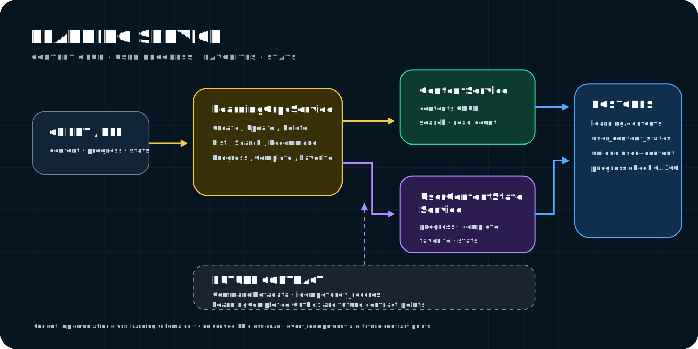

# Learning Service

투자 학습 콘텐츠 관리 및 사용자 학습 진도 추적 서비스



## 아키텍처

```
BFF ──gRPC──▶ LearningGrpcService
                  │
          ┌───────┴────────┐
          ▼                ▼
     [조회 흐름]      [쓰기 흐름]
          │           IdempotencyExecutor
          │                │
          ▼                ▼
     ContentService   StateService
          │                │──▶ OutboxWriter (같은 TX)
          ▼                ▼
     ContentRepository  StateRepository
          │                │
          ▼                ▼
       PostgreSQL (candle_learning / learning schema)
                           │
                    outbox_events 테이블
                           │ (5초 폴링)
                    KafkaOutboxPublisher
                           │
                       Kafka (MSK)
                    "LearningCompleted"
                           │
                    Mission Service (consume)
```

## 기술 스택

| 항목 | 기술 |
|------|------|
| 언어/프레임워크 | Java 21, Spring Boot 4.1.0 |
| 통신 | gRPC (spring-boot-grpc-server) |
| DB | PostgreSQL (Flyway 마이그레이션) |
| 메시징 | Apache Kafka (MSK) |
| 빌드 | Gradle (멀티모듈) |

## 패키지 구조

```
org.profit.candle.learning/
├── content/
│   ├── dto/             CreateContentCommand, UpdateContentCommand, ContentResult
│   ├── entity/          Content, ContentLevel, ContentLevelConverter
│   ├── repository/      ContentRepository (JpaSpecificationExecutor)
│   └── service/         ContentService (I), DefaultContentService
├── state/
│   ├── dto/             ContentStateResult, LearningStatsResult
│   ├── entity/          UserContentState
│   ├── repository/      UserContentStateRepository
│   └── service/         UserContentStateService (I), DefaultUserContentStateService
├── event/
│   ├── entity/          OutboxEvent
│   ├── repository/      OutboxEventRepository
│   ├── KafkaOutboxPublisher, OutboxWriter
│   ├── LearningEventType, LearningCompletedEvent
├── idempotency/
│   ├── entity/          IdempotencyRecord
│   ├── repository/      IdempotencyRecordRepository
│   └── service/         IdempotencyExecutor
├── exception/           LearningException, LearningErrorCode
├── grpc/                LearningGrpcService
├── config/              SchedulingConfig, JacksonConfig
└── LearningServiceApplication
```

## gRPC API

### 콘텐츠 관리 (관리자)

| RPC | 설명 | Idempotency |
|-----|------|-------------|
| `CreateContent` | 학습 콘텐츠 생성 | ✅ |
| `UpdateContent` | 콘텐츠 부분 수정 (optional 필드) | ✅ |
| `DeleteContent` | Soft delete (deleted_at 세팅) | ✅ |
| `ListAdminContents` | 관리자용 목록 (공개/비공개 필터) | - |

### 콘텐츠 조회 (사용자)

| RPC | 설명 |
|-----|------|
| `GetContent` | 상세 조회 + 조회수 증가 + 사용자 학습 상태 포함 |
| `ListContents` | 카테고리/레벨 필터, 최신순/인기순/조회순 정렬 |
| `SearchContents` | 제목 기반 검색 |
| `GetRecommendedContents` | 미열람 콘텐츠 기반 추천 |

### 학습 상태 (사용자)

| RPC | 설명 | Idempotency |
|-----|------|-------------|
| `UpdateProgress` | 진도율 업데이트 (100% 시 자동 완료) | ✅ |
| `CompleteContent` | 학습 완료 처리 | ✅ |
| `ToggleFavorite` | 즐겨찾기 토글 | ✅ |
| `GetUserLearningStats` | 대시보드 통계 (전체/카테고리별 진도) | - |
| `ListFavorites` | 즐겨찾기 목록 | - |

## DB 스키마

### learning.contents
학습 콘텐츠 본문. `deleted_at`으로 soft delete, `@SQLRestriction`으로 자동 필터링.

### learning.user_content_states
사용자별 콘텐츠 학습 상태. `(user_id, content_id)` unique 제약.

### learning.outbox_events
Outbox 패턴. DB 트랜잭션과 동일 TX로 이벤트 저장, 별도 publisher가 Kafka 전송.

### learning.idempotency_records
쓰기 RPC 멱등성 보장. `(user_id, operation, idempotency_key)` unique 제약.

## 주요 설계 결정

### Outbox 패턴
학습 완료 시 `LearningCompleted` 이벤트를 비즈니스 로직과 같은 트랜잭션으로 outbox 테이블에 저장. `KafkaOutboxPublisher`가 5초 주기로 미발행 이벤트를 Kafka로 전송. Kafka 전송 실패 시 업무 데이터 롤백하지 않음.

### Idempotency
모든 쓰기 RPC에 `idempotency_key` 필수. `userId + operation + idempotencyKey` 기준으로 중복 감지. 동일 key + 동일 요청 → 캐시된 결과 반환. 동일 key + 다른 요청 → `ALREADY_EXISTS` 거부.

### Soft Delete
`deleted_at IS NULL` 조건이 `@SQLRestriction`으로 모든 JPA 조회에 자동 적용. partial index에도 동일 조건 적용하여 삭제 데이터 인덱스 제외.

### 조회수
`UPDATE read_count = read_count + 1` atomic 쿼리로 동시 요청 시 lost update 방지.

## 로컬 실행

```bash
# Docker 기동 (PostgreSQL, Kafka)
docker compose -f deploy/local/docker-compose.yml up -d

# 빌드
../../gradlew :services:learning-service:build

# 실행
../../gradlew :services:learning-service:bootRun
```

- gRPC: `localhost:50059`
- HTTP: `localhost:8088`

## 테스트

```bash
../../gradlew :services:learning-service:test
```

| 테스트 | 대상 |
|--------|------|
| `DefaultContentServiceTest` | CRUD, soft delete, 미존재 예외 |
| `DefaultUserContentStateServiceTest` | 진도 업데이트, 자동 완료, 이벤트 발행/중복 방지, 즐겨찾기 토글 |
| `IdempotencyExecutorTest` | null key 거부, 첫 요청 저장, 중복 캐시, hash 불일치 거부 |
