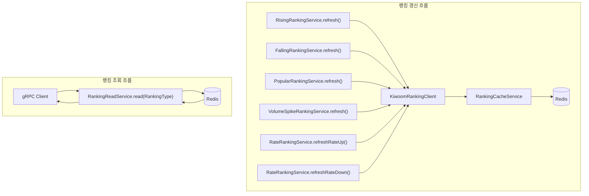

### 작업 개요/내용

# Market Service


## 1. 서비스 개요

Market Service는 키움 랭킹 API를 호출하여 주식 랭킹 데이터를 가져오고,
이를 공통 캐시 DTO로 변환한 뒤 Redis에 저장한다.

조회 요청은 키움 API를 직접 호출하지 않고 `RankingReadService`가 Redis 캐시를 읽어 반환한다.
랭킹 갱신은 각 랭킹별 `refresh()` 또는 `refreshRateUp()`, `refreshRateDown()` 메서드에서 수행한다.

현재 구현된 랭킹 기능은 다음과 같다.

- 상승 종목 랭킹
- 하락 종목 랭킹
- 인기 종목 랭킹
- 거래량 급증 랭킹
- 등락률 상위 랭킹
- 등락률 하위 랭킹

---

## 2. 주요 기능

## 2.1 상승 종목 랭킹 갱신

### 시작 지점

`RisingRankingService.refresh()`

### 처리 과정

1. `KiwoomRankingClient.getRisingStocks()` 호출
2. `KiwoomPriceRankResponse` 응답 수신
3. 응답이 `null`이면 `RankingException(RankingErrorCode.RANKING_API_ERROR)` 발생
4. `RankingCacheService.validateResponse()`로 `returnCode`와 응답 목록 검증
5. `RankingCacheService.rankCounter()`로 1부터 순위 생성
6. `StockRankingCacheItem`으로 변환
7. `RankingCacheService.save(StockRankingRedisKey.RISING, rankingItems)`로 Redis 저장

### 관련 클래스

- `RisingRankingService`
- `KiwoomRankingClient`
- `KiwoomPriceRankResponse`
- `RankingCacheService`
- `StockRankingRedisKey.RISING`
- `StockRankingCacheItem`

---

## 2.2 하락 종목 랭킹 갱신

### 시작 지점

`FallingRankingService.refresh()`

### 처리 과정

1. `KiwoomRankingClient.getFallingStocks()` 호출
2. `KiwoomPriceRankResponse` 응답 수신
3. 응답이 `null`이면 `RankingException(RankingErrorCode.RANKING_API_ERROR)` 발생
4. `RankingCacheService.validateResponse()`로 `returnCode`와 응답 목록 검증
5. `RankingCacheService.rankCounter()`로 1부터 순위 생성
6. `StockRankingCacheItem`으로 변환
7. `RankingCacheService.save(StockRankingRedisKey.FALLING, rankingItems)`로 Redis 저장

### 관련 클래스

- `FallingRankingService`
- `KiwoomRankingClient`
- `KiwoomPriceRankResponse`
- `RankingCacheService`
- `StockRankingRedisKey.FALLING`
- `StockRankingCacheItem`

---

## 2.3 인기 종목 랭킹 갱신

### 시작 지점

`PopularRankingService.refresh()`

### 처리 과정

1. `KiwoomRankingClient.getPopularStocks()` 호출
2. `KiwoomPopularRankResponse` 응답 수신
3. 응답이 `null`이면 `RankingException(RankingErrorCode.RANKING_API_ERROR)` 발생
4. `RankingCacheService.validateResponse()`로 `returnCode`와 응답 목록 검증
5. `RankingCacheService.rankCounter()`로 1부터 순위 생성
6. `StockRankingCacheItem`으로 변환
7. `RankingCacheService.save(StockRankingRedisKey.POPULAR, rankingItems)`로 Redis 저장

### 인기 종목 변환 정책

인기 종목 응답에서는 다음 값이 캐시 DTO에 고정값으로 들어간다.

- `priceChange` : `0L`
- `tradingVolume` : `0L`

### 관련 클래스

- `PopularRankingService`
- `KiwoomRankingClient`
- `KiwoomPopularRankResponse`
- `RankingCacheService`
- `StockRankingRedisKey.POPULAR`
- `StockRankingCacheItem`

---

## 2.4 거래량 급증 랭킹 갱신

### 시작 지점

`VolumeSpikeRankingService.refresh()`

### 처리 과정

1. `KiwoomRankingClient.getVolumeSpikeStocks()` 호출
2. `KiwoomVolumeSpikeResponse` 응답 수신
3. 응답이 `null`이면 `RankingException(RankingErrorCode.RANKING_API_ERROR)` 발생
4. `RankingCacheService.validateResponse()`로 `returnCode`와 응답 목록 검증
5. `RankingCacheService.rankCounter()`로 1부터 순위 생성
6. `StockRankingCacheItem`으로 변환
7. `RankingCacheService.save(StockRankingRedisKey.VOLUME_SPIKE, rankingItems)`로 Redis 저장

### 관련 클래스

- `VolumeSpikeRankingService`
- `KiwoomRankingClient`
- `KiwoomVolumeSpikeResponse`
- `RankingCacheService`
- `StockRankingRedisKey.VOLUME_SPIKE`
- `StockRankingCacheItem`

---

## 2.5 등락률 상위 랭킹 갱신

### 시작 지점

`RateRankingService.refreshRateUp()`

### 처리 과정

1. `KiwoomRankingClient.getRateUpStocks()` 호출
2. `KiwoomRateRankResponse` 응답 수신
3. `RateRankingService.refresh(response, StockRankingRedisKey.RATE_UP)` 실행
4. 응답이 `null`이면 `RankingException(RankingErrorCode.RANKING_API_ERROR)` 발생
5. `RankingCacheService.validateResponse()`로 `returnCode`와 응답 목록 검증
6. `StockRankingCacheItem`으로 변환
7. `RankingCacheService.save(StockRankingRedisKey.RATE_UP, rankingItems)`로 Redis 저장

### 관련 클래스

- `RateRankingService`
- `KiwoomRankingClient`
- `KiwoomRateRankResponse`
- `RankingCacheService`
- `StockRankingRedisKey.RATE_UP`
- `StockRankingCacheItem`

---

## 2.6 등락률 하위 랭킹 갱신

### 시작 지점

`RateRankingService.refreshRateDown()`

### 처리 과정

1. `KiwoomRankingClient.getRateDownStocks()` 호출
2. `KiwoomRateRankResponse` 응답 수신
3. `RateRankingService.refresh(response, StockRankingRedisKey.RATE_DOWN)` 실행
4. 응답이 `null`이면 `RankingException(RankingErrorCode.RANKING_API_ERROR)` 발생
5. `RankingCacheService.validateResponse()`로 `returnCode`와 응답 목록 검증
6. `StockRankingCacheItem`으로 변환
7. `RankingCacheService.save(StockRankingRedisKey.RATE_DOWN, rankingItems)`로 Redis 저장

### 관련 클래스

- `RateRankingService`
- `KiwoomRankingClient`
- `KiwoomRateRankResponse`
- `RankingCacheService`
- `StockRankingRedisKey.RATE_DOWN`
- `StockRankingCacheItem`

---

## 2.7 랭킹 조회

### 시작 지점

`RankingReadService.read(RankingType type)`

### 처리 과정

1. gRPC 계층에서 전달된 `RankingType`을 받는다.
2. `redisKeyOf(type)`으로 Redis Key를 결정한다.
3. `RankingCacheService.read(redisKey)`를 호출한다.
4. Redis에 `RankingSnapshot`이 있으면 반환한다.
5. 캐시가 없으면 `null`을 반환한다.
6. gRPC 계층에서 cache miss를 `UNAVAILABLE`로 변환한다.

### RankingType 매핑

| RankingType | Redis Key |
|---|---|
| `RISING` | `StockRankingRedisKey.RISING` |
| `FALLING` | `StockRankingRedisKey.FALLING` |
| `VOLUME_SPIKE` | `StockRankingRedisKey.VOLUME_SPIKE` |
| `POPULAR` | `StockRankingRedisKey.POPULAR` |
| `RATE_UP` | `StockRankingRedisKey.RATE_UP` |
| `RATE_DOWN` | `StockRankingRedisKey.RATE_DOWN` |

`RANKING_TYPE_UNSPECIFIED`, `UNRECOGNIZED`는 `IllegalArgumentException`을 발생시킨다.

### 관련 클래스

- `RankingReadService`
- `RankingType`
- `RankingCacheService`
- `RankingSnapshot`
- `StockRankingRedisKey`

---

## 3. 서비스 흐름



---

## 4. 외부 서비스 계약

## 4.1 키움 랭킹 API

### 호출 대상

`KiwoomRankingClient`

### 호출 메서드

| 기능 | 호출 메서드 | 응답 DTO |
|---|---|---|
| 상승 종목 | `getRisingStocks()` | `KiwoomPriceRankResponse` |
| 하락 종목 | `getFallingStocks()` | `KiwoomPriceRankResponse` |
| 인기 종목 | `getPopularStocks()` | `KiwoomPopularRankResponse` |
| 거래량 급증 | `getVolumeSpikeStocks()` | `KiwoomVolumeSpikeResponse` |
| 등락률 상위 | `getRateUpStocks()` | `KiwoomRateRankResponse` |
| 등락률 하위 | `getRateDownStocks()` | `KiwoomRateRankResponse` |

### 공통 응답 처리

각 응답의 `items()`와 `returnCode()`를 `RankingCacheService.validateResponse()`로 검증한다.

- `returnCode != 0` : `RankingException(RankingErrorCode.RANKING_API_ERROR)`
- `items == null` 또는 `items.isEmpty()` : `RankingException(RankingErrorCode.EMPTY_RANKING_DATA)`

### Deadline

현재 서비스 코드에서 별도 deadline 설정은 확인되지 않는다.

### Retry

현재 서비스 코드에서 재시도 정책은 확인되지 않는다.

### 호출 실패 시 영향

- 키움 API 응답이 `null`이면 Redis 갱신 실패
- `returnCode != 0`이면 Redis 갱신 실패
- 응답 목록이 비어 있으면 Redis 갱신 실패
- 기존 Redis 캐시는 TTL 만료 전까지 유지될 수 있음
- 캐시가 없으면 `RankingReadService`는 `null`을 반환하고 gRPC 계층에서 `UNAVAILABLE`로 변환

---

## 5. 데이터 저장 결과

## 5.1 Redis 저장 구조

`RankingCacheService.save(String redisKey, List<StockRankingCacheItem> items)`가 Redis에 데이터를 저장한다.

저장 방식

```java
redisTemplate.opsForValue().set(
    redisKey,
    new RankingSnapshot(items, Instant.now()),
    Duration.ofMinutes(2)
);
```

저장 값

- `RankingSnapshot`
    - `items`
    - `Instant.now()`

TTL

- 2분

## 5.2 Redis Key

| 기능 | Redis Key |
|---|---|
| 상승 종목 | `StockRankingRedisKey.RISING` |
| 하락 종목 | `StockRankingRedisKey.FALLING` |
| 인기 종목 | `StockRankingRedisKey.POPULAR` |
| 거래량 급증 | `StockRankingRedisKey.VOLUME_SPIKE` |
| 등락률 상위 | `StockRankingRedisKey.RATE_UP` |
| 등락률 하위 | `StockRankingRedisKey.RATE_DOWN` |

## 5.3 DB 저장 결과

현재 업로드된 랭킹 서비스 코드 기준으로는 DB 테이블을 직접 변경하지 않는다.

- 변경 테이블 없음
- 조회 테이블 없음
- 다른 서비스 DB 직접 조회 없음
- FK 연결 없음

## 5.4 Transaction

현재 업로드된 랭킹 서비스 코드 기준으로는 `@Transactional`이 확인되지 않는다.

랭킹 갱신은 Redis 저장 단위로 수행된다.

## 5.5 Outbox

미사용

## 5.6 Kafka

미사용

---

## 6. 핵심 정책

## 6.1 응답 검증 정책

`RankingCacheService.validateResponse()` 기준으로 검증한다.

```java
if (returnCode != 0) {
    throw new RankingException(RankingErrorCode.RANKING_API_ERROR);
}

if (items == null || items.isEmpty()) {
    throw new RankingException(RankingErrorCode.EMPTY_RANKING_DATA);
}
```

각 서비스는 응답 객체가 `null`인 경우에도 `RankingException(RankingErrorCode.RANKING_API_ERROR)`를 발생시킨다.

## 6.2 순위 생성 정책

`RankingCacheService.rankCounter()`가 `new AtomicInteger(1)`을 반환한다.

각 랭킹 데이터는 API 응답 순서를 유지하며 1부터 순위를 부여한다.

## 6.3 숫자 변환 정책

### `parseLongAbs(String value)`

- `parseLong(value)` 결과에 `Math.abs()` 적용
- 현재가처럼 부호가 포함될 수 있는 값을 양수로 저장할 때 사용

### `parseLong(String value)`

- `null` 또는 blank는 `0L`
- `+`, `,` 제거 후 `Long.parseLong()`

### `parseDouble(String value)`

- `null` 또는 blank는 `0.0`
- `+`, `%`, `,` 제거 후 `Double.parseDouble()`

## 6.4 캐시 조회 정책

`RankingCacheService.read(redisKey)`는 Redis 값을 조회한다.

- 값이 `RankingSnapshot`이면 반환
- 아니면 `null` 반환

`RankingReadService`는 키움 API를 호출하지 않는 읽기 전용 경로다.

## 6.5 멱등성 기준

동일 Redis Key에 대해 `RankingSnapshot`을 덮어쓴다.

따라서 같은 랭킹 갱신이 여러 번 실행되어도 최종 결과는 해당 Redis Key의 최신 스냅샷 1개다.

## 6.6 정렬 정책

별도 정렬 로직은 없다.

키움 API 응답 리스트 순서를 그대로 사용하고, 순위만 1부터 증가시킨다.

## 6.7 실패 정책

- 외부 API 응답 `null` : `RANKING_API_ERROR`
- `returnCode != 0` : `RANKING_API_ERROR`
- 응답 리스트 비어 있음 : `EMPTY_RANKING_DATA`
- 알 수 없는 `RankingType` : `IllegalArgumentException`

---

## 7. 서비스 영향도

## 7.1 성공 시

랭킹 갱신 성공 시 Redis에 최신 `RankingSnapshot`이 저장된다.

반영되는 기능

- 상승 종목 랭킹 조회
- 하락 종목 랭킹 조회
- 인기 종목 랭킹 조회
- 거래량 급증 랭킹 조회
- 등락률 상위 랭킹 조회
- 등락률 하위 랭킹 조회

## 7.2 실패 시

랭킹 갱신 실패 시 해당 Redis Key는 갱신되지 않는다.

영향

- 기존 캐시가 TTL 만료 전이면 이전 데이터 조회 가능
- 기존 캐시가 없거나 TTL이 만료되면 `RankingReadService`가 `null` 반환
- gRPC 계층에서 cache miss를 `UNAVAILABLE`로 변환

## 7.3 이미 커밋된 다른 서비스 데이터

현재 랭킹 서비스는 DB 트랜잭션을 사용하지 않고 Redis만 갱신한다.

따라서 다른 서비스 DB에 커밋된 데이터에는 영향을 주지 않는다.

## 7.4 Outbox 또는 Kafka 발행 지연

현재 Outbox와 Kafka를 사용하지 않는다.

## 7.5 외부 서비스 장애 시 fallback

별도 fallback 로직은 없다.

단, Redis에 기존 캐시가 남아 있으면 TTL 만료 전까지 기존 스냅샷 조회가 가능하다.

---

## 9. 운영 설정과 향후 변경 지점

### 9.1 주요 환경 변수

- Kiwoom API 인증 정보
- Redis 접속 정보

> 실제 인증 정보는 문서에 포함하지 않는다.

---

### 9.2 운영 설정

- Redis Cache TTL : 2분
- `RankingReadService`는 Redis 캐시만 조회하며 키움 API를 직접 호출하지 않는다.
- 랭킹 갱신은 각 `refresh()` 메서드에서 수행된다.

---

### 9.3 현재 미구현 사항

- Retry 정책
- Deadline 설정
- Kafka 연동
- Outbox
- Circuit Breaker


### 참고 자료 (선택)

_No response_
